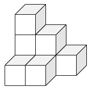

## このサイトについて

組合せ論の魅力を発信するサイトです。

- ⭐組合せ論の様々な話題を紹介する[月刊組合せ論 Natori](./natori/)
- 🔢組合せ論系 VTuber 早稲くみあがお届けする[くみあラボ](./kumialab/)
- 💕好奇心旺盛ないおりとしいなが数え上げを学ぶ部活[いーしー部！](./ec/)
- 🔍数学を通じて人間らしい暮らしを探究する雑誌[Math 人](./mathzine/)

など、様々なコンテンツがあります。

## 管理人について

箱星（はこぼし）です。組合せ論が大好きです。

修士課程を修了しており、現在は社会人です。

各種リンクは [lit.link](https://lit.link/hakoboshi) にまとめています。記事に間違い等があった場合の連絡はこちらからお願いします。

### CV

石川県金沢市生まれ。東京都で学生時代を過ごした後、石川県金沢市に戻る。

#### 学歴




東京大学理学部数学科を卒業しました。当時の専門は有限群でした。



東京大学大学院数理科学研究科の修士課程を修了しました。無限群、リー代数、頂点代数などいろいろなものを勉強しました。最終的に代数的組合せ論で修士論文を書きました。



博士を目指すかもしれませんし、目指さないかもしれません。




#### 職歴




学校で事務系の仕事をしています。主な職務内容は Word, Excel, PowerPoint を用いた資料作りです。



転職するかもしれませんし、しないかもしれません。




#### 資格・受賞歴

- 日本数学オリンピック　本選出場
- 基本情報技術者試験　合格
- JDLA Deep Learning for GENERAL 2022#3
- 漢字検定準 1 級