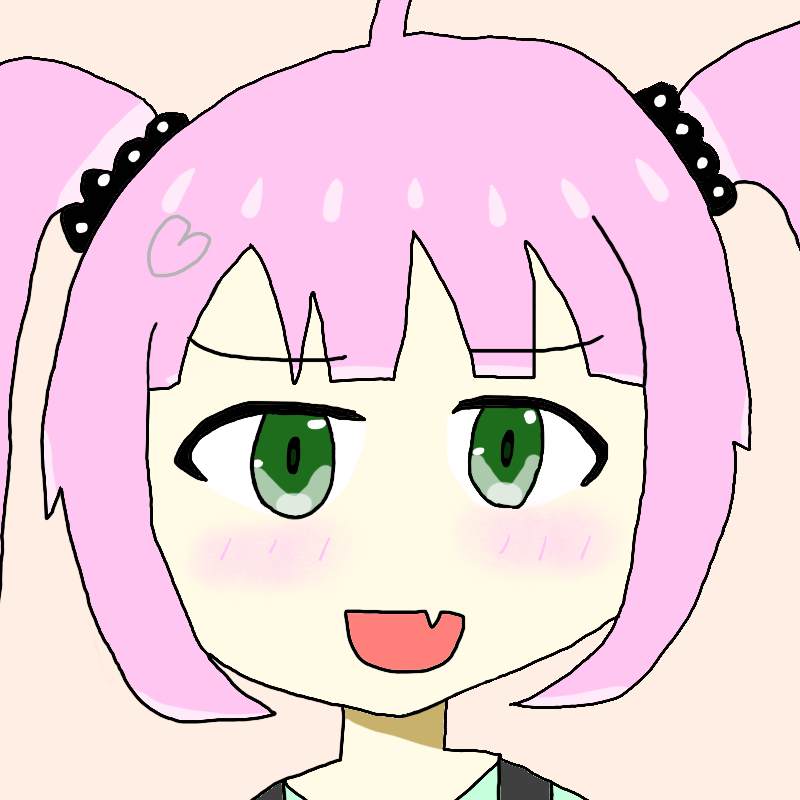
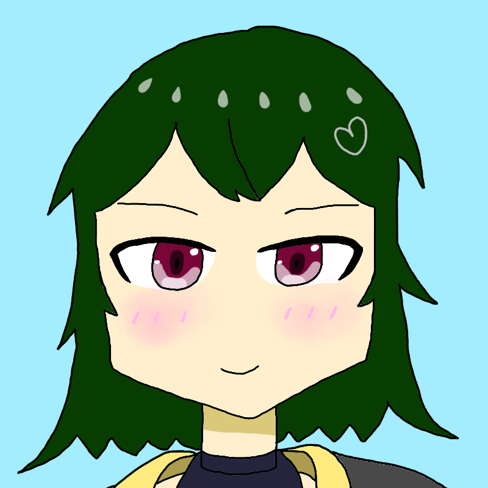



Enumerative Combinatorics を読み始めたいおりとしいな。そんな 2 人の前に、困難が立ちはだかる。





ぴえ～～～～～。わかんない～～～～～！




難しすぎ……。




そう、Enumerative Combinatorics は難しい本なのだ。

このままではいーしー部としての活動ができなくなってしまうかもしれない。そんな中、しいなは 1 つの案を思いついた。





いーしー部は部活。部活には何が必要？




部費とか、部員とか……？




顧問の先生だよ！




部活には顧問の先生が必要。つまり、難しい Enumerative Combinatorics を読むために、アドバイスをくれる存在が必要である。

こうして呼ばれたいーしー部の顧問が、組合せ論系 VTuber の早稲くみあであった。





よろしくね、顧問の先生。




くみあせんせー！




（先生じゃなくて大学院生なんだけどな……）




こうして 3 人は数え上げの世界へ足を踏み入れることになったのであった。
