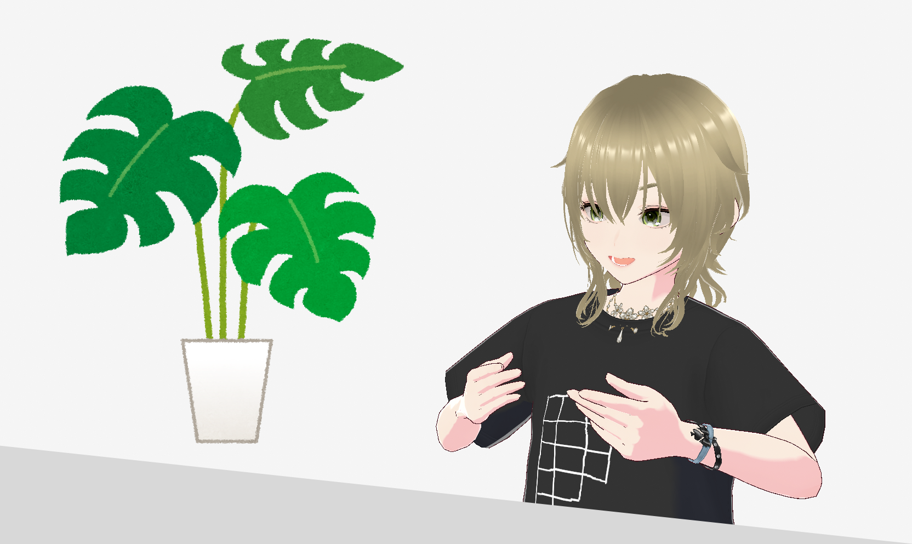

+++
title = "早稲くみあ独占インタビュー"
date = 2026-08-04
authors = [ "kumia" ]
+++

バーチャル combinatorialist として活動する早稲くみあさんに独占インタビューを実施しました。

なお、早稲くみあさんは架空の存在なので、インタビュー内の情報は実在しない場合があります。

## バーチャル世界から組合せ論を発信

**箱星**：こんにちは。

**くみあ**：combanwa～！バーチャル combinatorialist の早稲くみあです。

**箱星**：よろしくお願いします。早速ですが、早稲くみあさんはバーチャル combinatorialist として活動されていますが、どのような活動を行っていますか？

**くみあ**：組合せ論に関する動画を上げたり、ライブ配信で雑談したりしています。堅苦しくならないように、組合せ論の楽しさが伝わるようにしています。おかげさまで最近は登録者も増えてきています。「くみあさんを見て数学を勉強し始めました！」というコメントもよくいただいてて、この活動をやっていてよかったなと思います。



**箱星**：中でも人気なのが、ヤング図形を食べる動画ですよね。

**くみあ**：数学ってこんなふうに楽しむこともできるんだということを伝えたくて作った動画です。美味しいですよ。（笑）

**箱星**：（笑）

## ヤング図形には興味がなかった？

**箱星**：ヤング図形に興味を持ったのはいつからでしょうか。

**くみあ**：それが、よく覚えてないんです。大学で数学を勉強していろいろな概念を吸収しました。ヤング図形もそのうちの1つだったと思いますが、最初に出会ったときは特に何も思わなかったですね。

**箱星**：そうなんですね。

**くみあ**：箱を並べただけの図形ですからね。これがすごいものだとは思いませんでした。その後専門的な数学を学ぶにつれてヤング図形って実はすごいやつだってことがわかるようになって、今ではもう完全にとりこです。

**箱星**：なぜ大学で数学を学ぼうと思ったのでしょうか。

**くみあ**：高校時代の先生の影響ですね。面白くて好きな先生だったので、私もこんな数学の先生になれたらと思い、大学では数学を学ぶことにしました。このときは研究者になるつもりはなかったんですが、今は結構迷っています。

**箱星**：研究している内容について教えてもらってもいいですか？

**くみあ**：修士課程なのでまだ立派な研究成果はないですが、ヤング図形にまつわる組合せ論を研究しています。ヤング図形は表現論と関係の深いオブジェクトなので、関連する分野もあわせて勉強しています。大変ですけど充実した毎日です。目標は、数学の難しい問題をヤング図形のような見てわかりやすいオブジェクトに翻訳することで、いろいろな人に数学を楽しんでもらうことです。

## ドーナツの楽しみ

**箱星**：勉強以外で学生生活はどのようなことをやっていましたか？

**くみあ**：もちろん息抜きも充実していました。高校時代バスケ部だったので大学でもそういう活動をしてました。学科の友人が「ドーナツ研究会」なるサークルを立ち上げたので、学部生の後半からはそっちの方に行ってました。

**箱星**：ドーナツ研究会とは？

**くみあ**：ドーナツを食べるサークルです。友人はドーナツのことを何でも知ってて、新しいお店ができたときはすぐに買いに行って私たちに配ってたんです。それで食べながらおしゃべりしたり、同じ学科なので自主ゼミをしたりしていました。

**箱星**：早稲くみあさんのプロフィールには好きなものはワッフルと書かれていますね。

**くみあ**：ワッフルもドーナツも好きです。でもワッフルってヤング図形っぽいですよね。だから私はワッフルの方が好きです。

**箱星**：（笑）

**くみあ**：ちなみに友人はドーナツはリーマン面だから数学だと言ってました。

## 組合せ論はナノテクノロジー

**箱星**：プロフィールの好きな言葉の欄には、Combinatorics is the nanotechnology of mathematics. という言葉がありますね。

**くみあ**：これは Sara Billey という数学者が語った言葉です。その真意はまだつかめていませんが、難しい数学の問題を組合せ論の問題に翻訳して解くと、組合せ論の力を実感します。

**箱星**：例えば？

**くみあ**：ヤング図形との関係でいうと、シューア多項式があります。シューア多項式はグラスマン多様体のコホモロジーとも関係が深いですが、こう聞くと難しく感じますよね。それがヤング図形を使って計算できるというのは嬉しいことなんです。

**箱星**：私も以前書いた記事（[【月刊組合せ論 Natori】Brouwer の不動点定理と Sperner の補題【2025 年 11 月号】](natori/202511/)）では、Brouwer の不動点定理の組合せ論版が Sperner の補題という話をしました。難しい定理の骨格・本質を捉えようとする行為はまさにナノテクノロジーといえるのではないかと述べました。

**くみあ**：そうですよね。

**箱星**：しかし、組合せ論の問題が難しい数学の理論を使って解ける場合もあって、一筋縄ではいかないかもしれません。

**くみあ**：そこが数学の難しいところでもあり、面白いところでもありますね。

**箱星**：先ほど、数学の難しい問題を組合せ論のオブジェクトに翻訳することでいろいろな人に数学を楽しんでもらうことが目標とおっしゃっていましたが、まさにこのナノテクノロジーの考え方がありそうだと感じました。

**くみあ**：はい。どんどん組合せ論に翻訳していきたいです。

## 研究室

**箱星**：大学院の研究室はどのような雰囲気ですか？

**くみあ**：留学生や社会人博士の方もいて、個性的で賑やかな雰囲気です。ゼミ以外でも数学の話をしたり、雑談で盛り上がることもあります。一緒に食事に行くことも多いです。

**箱星**：楽しそうですね。私は学生時代ぼっちでした。

**くみあ**：一人の時間も大事ですけど、他の人と数学をするのが大事だと思います。

**箱星**：大人になってから大事さに気づきました。

**くみあ**：近い分野の人たちだけでなく、離れた分野の人とも数学の話をしてみるといいと思います。異なる分野に橋を架けるのはとても面白いですから。

**箱星**：大学院ではゼミ発表がつきものですが、どのように準備していますか？

**くみあ**：ゼミ準備のいい方法は私が知りたいです（笑）。数学科のゼミ準備方法で一番有名なのは、[河東先生の記事](https://www.ms.u-tokyo.ac.jp/%7Eyasuyuki/sem.htm)だと思います。私の研究室は時間を守るとかメモを見ないとかにはルーズですが、ちゃんと準備しないといけないことには変わりありません。発表箇所を読み込んで、わからない部分はメモしていっぱい考えます。それから何も見ずにノートに書き出してみると理解が深まります。わかったつもりになることが一番怖いです。最初の頃は全部わかったつもりになって発表に臨んでも、指導教員からの質問で何もわかっていなかったと判明することがよくありました。あれはつらいです。

**箱星**：わかります。

**くみあ**：落ち込みますけど、後から思うとこういう経験があったおかげで強くなれたと感じます。

**箱星**：傷つくことを恐れていては成長できませんからね。勿論心理的安全性は必要ですが。

**くみあ**：そうですね。私の研究室はいい環境だと思います。

## 未来の combinatorialist へ

**箱星**：これから数学、特に組合せ論を本格的に学びたい人に向けてアドバイスをお願いします。

**くみあ**：まず、組合せ論は楽しいです。そこを忘れないでほしいなと思います。そして、数学の勉強は大変です。理解できないと焦ったり落ち込んだりすると思いますが、その必要はありません。むしろじっくりと数学に取り組んだ経験というのは大事になってくると思います。それから、手を動かしましょう。論より証拠というとちょっと違うかもしれませんが、抽象的な理論を支えるのは具体例です。嬉しいことに、組合せ論は手を動かせる具体例の宝庫です。

**箱星**：私も、組合せ論を学ぶ人が増えることを願っています。

**くみあ**：みなさんと共同研究がしたいです！

**箱星**：本日はお忙しい中ありがとうございました。

**くみあ**：ありがとうございました！bye-jection！
