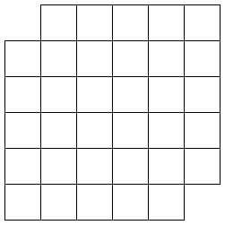
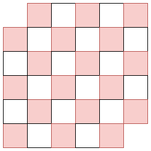
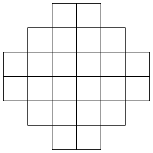

みなさん、combanwa～！組合せ論系 VTuber の早稲くみあです！

長い間おやすみしちゃっててごめんなさい！

思ったより準備に時間がかかってしまいました。今日からまた連載もがんばっていくので、よろしくお願いします！

前回でヤング図形の連載が終わりました。次の連載テーマはまだ発表していませんでした。早速発表しようと思います。それは……。

**タイリング**です！

ヤング図形も魅力的ですが、タイリングもとっても面白いんです。私と一緒に、タイリングの魅力を探検しましょう！

この記事は[組合せ論 Advent Calendar 2025](https://adventar.org/calendars/11332) の 15 日目の記事です。

## ドミノとは

ドミノと聞いてみなさんは何を連想しますか？ドミノを並べて倒す遊びですか？それともピザでしょうか？

ドミノというのは、2 マスぶんの長方形にこんなふうに数字が書き込まれたものです。

いろいろな遊び方があるみたいです。立てて並べるだけじゃなくて、倒した状態で並べることもあるそうです。私は遊んだことがないですが……。

数学でもドミノが登場します！数学者が興味を持っているのは、こんな問題です。

> 与えられた図形にドミノを敷き詰めることはできるか。できるとしたら、敷き詰め方は何通りあるか。

例えば、こんな図形はどうでしょう？

この図形に、ドミノを敷き詰めることはできますか？ドミノは縦向きに置いても横向きに置いてもいいですが、重なったり外に出たりするのはダメです。すべてのマスを覆うことができたら成功です。

気になった方は読み進める前に、実験してみましょう！ドミノをもっているなら敷き詰められるか試してみてください。もちろん紙に書いても OK です！

---

実験してみましたか？

実験してみると、どう頑張ってもマスが余ってしまいますよね。だから敷き詰められないような気がしてきます。

でもこれは仮説なので、数学的に証明したわけじゃないです。もしかしたら敷き詰める方法があるかもしれません。

ですが、数学的に証明することができます！

つまり、どう頑張ってもドミノでこの図形を敷き詰めることはできないことがわかるんです。証明も難しくないので早速みていきましょう！

図形を市松模様で塗りました。するとドミノは必ず赤いマスと白いマスの両方にまたがります。数えてみると赤いマスは 18 個、白いマスは 16 個あります。だから、ドミノを敷き詰めていくと最終的に赤いマスが 2 個残ってしまいます。この 2 マスをドミノで覆うことはできません。

どうですか？この証明、面白くないですか？エレガントにスパッと解決できちゃいましたね。

## ドミノタイリングの数え上げ

### 長方形の場合

ここからはドミノを敷き詰める方法が何通りあるかを調べていきます。

まずは $m\times n$ の長方形の場合を考えてみましょう！

いきなり一般の場合を考えるのは難しいので、まずは $m=1$ として、$1\times n$ の長方形を考えます。これは簡単ですね。$n$ が偶数なら 1 通り、奇数なら 0 通りです。

次は $m=2$ としましょう。$2\times n$ の長方形のドミノタイリングは何通りでしょうか？

これを $a_n$ 通りとします。最も左上にあるマスを覆うドミノの種類で場合分けします。

- 縦向きのドミノを置くとき、残りは $2\times (n-1)$ の長方形なので、$a_{n-1}$ 通りあります。
- 横向きのドミノを置くとき、その下も横向きのドミノでないといけません。残りは $2\times (n-2)$ の長方形なので、$a_{n-2}$ 通りあります。

なので、$a_n=a_{n-1}+a_{n-2}$ という漸化式をみたすことがわかりました。初期値が $a_1=1, a_2=2$ なので、数列 $(a_n)$ は $1,2,3,5,8,13,21,\ldots$ という数列になります。数学が好きな人なら見たことがあると思います。そう、これはフィボナッチ数列です！

ドミノタイリングの個数にフィボナッチ数列が現れると知ったところで、一般の場合を考えましょう。

これの証明は大変なので省略しますが、実は

$$
\prod_{j=1}^{\lceil m/2\rceil}\prod_{k=1}^{\lceil n/2\rceil}\left(4\cos^2\frac{\pi j}{m+1}+4\cos^2\frac{\pi k}{n+1}\right)
$$

になることが知られています。三角関数が出てくるというのが面白いですね！

証明はきっと箱星さんがしてくれます！

### アステカダイヤモンドの場合

アステカダイヤモンドは次のような図形です。

これは位数 3 のアステカダイヤモンドと呼ばれます。

位数 $n$ のアステカダイヤモンドにドミノを敷き詰める方法は何通りあるでしょうか？

その答えは

$$
2^{n(n+1)/2}
$$

通りです！

長方形と比べてきれいな形ですよね。

これの証明は以下の動画で扱われています。



## おわりに

タイリングの魅力、伝わったでしょうか？

もちろんタイリングにはまだまだ魅力的なトピックがあるので、今後も紹介していきますよ！お楽しみに！

以上！早稲くみあでした！bye-jection!

## 参考文献

- 高崎金久, 線形代数と数え上げ　増補版, 日本評論社, 2021.
