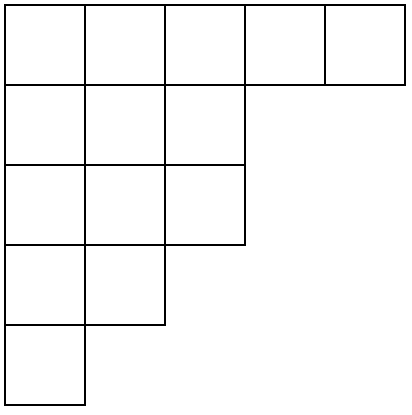
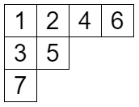
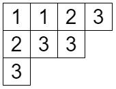


はじめましての方ははじめまして、そうでない方は、combanwa～！組合せ論系 VTuber の早稲くみあです！


普段は大学院修士課程に通いつつ、組合せ論の布教をするために VTuber 活動もしています。

この度、箱星さんの組合せ論サイトにて連載を持つことになりました！貴重な機会をくださり、ありがとうございます！

箱星さんの『月刊組合せ論 Natori』と同様に毎月更新となる予定です。ただしあちらは毎月1日の更新ですが、私の連載は毎月15日の更新となる予定です。とはいえ、どちらの連載も忙しいときは休載になることもあります。

## 何を書きましょうか

さて、この連載『くみあラボ』を書くにあたって「組合せ論に少しでも関係あることなら何を書いてもいいよ」と言われています。何でもいいと言われると逆に難しいですよね。

連載を持つことが決まってからいろいろなアイデアを出して、ああでもないこうでもないと考えを巡らせていました。そんな中、とある本に出合いました。それが山田裕史先生の『組合せ論プロムナード』と『組合せ論トレイル』です。最近発売された本ですが、組合せ論の美しい風景を散策しているような気持ちになれる本でした。

この本を読んで、私も組合せ論の魅力的な場所を案内するような文章を書きたいと思いました。もちろん山田先生のような数学経験も人生経験もありませんが、それでも組合せ論の魅力を精一杯伝えようと思います！

今回から 6 回分の連載 (つまり半年分) では、私が組合せ論の中で最も好きな対象である「ヤング図形」を中心に、その周辺をふらふらと散策しながら文章を書いていこうと思います。教科書のような堅い文章にはしないようにするので、気楽に読んでいってください。でも手を動かすとより深く味わえると思うので、興味を持った部分は実際に計算してみたりもっと調べたりしてみてください！

## ヤング図形とは


私の動画を見てくださっている方はご存知かと思いますが、ヤング図形は私の動画によく出てきます。これまでにも食べたり、抱き枕にしたり、改造してキーボードにしたりするなど幅広く活用されています。なによりヤング図形は私のTシャツの柄にもなっている図形です。



みなさんはこの図形を見てどのように感じるでしょうか？私の一番好きな対象と聞いて、すごいものが出てくると思った人もいるかもしれません。

正直に言うと、私も初めてヤング図形に出会ったときは特別な感情を抱きませんでした。いつ出会ったのかすらも覚えていません。日々定義・定理を吸収し続ける毎日の中で、ヤング図形は私の体を通り過ぎていったのかもしれません。ここでヤング図形との素敵な出会いのエピソードを放り込むことができれば掴みはバッチリだったかもしれませんが、そうはいかないものですね。

ただ、数学を学び進めていくと、ヤング図形の魅力に少しずつ気づいていくようになりました。今ではもうヤング図形の虜です。というわけで私のヤング図形との出会いは、一目惚れタイプではなく、じわじわと好きになっていったタイプでした。

そんなヤング図形の正確な定義を書いておきます。$\lambda$ を非負整数からなる広義単調減少列とするとき、$\lambda$ のヤング図形とは上から $i$ 行目に $\lambda_i$ 個の箱を並べた図形です。上の図は $\lambda=(5,3,3,2,1)$ の場合です。図を見れば明らかなことでも、数学書や論文を書くにあたっては真面目に書かないといけないこともあります。それが数学の（特に組合せ論の？）大変なところでもあります。

ところで、Wikipedia を見るとフェラーズ図形と呼ばれるものもあるようです。フェラーズ図形では $\lambda=(5,3,3,2,1)$ をこのように書きます。

```
・・・・・
・・・
・・・
・・
・
```

フェラーズ図形では箱ではなく点や丸を使います。実際のところ、ヤング図形とフェラーズ図形はしっかり使い分けられていないこともあります。大きな違いはないように見えるので当然と感じるかもしれません。ですが、ヤング図形には大きなメリットがあります。それは、**箱に書き込める**ということです。

## 標準ヤングタブローと半標準ヤングタブロー

お盆休みの際、懐かしいものを見ました。子供のころの身長が刻まれた柱です。これを見ると、私にも小さい頃があったんだなあという気持ちになります。まさに成長の証ですね。

標準ヤングタブローというのは、ヤング図形の成長記録です。空っぽの状態からスタートして、箱を 1 つずつ追加していくことでヤング図形を成長させます。もちろん途中でヤング図形でない状態になってはいけません。

追加する順に 1,2,3,... と書いていくことで標準ヤングタブローができます。別の言い方をすると、各行・列について単調増加になるように整数を書き込んだものが標準ヤングタブローです。



ところで、タブローには「盤」という日本語訳があります。ヤング盤ともいいます。しかし箱星さんはタブローという言い方を使い続けています。理由を聞いてみたところ、フルトン『ヤング・タブロー』の訳書での使い方に合わせているそうです。

標準ヤングタブローに少し変更を加えたものとして、半標準ヤングタブローがあります。

- 各行について**広義**単調増加
- 各列について**狭義**単調増加

をみたすものです。たとえば次のようなものです。



なぜこのようなものを考えるのでしょうか？

おおざっぱに言えば、標準ヤングタブローは対称群の表現論、半標準ヤングタブローは一般線形群の表現論に現れるものです。そして、対称群と一般線形群の表現論は、シューア・ワイル双対性という不思議な関係でつながっています。

シューア・ワイル双対性は勉強したことはあるんですが、その真髄といいますか、直感をつかむことはできていません。立派な数学者はただ定義を覚えているだけでなくそれを自由自在に使いこなせているイメージなので、こういう直感をつかめるようになると立派になれる気がします。真髄を教えていただける方を募集中です！

## おわりに

はじめての記事なのでうまく書けているかわかりませんが、組合せ論に興味を持つ人が増えたらとても嬉しいです！

次回の記事もヤング図形について書く予定なので、お楽しみに！

それではまた会いましょう！早稲くみあでした！bye-jection！