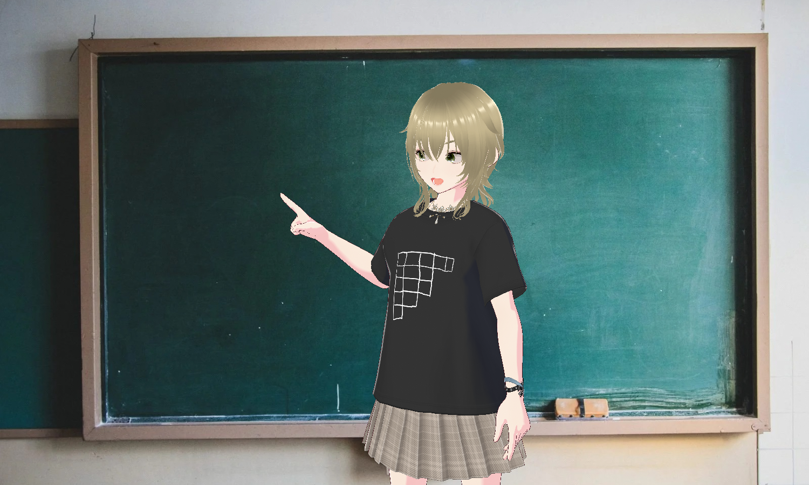
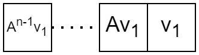
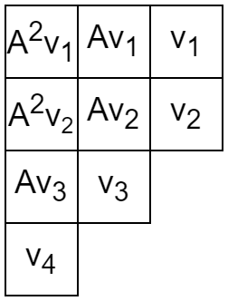


みなさん、combanwa～！組合せ論系 VTuber の早稲くみあです！

前回に引き続き、ヤング図形について語っていきたいと思います！

## ジョルダン標準形

ジョルダン標準形といえば、大学1年生で学ぶ線形代数のクライマックスという感じですね。私も大学1年生の頃は必死に食らいついていました。院試を受ける際にも改めて勉強しました。今回記事を書くにあたり改めて勉強しなおしましたが、やはり線形代数は奥が深くて難しいですね。余談ですが、とある本では「ンダルョジの形準標」という誤植があったそうです。

そんなジョルダン標準形を簡単に説明します。ジョルダン細胞 $J_n(a)$ は

$$
J_n(a)=\begin{pmatrix}
a & 1 & 0 & \cdots & 0 \\\
0 & a & 1 & \cdots & 0 \\\
& & \ddots & \\\
0 & \cdots & 0 & a & 1 \\\
0 & \cdots & 0 & 0 & a
\end{pmatrix}
$$

という行列です。これは $n$ 次正方行列で、対角線に $a$ が並び、その 1 つ右に 1 が並び、その他が 0 であるようなものです。そしてジョルダン細胞をブロック対角状に並べた行列

$$
\begin{pmatrix}
J_{n_1}(a_1) & & & O \\\
& J_{n_2}(a_2) & & \\\
& & \ddots & \\\
O & & & J_{n_k}(a_k)
\end{pmatrix}
$$

を考えます。どんな正方行列 $A$ も、ある正則行列 $P$ をとることで $P^{-1}AP$ が上の形の行列にできるという定理があります。さらにジョルダン細胞の並べ方の違いを除いてこのような表し方は一意的です。この $P^{-1}AP$ を $A$ のジョルダン標準形といいます。

よく数学の学習アドバイスとして「抽象論を学んだあとは具体例を知るとよい」というものがあります。抽象論だけを学んで満足しちゃう人も結構見かけるんですが、もったいない感じがします。というわけで、実際に手を動かしてジョルダン標準形を求めてみましょう。

$$
A=\begin{pmatrix}
-11 & -25 \\\
4 & 9
\end{pmatrix}
$$

まずは固有方程式を解きます。$\det(A-\lambda I)=0$ は $\lambda^2+2\lambda+1=0$ となり、固有値は $-1$ (重複度 2) です。$A\mathbf{v}=-\mathbf{v}$ をみたすベクトル $\mathbf{v}$ を求めると $t\binom{-5}{2}$ の形です。$\mathbf{v}_1=\binom{-5}{2}$ とします。ここで $A\mathbf{v}=-\mathbf{v}+\mathbf{v_1}$ をみたす $\mathbf{v}$ を求めると、$t\binom{-5}{2}+\binom{-2}{1}$ です。$\mathbf{v}_2=\binom{-2}{1}$ とします。$P=(\mathbf{v}_1 \ \mathbf{v}_2)$ とすると

$$
AP=(A\mathbf{v}_1 \ A\mathbf{v}_2)=(-\mathbf{v}_1 \ -\mathbf{v}_2+\mathbf{v}_1)=P\begin{pmatrix} -1 & 1 \\\ 0 & -1 \end{pmatrix}
$$

よって、$A$ のジョルダン標準形が

$$
\begin{pmatrix} -1 & 1 \\\ 0 & -1 \end{pmatrix}
$$

であることがわかりました。

この方法で必ずジョルダン標準形を求められるでしょうか？

次は

$$
A=\begin{pmatrix}
1 & 1 & 1 \\\
1 & 1 & 1 \\\
-2 & -2 & -2
\end{pmatrix}
$$

とします。固有値は 0 (重複度 3) です。固有空間の基底として

$$
\mathbf{v}_1=\begin{pmatrix} -1 \\\ 1 \\\ 0 \end{pmatrix}, \mathbf{v}_2=\begin{pmatrix} -1 \\\ 0 \\\ 1 \end{pmatrix}
$$

がとれます。次は $A\mathbf{v}=\mathbf{v}_1$ または $A\mathbf{v}=\mathbf{v}_2$ をみたす $\mathbf{v}$ を求めたいですが、どちらも解をもちません。どうすればいいでしょうか？

ここで基底を取り換えて、$\mathbf{v}_3=\mathbf{v}_1-2\mathbf{v}_2=\begin{pmatrix} 1 \\\ 1 \\\ -2 \end{pmatrix}$ として、$\mathbf{v}_3,\mathbf{v}_2$ を基底とします。すると $A\mathbf{v}=\mathbf{v}_3$ をみたす $\mathbf{v}$ がとれます。

というわけで、ジョルダン標準形を求めるのは一筋縄ではいきませんね。次数が大きくなるとジョルダン標準形を求めるのは大変になります。

ところで、この記事はヤング図形に関する連載です。ジョルダン標準形とヤング図形の関係について紹介します。ジョルダン標準形に現れるジョルダン細胞が $J_{n_1}(a_1), J_{n_2}(a_2),\ldots, J_{n_k}(a_k)$ のとき、大きさ $n_1,n_2,\ldots,n_k$ を降順に並べてヤング図形を得ます。これだけ？と思う人もいるかもしれないので、もう少し詳しく解説します。

簡単のため $A$ はべき零行列とします (簡単のため、は理系方言です！一度使ってみたかったです)。つまり固有値はすべて 0 です。$A$ のジョルダン標準形に現れるジョルダン細胞は

$$
J_n(0)=\begin{pmatrix}
0 & 1 & 0 & \cdots & 0 \\\
0 & 0 & 1 & \cdots & 0 \\\
& & \ddots & \\\
0 & \cdots & 0 & 0 & 1 \\\
0 & \cdots & 0 & 0 & 0
\end{pmatrix}
$$

です。もし $A$ の ジョルダン標準形が $J_n(0)$ のとき、$\mathbb{C}^n$ の基底 $v_1,\ldots,v_n$ であって

$$
Av_1=v_2, Av_2=v_3,\ldots,Av_{n-1}=v_n, Av_n=0
$$

となるものが存在します。このとき一行のヤング図形に

$$
\boxed{v_n}\cdots\boxed{v_2}\boxed{v_1}
$$

と書き込みます。別の書き方をすると

です。これを各ジョルダン細胞ごとに行ったものを並べることで、ベクトルが書き込まれたヤング図形が得られます。例えば

を考えます。横方向に見るとジョルダン細胞を表しているというのは説明した通りです。では縦方向に見るとどうなるでしょうか？

まず、左から 1 列目に並ぶ $A^2v_1,A^2v_2,Av_3,v_4$ は $\operatorname{Ker}A$ の元です。特に基底になっています。左から 2 列目の $Av_1,Av_2,v_3$ は $\operatorname{Ker}A^2$ の元です。もちろん $\operatorname{Ker}A$ は $\operatorname{Ker}A^2$の部分空間です。商空間 $\operatorname{Ker}A^2/\operatorname{Ker}A$ を考えると、$Av_1,Av_2,v_3$ (の像) がこの空間の基底になっています。

つまり部分空間の列 $\operatorname{Ker}A^0\subset \operatorname{Ker}A^1\subset \operatorname{Ker}A^2\subset\cdots\subset \operatorname{Ker}A^n$ に対して、商空間の列 $\operatorname{Ker}A^1/\operatorname{Ker}A^0, \operatorname{Ker}A^2/\operatorname{Ker}A^1,\ldots,\operatorname{Ker}A^n/\operatorname{Ker}A^{n-1}$ が考えられ、ヤング図形を縦に見るとそれぞれの商空間の基底が得られる、ということです。

## ジョルダン標準形の先には何がある？

ジョルダン標準形は工学を含めて様々な応用がありますが、数学に限定して紹介します。

『テンソル代数と表現論』という本では、前半でジョルダン標準形を扱い、後半で対称群と一般線形群の表現論を扱います。どちらにもヤング図形が登場するので、何か共通点があるのではないかと思う人もいるでしょう。これについてのコメントが巻末に載っています。

> 巾零行列全体のなす集合（代数多様体）の幾何学を用いて対称群の既約表現（Springer 表現）が構成される。

ヤング図形は代数多様体とも関係があるということですね。より詳しく対称対のべき零軌道についての解説が『代数群と軌道』という本に載っています。

とはいえ私はあまり代数多様体に詳しくありません……。代数幾何も組合せ論と関係があるので気になってはいるんですが。誰か一緒にゼミしませんか？

## 余談

ジョルダン標準形は広義固有空間を考えることがメインですが、齋藤正彦先生の『線型代数入門』では単因子論を用いています。単因子論を使うのが悪いというつもりではありません。実際『組合せ論トレイル』でも単因子を調べるという面白い研究がありました。でも初学者が線形代数を学ぶという視点に立つと難しいのかなと思います。

## おわりに

ジョルダン標準形とヤング図形の関係を簡単に紹介しました。ヤング図形は他にもいろいろな場所に出現します。そういった魅力的な景色をこれからも紹介していきたいです。

それでは次回の記事でお会いしましょう、早稲くみあでした！bye-jection！