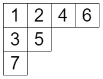
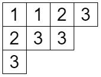
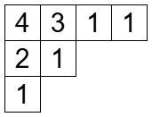
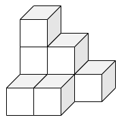
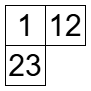
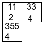


みなさん、combanwa～！組合せ論系 VTuber の早稲くみあです！

先月は休載しちゃってごめんなさい！毎月更新の予定でしたが、研究や配信活動との両立が思ったより大変ですね……。これからも無理のないペースで続けていくので、応援お願いします！

そして、今回の記事は[組合せ論 Advent Calendar 2024](https://adventar.org/calendars/10062) の 15 日目の記事です。

## 標準ヤングタブローと半標準ヤングタブロー

今回のテーマはヤング図形にいろいろ書き込むことです。代表的なものが標準ヤングタブローと半標準ヤングタブローで、こちらの記事で軽く解説しています。

[私の大好きなヤング図形について紹介します！【ヤング図形 1】](../young1/)

このように、ヤング図形にはいろいろなものを書きこむことができます。今回はそれをさくさくと見ていきましょう！

## いろいろ書き込みましょう！

### 標準ヤングタブロー

まずは標準ヤングタブローです。これは以前説明した通りですが復習します。$n$ 個のマスがあるヤング図形に $1,2,\ldots,n$ を書き込み

- 各行について単調増加
- 各列について単調増加

となるようにしたものです。

標準ヤングタブローは対称群の表現論に登場します。そしてその個数はフック長公式で求めることができます。解説は箱星さんが月刊組合せ論 Natori で書いているので、ぜひ読んでみてください。

[【月刊組合せ論 Natori】フック長公式【2023 年 5 月号】](../../natori/202305/)

### 半標準ヤングタブロー

半標準ヤングタブローも以前解説しましたね。これも簡単に復習すると

- 各行について広義単調増加
- 各列について狭義単調増加

となるものです。行の方は同じ数字が並んでもいいということです。

こちらは一般線形群の表現論に登場します。個数を表す公式もあって、こちらも箱星さんが解説しています。

[【月刊組合せ論 Natori】半標準ヤングタブローの個数【2024 年 5 月号】](../../natori/202405/)

### reverse plane partition

じゃあ列の方も同じ数字が並んでいいことにするとどうなるの？と思った人もいるかもしれません。実はちゃんとあって、reverse plane partition といいます。日本語訳はあるのでしょうか？逆平面分割でしょうか？

話はそれますが、日本語訳がない専門用語っていっぱいありますよね。個人的にはどんどん日本語訳をしていってほしいなって思うんですけど、「第一人者じゃない人が勝手に訳語を作るのはよくない」っていう意見も見たことがあるので、私が勝手に訳語を作るのはよくないのかなーっていう思いもあります。第一人者のみなさん、よろしくお願いします！

さて、reverse plane partition の個数ですが、$i$ 行目の各マスに $i-1$ を足すことで半標準ヤングタブローとの対応が得られます。このことから、半標準ヤングタブローの個数公式が使えることになりますね。

### 平面分割

reverse plane partition の何が reverse なのかといいますと、平面分割というものの逆ということです。平面分割は

- 各行について広義単調減少
- 各列について広義単調減少

をみたすものです。増加と減少で逆になってますね。

各マスの上に、そのマスに書かれた数字の分だけ箱を積み上げることでこんな感じの図形になります。これは箱星さんのアイコンですが、実は平面分割なんです。

平面分割をこのように表したものを 3 次元ヤング図形と呼ぶ人もいます。

平面分割の母関数はマクマホンの公式とも呼ばれていて、物理とも関係がある興味深い公式です。これも箱星さんが以前解説していたので、ぜひ読んでみてください。

[【月刊組合せ論 Natori】平面分割の母関数【2023 年 7 月号】](../../natori/202307/)

## もっと自由に書き込みましょう！

ここまではヤング図形に一つの数を書き込んでいましたが、もっと書き込むことだってできちゃいます！

12 のマスは「じゅうに」ではなく 1 と 2 を書き込んだということです。このような図形は set-valued タブローといいます。半標準ヤングタブローはシューア多項式の研究で使われますが、set-valued タブローはグロタンディーク多項式というものの研究で使われるそうです。

個数を表すきれいな公式は見つかっていないみたいですが、実は個数は必ず奇数になることが知られているみたいです！

Taikei Fujii, Takahiko Nobukawa, Tatsushi Shimazaki. The number of the set-valued tableaux is odd. [arXiv:2305.06740](https://arxiv.org/abs/2305.06740).

set-valued タブローでは数を書く順番は自由でしたけど、こんな風にフックの形に書いたものもあります。その名も、hook-valued タブローです！

これもグロタンディーク多項式の研究に使われるみたいです。（一口にグロタンディーク多項式と言っていますが色々な種類があります）

## まだまだいろいろあります！

ここで紹介したものはごく一部です。もっと独創的な書き込み方があります。ヤング図形の外側に書き込んだり、数以外を書き込んだりしてもいいかもしれませんね。

そのどれもが、ただの遊びじゃなくてちゃんと意味のある数学研究に由来しているというのがすごいですよね！組合せ論は、ただの遊びに見えてもすごい研究につながっているというところが面白いと思ってます。別の見方では、最先端の難しい数学が、組合せ論を通じて楽しいパズルになることもあります。

今後も組合せ論系 VTuber として楽しい組合せ論の話題をお届けしていきたいと思ってます！

全 6 回を予定しているヤング図形の連載も折り返しとなりました。後半も応援よろしくお願いします！

以上、早稲くみあでした！bye-jection！

## 参考文献

- Stanley, Richard P. Enumerative combinatorics. Volume 2. 2nd edition. Cambridge University Press (2024).