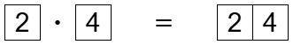
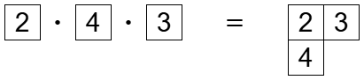
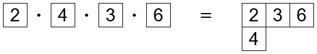
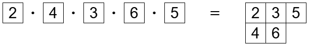
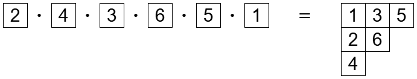
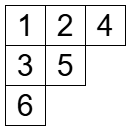

みなさん、combanwa～！組合せ論系 VTuber の早稲くみあです！


昨日はバレンタインデーでしたね。当日はチョコづくり配信をしていました。見に来てくださった方、ありがとうございました！ちょっと失敗しちゃいましたけど、楽しかったです！

ところで、板チョコってヤング図形みたいですよね？というわけで今回も、ヤング図形の魅力を語っていきますよ～！

## まずはプラクティックモノイドの復習から

前回の記事でプラクティックモノイドを定義しました。2 つの半標準ヤングタブローのかけ算を定義できるという内容でした。

[【くみあラボ】ヤングタブローのかけ算！？【ヤング図形 4】](../young4/)

## タブロー P の作り方

RSK 対応の前に RS 対応、つまりロビンソン・シェンステッド対応を説明します。

RS 対応は順列 $x=(x_1,\ldots,x_n)$ から 2 つの標準ヤングタブローを作る方法です。これは一対一対応になります。

まず 1 つ目のタブロー $P$ を作ります。それは、これです！

$$
P=\boxed{x_1}\cdot \boxed{x_2}\cdots \boxed{x_n}
$$

ここで $\boxed{x_1}$ というのは $x_1$ が書かれた 1 マスだけからなるタブローです。順列 $(x_1,\ldots,x_n)$ から 1 マスだけのタブローを $n$ 個作って、順番にかけていくことで $P$ ができます。

試しに $x=(2,4,3,6,5,1)$ で試してみましょう。







## タブロー Q の作り方

タブロー $P=\boxed{x_1}\cdot \boxed{x_2}\cdots \boxed{x_n}$ の計算例を先ほど見ました。順番にかけていくことでタブローを作っていたんですが、書いてある数字を忘れて形だけに注目してみます。

連載の最初の記事で「標準ヤングタブローというのは、ヤング図形の成長記録です。」と書いたように、この成長記録をタブローとして見るのは大事なんです。このタブローこそが、タブロー $Q$ です！



こうして 2 つのタブロー $P,Q$ ができました。RS 対応は順列 $x$ から組 $(P,Q)$ を得る操作のことです。RS 対応の性質を紹介します。どれをとっても不思議で、奇跡のように見えてしまいます。


**定理**
1. RS 対応は、長さ $n$ の順列の集合と、サイズ $n$ の同じ形をもつ 2 つの標準ヤングタブローの組との間の一対一対応である。
2. $x$ に対応するタブローの組が $(P,Q)$ のとき、$x$ の逆順列に対応するタブローの組は $(Q,P)$ である。
3. $x$ の最長増加部分列の長さは、$P,Q$ の一行目の長さに等しい。
4. $x$ の最長減少部分列の長さは、$P,Q$ の一列目の長さに等しい。


## 挿入を使った解釈

タブロー $P$ を計算するとき、タブロー $T$ に 1 マスだけのタブローをかけた $T\cdot\boxed{x}$ を計算する場面がよく出てきましたね。これがどんなふうになっているか見てみましょう。

$T$ が

```
12234
234
3
```

のとき、$T\cdot\boxed{2}$ は

```
12224
233
34
```

です。タブロー $T$ のワードは 3|234|12234 です (わかりやすさのために縦棒を入れています)。このワードの右端に 2 を加えて、クヌース同値で変換していきます。クヌース同値とはこのような変換で移り合う関係でした。

- $x<y\le z$ のとき、$yzx$ を $yxz$ にできる。
- $x\le y<z$ のとき、$xzy$ を $zxy$ にできる。

では実際にやっていきましょう！

```
122342 -> 122324 -> 123224 -> 132224 -> 312224
```

これは「$\text{(古い 1 行目)}\cdot x=y\cdot\text{(新しい 1 行目)}$」ととらえられます。どのような $y$ が出てくるでしょうか。

それは、$x$ より大きい要素のうち最も左端のものです。

というわけで、$T\cdot\boxed{x}$ の計算は次のようなアルゴリズムで説明できます。

- $T$ の 1 行目から、$x$ より大きい要素のうち最も左端のものを $y$ とする。$y$ のある位置に $x$ を置く。
- $T$ の 2 行目から、$y$ より大きい要素のうち最も左端のものを $z$ とする。$z$ のある位置に $y$ を置く。
- もし $z$ より大きい要素がなければ、3 行目の末尾に $z$ を置く。

これをシェンステッドのアルゴリズムといいます。RS 対応をこれで定義する文献が多いですね。

クヌース同値はミクロなものの見方でしたが、それをマクロに捉えたといえますね。なお実際には順番が逆で、シェンステッドのアルゴリズムが先にあってその後にクヌース同値が生まれました。

## Viennot の影

RS 対応の別の見方として、Viennot の geometric construction と呼ばれるものがあります。

（ここに実際に遊べるサイトのリンクを張っていたんですが、サイトが無くなってしまいました……）

## ついに RSK 対応の登場です！

RS 対応では $x$ を順列にしていましたが、一般の数列にしても大丈夫です。この場合、$Q$ は標準ヤングタブローのままですが、$P$ は半標準ヤングタブローになります。

では $Q$ も半標準ヤングタブローになるような対応はないのかな？と考えたくなりますね。それこそが、RSK 対応です！

RSK 対応では順列や数列の代わりに、成分が非負整数の行列が登場します。

$$
\begin{pmatrix}
0 & 2 & 1 \\
1 & 1 & 0 \\
2 & 3 & 1
\end{pmatrix}
$$

行列が置換行列のとき、RSK 対応は上で紹介した Viennot の方法と同じになります。フルトンの『ヤング・タブロー』には「行列と玉の方法」というアルゴリズムが載っていて、これは Viennot の方法を一般の行列に拡張したものとなっています。

RSK 対応の詳細を書きたいところですが、時間が足りなくなってきたので割愛させてください。

## 奇跡

今では様々な分野で RSK 対応が研究されています。RSK 対応の亜種や一般化も考えられています。

そんな RSK 対応は、**奇跡**だという人がいます。

> What matters is that each RSK appearance is a shadow of one fundamental result that is yet to be formalized. This suggests we treat RSK as **the one true miracle** which causes much of what we consider magical about the symmetric group.
>
> (Igor Pak. WHAT IS A COMBINATORIAL INTERPRETATION?)

世界には不思議なことがいっぱいありますよね。なぜ生命があるのか。なぜ宇宙が生まれたのか。私にとっては、なぜ RSK 対応があるのかが不思議です。

RSK 対応には 2 つのタブローの組が出てきましたけど、素人的考えで 3 つ以上のタブローを考えたくなります。でもこれはいい性質がないみたいです。

このことを箱星さんに話したところ、こんなエピソードを紹介してくれました。J. H. コンウェイという数学者は、モンスターという群について「死ぬまでにはモンスターが存在する理由を理解したい」と言っていたそうです。モンスターは有限単純群の中で散在型と呼ばれるクラスに属する群で、散在型の群の中で最も位数が大きい群ですね。そのような群があるだけでも不思議なのに、「ムーンシャイン」というさらに不思議な現象もあります。どうしてこのような不思議な群が存在するのか、コンウェイは理解したかったのでしょう。残念ながらコンウェイはコロナ禍の中で亡くなってしまいました。今後コンウェイの夢を叶える研究が出てくるかもしれません。私も何か貢献したいですが、今の私ではモンスターの足元にも及びません……。

話がそれてしまいましたが、RSK 対応も不思議です。この不思議さに感謝ですね。


## おわりに

というわけで、至高を超えて奇跡のアルゴリズム、RSK 対応を紹介しました！

厳密な定義は時間がなくて紹介できなくてごめんなさい！

いよいよ次回はヤング図形に関する連載の最終回です！楽しい話題をお届けできればと思います。

以上、早稲くみあでした！bye-jection！
