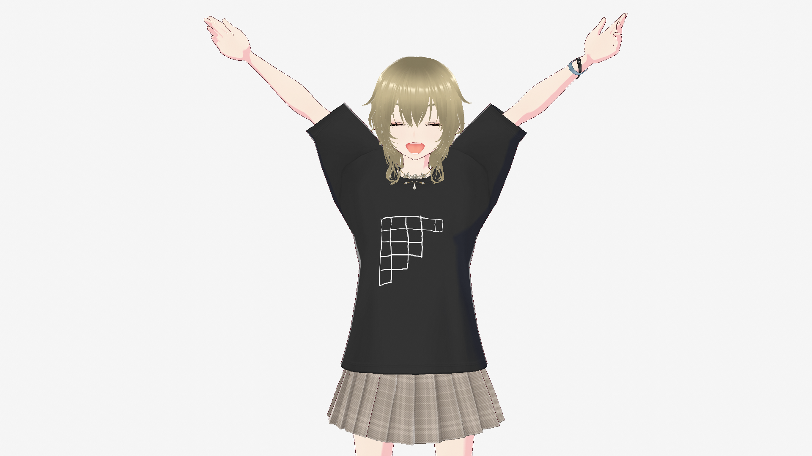
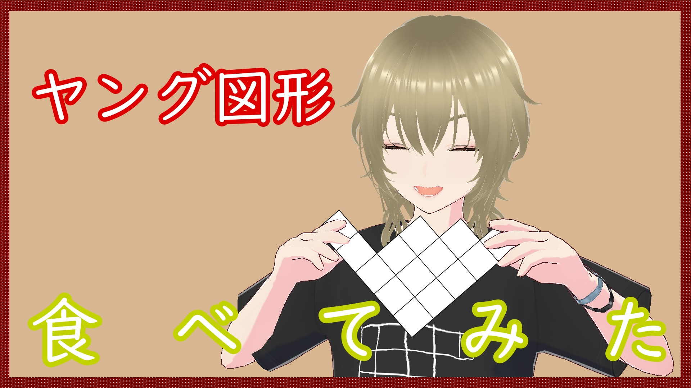
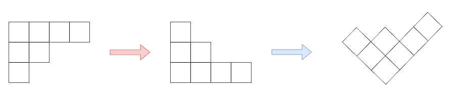
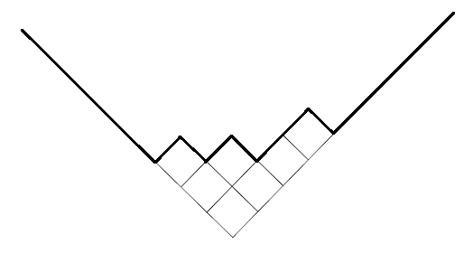

みなさん、combanwa～！組合せ論系 VTuber の早稲くみあです！

ついに、ヤング図形の連載も最終回になりました！

私の大好きなヤング図形の魅力が少しでも伝わっていたらうれしいです。

それでは今回も早速始めていきましょう！

## ヤング図形はとがってる？

最初の記事でも載せたこの動画ですけど、「とがってて痛そう」っていうコメントもいただきました。確かに食べにくいかもしれません。

でも、そんな人のために、なめらかなヤング図形があるってことを知ってほしくてこの記事を書くことにしました。

## 極限形状

今回紹介するのは、ヤング図形の極限形状という話題です。要するに、ヤング図形の箱の数を無限に大きくしていったとき、どんな形になるか、という問題です。

箱の増やし方はいろいろありますが、ここではプランシュレル測度というものに従って箱を増やしていきます。プランシュレル測度というのは、順列を一様ランダムに選んだとき、ロビンソン・シェンステッド対応で対応するヤング図形を考えるということです。

もちろんそのまま増やし続けると図形も無限に大きくなっちゃうので、箱が $n$ 個あるときは箱の一辺の長さを $\frac{1}{\sqrt{n}}$ にします。こうすると全体の面積が 1 のままになります。

さらに、上下反転した上で $45^{\circ}$ 回転させます。

ヤング図形の上側の部分を見ることで、ヤング図形の形を調べようということです。

このとき、極限形状は次の式で表せることが知られています。

$$
\Omega(x)=\begin{cases}
\frac{2}{\pi}(x\arcsin \frac{x}{2}+\sqrt{4-x^2}) & |x|\le 2 \\
|x| & |x|\ge 2
\end{cases}
$$

アークサインが出てくるのが不思議に感じますね。これは Logan-Shepp-Vershik-Kerov の極限形状と呼ばれています。

## まだまだあります！

確率を変えることで、他の極限形状がでてきます。例えば、大きさ $n$ のヤング図形の集合から一様ランダムに選ぶということも考えられます。

他にも、「成分が相異なる分割」のように組合せ論や数論と関係のある分野からヤング図形を考えることもできますし、表現論に由来するものもあります。そうして様々な確率を考えたうえで、極限形状を考えるという研究も行われています。

しかも、物理とも関係があるみたいです！私はこの辺りのことは全然知らないんですけど、知りたいことがまだまだあるってすごくワクワクします！

今回厳密な話は全然できなかったんですが、きっと箱星さんが Natori で解説してくれると思います。（このことを箱星さんに話したら苦い顔をしていましたが……）

## 締めくくりの挨拶

というわけで、全 6 回のヤング図形の連載を無事に終えることができました！

次回からは別のテーマで連載を書く予定です。そして、変更になって申し訳ないんですが、同じテーマで 6 個の記事を書くのが結構大変だったので、次回からは 4 個になります。

テーマについては次回発表します。楽しみに待っていてください！

それでは、これで終わりにしようと思います！早稲くみあでした！bye-jection！
