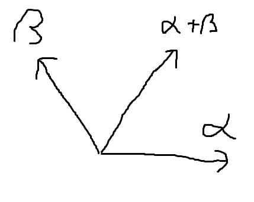
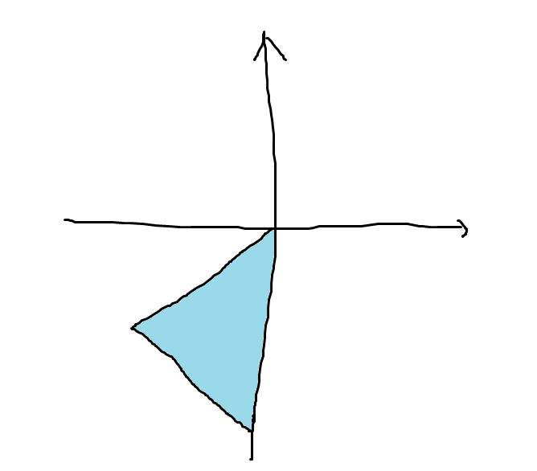
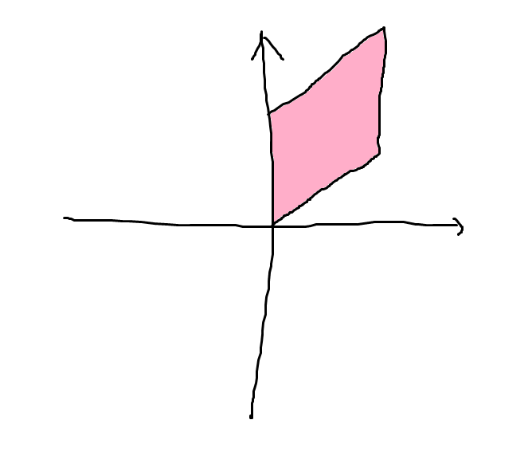

## 巻頭言

世間はゴールデンウィークである。遊びに出かける人もいれば、家でゆっくり過ごす人もいるだろう。そんな中、数学などの勉強をする人もいる。なぜ貴重な休みに勉強をするのかと疑問に思う人も多いかもしれない。私の答えは単純で、そこに知りたいことがあるから勉強しているのである。ゴールデンウィークこそ絶好の探究日和である。

## 探究 002

### 探究の始まり

4 月 8 日、次のようなプレプリントが公開された。

- Federico Castillo, Damian de la Fuente, Nicolas Libedinsky, David Plaza. Paper BOAT. [arXiv:2504.04489](https://arxiv.org/abs/2504.04489)

Paper BOAT というタイトルだけでは何もわからない。ただ、著者の 1 人である Libedinsky は別の論文で見かけたことがある。表現論についてのサーベイを書いていた。

- Libedinsky, Nicolas. IntroSurvey of representation theory. J. Indian Inst. Sci. 102, No. 3, 907-946 (2022).

というわけで、プレプリントを眺めてみる。すると、カラフルなタイリングのイラストが載っていた。筆者はこういった図が好物である。加えて内容も興味深い。以上の理由により、このプレプリントを探究の起点とすることにした。

### BOAT とは？

タイトルの Paper BOAT には 2 つの意味が込められている。1 つは実際にボートであり、タイリングの図形の一種がボートに似ているから名付けられた。もう 1 つは Bruhat Order and Alcovic Tilings の略語である。

定義 1.2 および定義 2.11 に paper boat の定義が載っている。

ChatGPT によれば

> Paper Boat は「1 つの Bruhat 区間の中で、その層（レベル）だけを取り出すもの」です。
> - $I_a(\lambda)$：下から「$\lambda$ 以下すべて」を含む。
> - でも、$\mu\prec\lambda$ に対応する部分はすでに以前に扱っている。
> - そこで、それらを除いた差分が Paper Boat。

とのこと。本当だろうか。

今回の目標は論文の主張を正確に追うことではなく、$A_2$ や $A_3$ などの場合に具体例を作ることである。例示は理解の試金石というように、具体例を作ることも大切な行為である。

Paper Boat の正確な定義は

$$
PB_a(\lambda)=\mathcal{I}_a(\lambda)\setminus\bigcup_{\mu\lessdot\lambda}\mathcal{I}_a(\mu)
$$

である。ここで

- $\lambda\in (\Lambda^{\vee})^+$
- $a\in\mathcal{F}$
- $\mu\lessdot\lambda$ は poset $(\Lambda^{\vee})^+$ における covering relation
- $\mathcal{I}_a(\lambda)= [\mathrm{id}, \theta_a(\lambda)] = \{x\in W_{\mathrm{aff}}\mid x\le \theta_a(\lambda)\}$

である。さらに探究すべきことが増えた。順に見ていこう。

- $(\Lambda^{\vee})^+$ は dominant coweight からなる集合
- $\mathcal{F}=\{a\in W_{\mathrm{aff}}\mid \mathcal{A}_a\subset -\Pi^+\}$
- covering relation $x\lessdot y$ とは、$x<z\le y$ ならば $z=y$ となること。つまり $x,y$ の間に元がないこと。
- $[\mathrm{id}, \theta_a(\lambda)]$ は lower Bruhat interval と呼ばれている。$\theta_a(\lambda)$ 以下の元の集合ということ。

次に $\mathcal{A}_w$ の定義を追いたいが、その前に alcove を見ていく。$A_2$ 型の場合、論文の図にあるような平面に三角形を敷き詰めたものになる。一つ一つの三角形が alcove と呼ばれるようである。alcove 全体の集合が $\mathcal{A}$ である。

$\mathcal{A}_{\mathrm{id}}$ は fundamental alcove と呼ばれ

$$
\mathcal{A}_{\mathrm{id}}=\{x\in E\mid \forall \alpha\in\Phi^+, -1<\langle x,\alpha\rangle <0\}
$$

により定義される。$A_2$ の場合、図 2 における赤い三角形である。

$\mathcal{A}_w=w(\mathcal{A}_{\mathrm{id}})$ と定義される。アフィンワイル群が作用している。$W_{\mathrm{aff}}\to\mathcal{A}, w\mapsto \mathcal{A}_w$ は全単射になる。

Paper Boat の定義に現れる $\theta_a(\lambda)$ を定義する。$\mathcal{A}_{\theta_a(\lambda)}=\mathcal{A}_{w_0a}+\lambda$ をみたす唯一の $W_{\mathrm{aff}}$ の元として定義される。

ChatGPT に聞いてみると

> ここがポイント！
>
> - $w_0$ は「反転する」役割。
> - $a$ は基本領域の壁にある点で、これを $w_0$ で反転させ、さらに $\lambda$ だけ「押し上げる」。
> - こうして得られる位置 $w_0a+\lambda$ を基準に、新しい alcove（部屋）を指定する。
>
> つまり、「支配的な方向に押し出した alcove」を作るための操作です。

とのこと。本当だろうか。

### 具体例を作る

ある程度理解ができたところで、いよいよ $A_2$ 型の場合に具体例を作っていく。

ところで、筆者の知る $A_2$ 型ルート系は 2 種類の表現がある。1 つは $\alpha=(1,-1,0),\beta=(0,1,-1)$ を単純ルートとするもので、もう 1 つは次の図のようなものである。

前者の $\alpha,\beta$ は $\mathbb{R}^3$ の元であるが、各座標の和が 0 という制約があるので 2 次元空間に属するといえる。この 2 種類の表示を同一視しよう。$(1,-1,0)\mapsto (\sqrt{2},0), (0,1,-1)\mapsto(-\frac{\sqrt{2}}{2}, \frac{\sqrt{6}}{2})$ という線形同型を考える。内積も保っている。

本文中にも書かれているが、$A$ 型では自己双対となる。つまりルート系と余ルート系を同一視してよい。余ウェイトの集合 $\Lambda^{\vee}$ は

$$
\mathbb{Z}(\frac{\sqrt{2}}{2},\frac{\sqrt{6}}{6})\oplus\mathbb{Z}(0,\frac{\sqrt{6}}{3})
$$

となる。fundamental alcove $\mathcal{A}_{\mathrm{id}}$ を計算すると、3 頂点が $(0,0),(0,-\frac{\sqrt{6}}{3}), (-\frac{\sqrt{2}}{2},-\frac{\sqrt{6}}{6})$ の三角形となる。

ここに来て、論文中の図とこの図では回転のずれがあることに気がついた。これは $\alpha,\beta$ のとり方が原因である。ルートのなす格子とウェイトのなす格子が異なることに気がついた。致命的な間違いではないのでこのまま進める。

$\Pi^+$ は平行六面体と呼ばれている。計算すると図のようになる。

これは 2 つの alcove からなる。$\mathcal{F}$ の元はこれらの alcove を指定することと対応するので、この場合 $\mathcal{F}$ は 2 元集合であるとわかった。

$w_0$ の作用を具体的に計算する。$S_3$ の最長元は $321$ である。最初に述べた同一視を思い出すと、$a\alpha+b\beta$ は $(a,-a+b,-b)$ と対応し、1,3 番目を入れ替えた $(-b,-a+b,a)$ は $-b\alpha-a\beta$ と対応する。このことから、$w_0(x,y)=(\frac12x-\frac{\sqrt{3}}{2}y, -\frac{\sqrt{3}}{2}x-\frac12y)$ となる。ある軸に沿った反転を表す線形写像である。ChatGPT の発言も正しそうだ。

$\mathcal{F}=\{a\in W_{\mathrm{aff}}\mid \mathcal{A}_a\subset -\Pi^+\}$ および $\mathcal{A}_{\theta_a(\lambda)}=\mathcal{A}_{w_0a}+\lambda$ という関係を見ると、$\Pi^+$ を $-1$ 倍した後、$w_0$ で反転させている。どういう意味があるのだろうか。無駄に見えるが、$A_2$ に特有のことかもしれない。

いよいよ大詰めだ。$\mathcal{I}_a(\lambda)= [\mathrm{id}, \theta_a(\lambda)] = \{x\in W_{\mathrm{aff}}\mid x\le \theta_a(\lambda)\}$ に現れる $\le$ はアフィンワイル群における Bruhat 順序であり

$$
PB_a(\lambda)=\mathcal{I}_a(\lambda)\setminus\bigcup_{\mu\lessdot\lambda}\mathcal{I}_a(\mu)
$$

に現れる $\lessdot$ はドミナンス順序における covering relation である。ドミナンス順序は、$\lambda-\mu$ が $\alpha,\beta$ の非負係数線形結合で表せるとき $\lambda\ge\mu$ となる順序である。

これらの順序の関係については命題 3.1 で述べられている。


**命題**: $x,y\in W_{\mathrm{aff}}^+$ とする。Bruhat 順序で $x\le y$ であることは、$\nu\equiv \mu\bmod{\mathbb{Z}\Phi}$ をみたすすべての $(\nu,\mu)\in V(x)\times V(y)$ に対してドミナンス順序で $\nu\le\mu$ が成り立つことと同値である。


ドミナンス順序の方が扱いやすいらしい。これをもとに計算すると、$\mathcal{I}_a(\lambda)$、つまりある元以下の元からなる集合が図 1 (a)(b) において上側の境界と左右の直線で囲まれた部分であることがわかった。

この論文の最初の主定理は次のようなものである。

$$
\mathcal{I}_a(\lambda)=\bigsqcup_{\mu\le\lambda}PB_a(\mu)
$$

$PB_a(\lambda)$ の定義を考えるとそれはそうという感じがするが、disjoint であることが自明ではないらしい。

### 探究の余地

この先には Paper Boat の大きさを求める式や、多面体の格子点に関する幾何学的な話題など、面白そうな事柄がたくさんある。しかし思ったより長くなってしまったのでこの辺りで探究を中断することにする。

機会があれば探究を再開したい。

## 編集後記

文章は線形に書かれるが、人間の思考は線形に進むとは限らないという発言をみた。筆者が論文を読むときも、最初から順番に読むことはあまりしない。そういった手探り感を本文中でも表現したかったのだが、やはり文章は線形に書かざるを得なかった。

この雑誌を創刊したときと比べて数学への意欲が回復してきた。一方で、そろそろ就活が始まる。就職後も探究を続けていくことができれば幸いだが、どうなるかはわからない。とにもかくにも、これからの人生でも探究は続けていくつもりである。そこに知りたいものがあるから。
