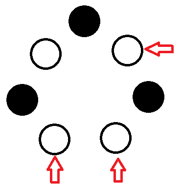

## 巻頭言

数学を自分のものにするにはどうすればよいか。大事なのは、手を動かすことである。

与えられた主張を鵜呑みにするのではなく、一度疑ってみたり、確かめてみたりする。自分の手で計算すると、書かれていないことがわかってきたり、点と点がつながったりする。このような訓練を繰り返せば、数学を自由に扱えるようになるだろう。

しかし、現状は厳しい。効率化の名のもとに、自分の手で失敗するというチャンスが奪われている。追い打ちをかけるように AI も発展している。AI のおかげで知識が手に入ったと思っている人も多いようだが、AI は人間の思考力を奪っている。その結果は、「自分のものになる」とは程遠い「奴隷化」である。

Math 人でも AI の利用を試みているが、あくまでも補助としての利用にとどめているつもりである。AI を利用する者と AI の奴隷になる者の差は大きい。

## 探究

今回の探究の起点は以下のプレプリントである。

- Gábor Damásdi, Nóra Frankl, János Pach, Dömötör Pálvölgyi. Monochromatic configurations on a circle. [arXiv:2504.10687](https://arxiv.org/abs/2504.10687)

ChatGPT に要約してもらった。その末尾の一文がこれである。

> 全体として、ラマゼイ理論と数論（特にBeatty列と分割問題）を巧みに結びつけた研究であり、幾何と離散数学の交差点における深い洞察が示されています。

普通はラムゼー理論と呼ぶと思う。

それはともかく、ラムゼー理論や数論は気になっているので深く探究していきたい。

### どのような問題を扱っているか

Stromquist の予想を扱っている。American Mathematical Monthly の問題に触発されて生まれた問題で、とある会議の Problem Session で発表されたようだ。


円周上に $2^k-1$ 個の点が等間隔に並んでいる。これらの点を 2 色のうちのいずれかで塗る。このとき、同色の $k$ 個の点であって弧の長さの比が $1:2:\cdots:2^{k-1}$ (順番は問わない) となるものは常に存在するか。


例として、$k=3$ として次のように 7 点に色を塗ったとき、赤い矢印で示す 3 点を選べばよい。

このプレプリントの主定理は Stromquist の予想の逆である。弧の長さの比が $d_1,\ldots,d_k$ であるような同色の $k$ 個の点を必ずとれるとき、$d_i=2^{k-i}$ であるといったものである。

### ラムゼー理論との関連

ラムゼー理論の代表的な主張は「6 人がいたとき、どの 2 人も知り合いであるような 3 人組が存在するか、どの 2 人も知り合いでないような 3 人組が存在する」である。

人を頂点とする完全グラフを考え、知り合いであるか知り合いでないかに応じて辺に色を塗ることを考えると、辺が同色の三角形が存在することと言い換えられる。

上で挙げた Stromquist の予想はラムゼー型の問題といえる。どのような色の塗り方をしても、同色のものを選ぶことができるという点で似ている。

ChatGPT に他のラムゼー型問題を挙げてもらった。

- Erdős–Szekeres の定理 (任意の $n$ に対して、十分多い点が一般の位置に配置されているとき、凸 $n$ 角形をなす点を選ぶことができる)
- van der Waerden の定理 (正の整数を有限色で塗ったとき、同色の等差数列が存在する)
- Schur の定理 (正の整数を有限色で塗ったとき、$a+b=c$ をみたす同色の正の整数 $a,b,c$ が存在する)

Erdős–Szekeres の定理と聞くと増加・減少部分列に関する定理を思い出すが、それとは別のようだ。Wikipedia には Happy ending problem という名前で載っていた。これがラムゼー理論と結びつくようには見えないが、調べてみると実際にそうなるらしい。探究したくなる。

van der Waerden の定理の説明として次のようなものがあったことを思い出した。素数かそうでないかに応じて 2 色に塗り分けたとき、同色の等差数列が存在する。ここで素数からなる等差数列が存在することが言えればグリーン・タオの定理が従うが、実際には $4,6,8,10,12,\ldots$ のような素数でない等差数列が存在するので、素数からなる等差数列については van der Waerden の定理からは何も言えない。

Schur の定理は YouTube チャンネルで扱った。フェルマーの最終定理と組み合わせて素数の無限性を証明している。



### 寄り道

ここでラムゼー理論に関する次のプレプリントの存在を思い出した。

- Bryce Alan Christopherson. Ramsey-Theoretic Characterizations of Classically Non-Ramseyian Problems. [arXiv:2502.04311](https://arxiv.org/abs/2502.04311)

このプレプリントによれば

- グリーン・タオの定理
- 双子素数予想
- Zhang の bounded prime gap theorem

などがラムゼー理論の言葉で書けるらしい。これを見た当時驚いた記憶がある。せっかくの機会なので寄り道して調べていこう。

ラムゼー数の概念を拡張しているようだ。ガロア型ラムゼー数というものも定義されている。ラムゼー数とある多項式の関係が述べられており、代数的に取り扱うことができるようだ。

これ以上は寄り道しすぎて迷ってしまうかもしれないので、一旦ここまでとする。

### ゲームとの関連

主定理（Stromquist の予想の逆）を示すための道具は、Beatty 列である。これは実数 $\alpha,\beta$ に対して $a_n=\lfloor \alpha n+\beta\rfloor$ により定まる数列 $(a_n)$ である。

いくつかの Beatty 列によって $\mathbb{N}$ を分割するという問題も様々な研究がある。そしてこの問題は組合せゲームとも関係があると書かれている。Wythoff のゲームが Beatty 列と関係あるらしい。詳しく調べてみよう。

組合せゲーム理論に関する本といえばやはり『組合せゲーム理論の世界』だろう。この本で Wythoff のニムが扱われている。これは 2 つの石の山を用いる石取りゲームであり

- 片方の山から 1 個以上石を取る
- 両方の山から同じ個数だけ石を取る

という操作を行うゲームである。このゲームの必勝判定では黄金比が登場する。驚くべき結果であると述べられている。

この定理の証明では Rayleigh の定理が用いられているが、これはまさに 2 つの Beatty 列が $\mathbb{N}$ を分割することに関する定理である。

また、『組合せゲーム理論の世界』では Wythoff のゲームの一般化として $r$-Wythoff のゲームが扱われている。ここでは黄金比の代わりに別の無理数を使った Beatty 列が関わる。

では、$\mathbb{N}$ を分割するような 2 本の Beatty 列が与えられたとき、それが必勝条件として現れるようなゲームを構成できるだろうかという疑問が浮かんだ。ゲームのルールが与えられて必勝条件やグランディ数を求めるのが普通であるから、これは逆問題といえる。軽く調べてみたところ、以下の論文が関係しそうだ。

- Larsson, Urban; Hegarty, Peter; Fraenkel, Aviezri S. Invariant and dual subtraction games resolving the Duchêne-Rigo conjecture. Theor. Comput. Sci. 412, No. 8-10, 729-735 (2011).

Beatty 列を 2 本ではなく 3 本以上にしたらどうなるかなど、疑問は尽きない。

### 終点

主定理の証明方法や他の話題には触れず、登場する用語をもとに寄り道しただけであるが、ここで探究を終えようと思う。

Math 人は寄り道を楽しむコンテンツなので、真面目な解説は期待しないでほしい。真面目な解説はいずれ Natori などで扱う可能性はある。

## 編集後記

冒頭で手を動かすべきと書いたが、結局自分もできていないのであった。

私事になるが、6 月 2 日から働き始める。労働の疲弊のせいで数学ができなくなるかもしれない。しかし、数学は最も人間らしい営みの一つであるから、引き続き趣味として続けていきたい。
