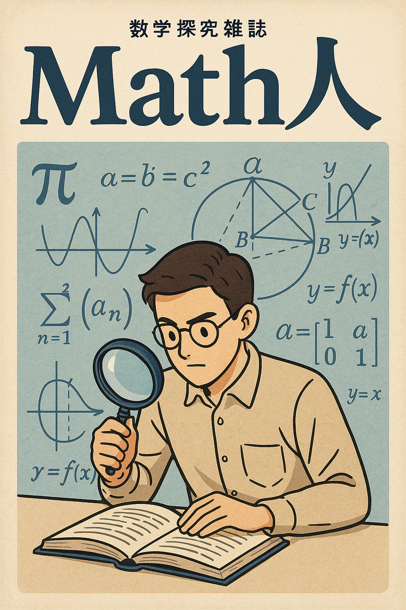

探究という視点から数学に取り組む雑誌です。

(ChatGPT で作成)

**最新号**：[#003](./003/) (Monochromatic configurations on a circle)

## バックナンバー

- [#001](./001/) (On refined enumerations of plane partitions of a given shape with bounded entries)
- [#002](./002/) (Paper BOAT)
- [#003](./003/) (Monochromatic configurations on a circle)
