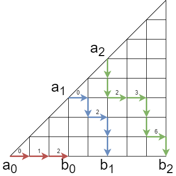

+++
title = "【月刊組合せ論 Natori】EDPC-T Permutation を深掘り【2022 年 9 月号】"
date = 2022-09-01
+++












月刊組合せ論 Natori は面白そうな組合せ論のトピックを紹介していく企画です。Natori の名前の由来は combinatorics の natori の部分です。月刊とついていますが毎月更新できないこともあります。

創刊号の今回はなんと無料！（ずっと無料です）

## EDPC-T Permutation

今回は競技プログラミングの問題である [EDPC-T Permutation](https://atcoder.jp/contests/dp/tasks/dp_t) を紹介します。

競技プログラミングでは与えられた入力に対して適切な出力を行うプログラムを書くことが求められます。今回扱う問題は次のような問題です。

> 長さ $n-1$ の文字列 $s$ が与えられます。$s$ の文字は `<` または `>` です。
> $(1,2,\ldots,n)$ の順列 $p$ であって、各 $i=1,2,\ldots,n-1$ に対して $p_i$ と $p_{i+1}$ の大小関係が $s_i$ であるものはいくつありますか。

実はこの問題は数学的に奥が深く、様々な研究がされてきました。その歴史も古く、1908 年の MacMahon の論文  にも登場します。

この記事ではこの問題を数学的に深掘りすることを目標にします。

## 降下点集合

$(1,2,\ldots,n)$ の順列 $p=(p_1,p_2,\ldots,p_n)$ に対して、**降下点集合** を

$$
\{1\le i\lt n\mid p_i>p_{i+1}\}
$$

により定めます。例えば $(3,1,2,5,4)$ の降下点集合は $\{1,4\}$ です。

降下点集合を用いることで、今考えている問題は次のように言い換えられます。


$\{1,2,\ldots,n-1\}$ の部分集合 $S$ が与えられる。降下点集合が $S$ となるような $(1,2,\ldots,n)$ の順列の個数を求めよ。


この問題の答えを $\beta_n(S)$ とおきます。

## 包除原理

例として $n=6$ とし、降下点集合が $\{3\}$ の順列の個数を求めてみましょう。すなわち $p_1<p_2<p_3>p_4<p_5<p_6$ をみたす順列の個数です。

まず $p_1<p_2<p_3 \ ? \ p_4<p_5<p_6$ をみたす順列の個数を求めましょう。すなわち $p_3,p_4$ の間の大小関係を指定しないものです。まず $p_1,p_2,p_3$ の決め方は、$1,2,\ldots,6$ の中から 3 つを選んで昇順に並べたものなので $\binom{6}{3}=20$ 通りあります。これを決めると $p_4,p_5,p_6$ がただ 1 通りに決まります。ここから余事象の個数、すなわち $p_1<p_2<p_3<p_4<p_5<p_6$ をみたす順列の個数を引きます。これは 1 通りです。よって $p_1<p_2<p_3>p_4<p_5<p_6$ をみたす順列の個数は $20-1=19$ 通りです。すなわち $\beta_6(\{3\})=19$ です。

このように、ある条件をみたすものの個数を求めるときに全体の個数から条件をみたさないものの個数を引くことで求める手法を**包除原理**といいます。条件が 2 個以上でも使えます。

次は降下点集合が $\{3,5\}$ の場合を考えてみましょう。

- $p_1<p_2<p_3<p_4<p_5<p_6$ をみたす順列の個数は $1$
- $p_1<p_2<p_3 \ ? \ p_4<p_5<p_6$ をみたす順列の個数は $\binom{6}{3}=20$
- $p_1<p_2<p_3<p_4<p_5 \ ? \ p_6$ をみたす順列の個数は $\binom{6}{5}=6$
- $p_1<p_2<p_3 \ ? \ p_4<p_5 \ ? \ p_6$ をみたす順列の個数は $\binom{6}{3}\binom{3}{2}=60$
- $p_1<p_2<p_3>p_4<p_5>p_6$ をみたす順列の個数は $\beta_6(\{3,5\})=60-20-6+1=35$

一般の場合も同様です。降下点集合が $S$ である順列の個数を $\beta_n(S)$、降下点集合が $S$ に含まれるような順列の個数を $\alpha_n(S)$ とします。このとき

$$
\beta_n(S)=\sum_{T\subseteq S} (-1)^{|S\setminus T|}\alpha_n(T)
$$

となります。$S=\{s_1,s_2,\ldots,s_k\}$ とすると $\alpha_n(S)$ は多項係数として

$$
\alpha_n(S)=\binom{n}{s_1,s_2-s_1,\ldots,s_k-s_{k-1},n-s_k}
$$

と表されます。したがって

$$
\beta_n(S)=\sum_{1\le i_1<\cdots<i_j\le k}(-1)^{k-j}\binom{n}{s_{i_1},s_{i_2}-s_{i_1},\ldots,s_{i_j}-s_{i_{j-1}},n-s_{i_j} \ }
$$

となります。これで降下点集合が $S$ となる順列の個数を求めることができました。

なお、定義より明らかに

$$
\alpha_n(S)=\sum_{T\subseteq S}\beta_n(T)
$$

が成り立ちます。

## 行列式

多項係数を書き換えることで、$\beta_n(S)$ の式は

$$
\beta_n(S)=\sum_{1\le i_1<\cdots<i_j\le k}(-1)^{k-j}\binom{n}{s_{i_1}}\binom{n-s_{i_1}}{s_{i_2}-s_{i_1}}\cdots \binom{n-s_{i_j}}{n-s_{i_j}}
$$

となります。この式から行列式表示

$$
\beta_n(S)=\det\left(\binom{n-s_i}{s_{j+1}-s_i}\right)_{0\le i,j\le k}
$$

を得ることができます。ただし $s_0=0, s_{k+1}=n$ とおきます。前の例である $n=6, S=\{3,5\}$ では

$$
\beta_6(\{3,5\})=\det\begin{pmatrix}
\binom63 & \binom65 & \binom66 \\
\binom30 & \binom32 & \binom33 \\
0 & \binom10 & \binom11
\end{pmatrix}=\det\begin{pmatrix}
20 & 6 & 1 \\
1 & 3 & 1 \\
0 & 1 & 1
\end{pmatrix}=35
$$

となり、上で求めた数値と一致します。

この行列はほぼ上三角行列の形をしています。通常の行列式計算は時間計算量が $O(n^3)$ ですが、この形の場合 $O(n^2)$ に高速化できます。

## LGV 公式

行列式表示は LGV (Lindström-Gessel-Viennot) 公式から導くこともできます。

まず LGV 公式の主張を述べます。$\Gamma=(V,E)$ をサイクルを含まない有限有向グラフとします。各辺 $e\in E$ の重み $w(e)\in \mathbb{Z}$ が定まっているとします。パス $P=(a_1,\ldots,a_n)$ の重みを $w(P)=w(a_1,a_2)w(a_2,a_3)\cdots w(a_{n-1},a_n)$ により定めます。2 つのパスが交わるとは、共通の頂点を持つこととします。$a_1,\ldots,a_n,b_1,\ldots,b_n\in V$ に対して $n\times n$ 行列

$$
M(a,b)=\left(\sum_{P\colon a_i\to b_j}w(P)\right)_{1\le i,j\le n}
$$

を定めます。ただし和は $a_i$ から $b_j$ へのパス全体をわたるものとします。サイクルを含まないので有限和です。


**定理** (LGV): 条件「$i_1<i_2, j_1>j_2$ ならば $a_{i_1}$ から $b_{j_1}$ へのパスと $a_{i_2}$ から $b_{j_2}$ へのパスは必ず交わる」を仮定する。このとき

$$
\det M(a,b)=\sum_{(P_1,\ldots,P_n)}w(P_1)\cdots w(P_n)
$$

が成り立つ。ここで和は $P_i$ が $a_i$ から $b_i$ へのパスでどの 2 つのパスも互いに交わらないもの全体をわたる。


条件を仮定しないバージョンもありますが、ここでは扱わないので割愛します。

特に重みがすべて 1 のとき、LGV 公式の右辺は非交差経路の本数になります。これを用いて $\beta_n(S)$ の行列式表示を導出しましょう。

順列 $(p_1,\ldots,p_n)$ に対して、$f_j$ を $p_i<p_j$ をみたす $i \ (1\le i<j)$ の個数とします。例えば $p=(2,5,4,1,3)$ のとき $f=(0,1,1,0,3)$ です。$f$ は明らかに $0\le f_i\le i-1$ をみたしますが、逆にこれをみたす数列 $f$ が与えられたとき順列 $p$ を復元することができます。$p_i>p_{i+1}$ と $f_i\ge f_{i+1}$ が同値になります。

降下点集合を $S=\{s_1,\ldots,s_k\}$ とし、$s_0=0,s_{k+1}=n$ とします。グリッドグラフを考え、辺の向きを右または下とします。$a_i=(s_i,s_i), b_i=(s_{i+1},0) \ (0\le i\le k)$ とします。順列 $p$ から作った $f$ に対して非交差経路を作ります。

上の図は $f=(0,1,2,0,2,2,3,6)$ と対応する非交差経路です。$(i,j),(i+1,j)$ を結ぶ横向きの辺にラベル $i-j$ が付いており、通るラベルを順に並べると $f$ となるようになっています。

この対応は全単射となることが示せます。まとめると、降下点集合が $S$ である順列の個数 $\beta_n(S)$ は数列 $f$ の個数に等しく、これは非交差経路の個数に等しいです。LGV 公式より、非交差経路の個数は $\det M(a,b)$ に等しいです。これを求めるには $a_i$ から $b_j$ へのパスの個数を求める必要がありますが、これは普通の最短経路問題で、二項係数 $\binom{s_{j+1}}{s_{j+1}-s_i\ }$ です。したがって

$$
\beta_n(S)=\det\left(\binom{s_{j+1}}{s_{j+1}-s_i}\right)_{i,j}
$$

となります。

## Aitken の公式

さらに Aitken の公式からも行列式表示を導出できます。Aitken の公式は標準タブローの個数を行列式を用いて表す公式です。まず標準タブローについて解説します。

$\lambda=(\lambda_1,\lambda_2,\ldots,\lambda_k)$ が分割であるとは、$\lambda_1\ge\lambda_2\ge\cdots\ge\lambda_k\ge 1$ をみたすことをいいます。$i$ 行目に $\lambda_i$ 個のマスを左詰めで並べたものを $\lambda$ のヤング図形といいます。分割 $\lambda,\mu$ がすべての $i$ に対して $\mu_i\le \lambda_i$ をみたすとき、$\lambda$ のヤング図形の $i$ 行目の左から $\mu_i$ 個のマスを取り除いたものを歪ヤング図形と言います。これを $\lambda/\mu$ と表します。

図は $\lambda=(8,8,6,5,2,1,1), \mu=(6,4,3,3,1)$ の場合です。灰色のマスは取り除かれることを表します。

$\lambda/\mu$ のマスの個数を $n=|\lambda/\mu|$ とします。$\lambda/\mu$ 上の標準タブローとは、マスに $1,2,\ldots,n$ を 1 個ずつ書き込んだものであって

- 各行について左から右に単調増加
- 各列について上から下に単調増加

をみたすものです。

歪ヤング図形上の標準タブローの個数は以下の式によって求められます。


**定理** (Aitken): 歪ヤング図形 $\lambda/\mu$ 上の標準タブローの個数は以下の式に等しい。

$$
n!\det\left(\frac{1}{(\lambda_i-\mu_j-i+j)!}\right)_{i,j}
$$


ただし負の整数の階乗の逆数は 0 であるとします。

この公式から順列の個数 $\beta_n(S)$ を表す公式を導いてみましょう。まず、降下点集合が $S$ であるような順列と、ジグザグ型の歪ヤング図形上の標準タブローが一対一対応することに注意します。

上の図は降下点集合が $S=\{2,5,6\}$ である順列 $(2,5,3,4,8,7,1,6,9)$ を表しています。

$S=\{s_1,s_2,\ldots,s_k\}, s_0=0, s_{k+1}=n$ とすると、$\lambda$ の成分は小さい方から $s_1,s_2-1,s_3-2,\ldots$ となります。またジグザグ型であることから $\mu$ は $\mu_i=\lambda_{i+1}-1$ をみたします。これらを公式に代入して式変形することで

$$
\begin{align*}
\beta_n(S) &= n!\det\left(\frac{1}{(s_{j+1}-s_i)!}\right) _ {0\le i,j\le k} \\
&= \det\left(\binom{n-s_i}{s_{j+1}-s_i}\right)_{0\le i,j\le k}
\end{align*}
$$

が（再び）得られます。

## de Bruijn のアルゴリズム

降下点集合が $S$ で末尾の項が $j$ であるような順列の個数を $\gamma_n(S,j)$ とおきます。$\beta_n(S)=\sum_{j=1}^n \gamma_n(S,j)$ となります。de Bruijn  は次を証明しました。


**定理**: $n-1\not\in S$ ならば

$$
\gamma_n(S,j)=\sum_{1\le i<j}\gamma_{n-1}(S,i)
$$

をみたし、$n-1\in S$ ならば

$$
\gamma_n(S,j)=\sum_{j\le i\le n-1}\gamma_{n-1}(S\setminus\{n-1\},i)
$$

をみたす。


証明をします。$n-1\not\in S$ とし、$(p_1,\ldots,p_n)$ を降下点集合が $S$ で末尾の項が $j$ である順列とします。$p_n$ を削除し、$p_1,\ldots,p_{n-1}$ について $j$ より大きい数を 1 減らします。すると降下点集合が $S$ となる $(1,2,\ldots,n-1)$ の順列が得られます。$n-1\not\in S$ より末尾の項は $j$ 未満です。逆の対応も考えられるので、順列の個数の比較により 1 つ目の等式が得られます。2 つ目の等式も同様に得られます。

## 累積和

Viennot  による累積和を用いたシンプルなアルゴリズムを紹介します。

数列 $(a_1,a_2,\ldots,a_n)$ に対して、左からの累積和という操作を、数列 $(0,a_1,a_1+a_2,a_1+a_2+a_3,\ldots,a_1+a_2+\cdots+a_n)$ を作る操作とします。右からの累積和は $(a_1+a_2+\cdots+a_n,\ldots,a_{n-1}+a_n,a_n,0)$ と定義します。Viennot のアルゴリズムは次のように述べられます。


**定理**: 初め数列は $(1)$ であるとする。$i=1,2,\ldots,n-1$ の順に、$i\not\in S$ ならば左から累積和、$i\in S$ ならば右から累積和をとる。最終的に得られた数列の総和は降下点集合が $S$ である順列の個数 $\beta_n(S)$ に等しい。


例として $n=6, S=\{3,5\}$ とします。これまでの計算から $\beta_n(S)=35$ であることがわかっています。

- 初めの数列は $(1)$
- $1\not\in S$ なので左から累積和をとり、$(0,1)$
- $2\not\in S$ なので左から累積和をとり、$(0,0,1)$
- $3\in S$ なので右から累積和をとり、$(1,1,1,0)$
- $4\not\in S$ なので左から累積和をとり、$(0,1,2,3,3)$
- $5\in S$ なので右から累積和をとり、$(9,9,8,6,3,0)$

最終的に得られた数列の総和は $9+9+8+6+3+0=35$ となり、一致することが確かめられました。

正当性は上述の de Bruijn のアルゴリズムにより保証されます。

## 成瀬のフック長公式

Aitken の公式のセクションで説明したように、この問題は歪ヤング図形上の標準タブローの個数を求める問題に帰着できます。歪でない通常のヤング図形（すなわち $\mu=\emptyset$ の場合）では Aitken の公式は

$$
n!\det\left(\frac{1}{(\lambda_i-i+j)!}\right)
$$

となります。通常のヤング図形では行列式以外の方法でも標準タブローの個数を求めることができます。その中でも特に有名なものがフック長公式です。

ヤング図形のあるマスに関するフックとは、そのマスの右または下にあるマスからなる集合です。（そのマス自身も含む）

あるマスに関するフックに含まれるマスの数をフック長といい、$h_{\lambda}(\square)$ と表すことにします。


**定理** (フック長公式): ヤング図形 $\lambda$ 上の標準タブローの個数は次の式で表せる。

$$
\frac{n!}{\prod_{\square\in\lambda}h_{\lambda}(\square)}
$$


つまり、すべてのマスについてフック長を計算し、かけあわせて逆数をとり、$n!$ をかけたものが標準タブローの個数となります。

フック長公式の歪ヤング図形への一般化は長らく知られていませんでしたが、成瀬のフック長公式と呼ばれる公式が発見されました。

$\lambda/\mu$ を歪ヤング図形とします。まず $\lambda$ のフック長 $h_{\lambda}(\square)$ を計算しておきます。その後、$\mu$ の各マスの上に駒を置きます。右・下・右下に駒が置かれていないような駒を右下に移動させることを基本操作と呼ぶことにします。

基本操作を何回か行います（0 回でもよい）。こうしてできる盤面について、駒が置かれていないマスのフック長の積を計算します。これの逆数をとり、可能な盤面についてこれらを足し合わせます。最後に$|\lambda/\mu|!$ をかけます。こうして得られる値が $\lambda/\mu$ 上の標準タブローの個数に等しいという主張が成瀬のフック長公式です。数式で書くと次のようになります。


**定理** (成瀬のフック長公式): $\lambda/\mu$ を歪ヤング図形とし、基本操作を何回か行って得られる盤面の集合を $\mathcal{E}$ とする。このとき $\lambda/\mu$ 上の標準タブローの個数は次の式で表される。

$$
|\lambda/\mu|!\left(\sum_{E\in\mathcal{E}}\frac{1}{\prod_{\square}h_{\lambda}(\square)}\right)
$$

ここで $\square$ に関する積は盤面 $E$ において駒が置かれていないマス全体をわたる。


$n=6,S=\{3,5\}$ で計算してみましょう。

初期の盤面は左上で、基本操作を何回か行って得られる盤面は 9 通りです。それぞれについてフック長の積を求め、逆数を足し合わせて $6!$ をかけることで、答えである 35 が得られます。

図を見ると駒の置かれていないマスはジグザグ型になっています。一般に $\lambda/\mu$ がジグザグ型になる場合、すべての盤面は左下と右上を結ぶジグザグ型となります。よって左下から出発して右または上に進み右上に到着する動的計画法で $\beta_n(S)$ を計算することができます。

## 高速解法

ここまでで紹介した方法をプログラムにすると、時間計算量が $O(n^2)$ のアルゴリズムとなります。EDPC-T の制約ではこのアルゴリズムでもよいのですが、実はもっと高速に解くことができます。それを簡単に紹介します。

行列式の節で述べたように、答えは行列式で表せます。

$$
\beta_n(S)=\det\left(\binom{n-s_i}{s_{j+1}-s_i}\right)_{0\le i,j\le k}
$$

この行列式を右端の列で余因子展開します。$b_i=(-1)^i\frac{(n-s_i)!}{(n-s_k)!}\beta_n(\{s_1,\ldots,s_i\})$ とおくと

$$
b_i=-\sum_{j=0}^{i-1}b_j\frac{1}{(s_i-s_j)!}
$$

が成り立ちます。新たな数列 $(B_i)$ を

$$
\begin{cases}
B_{s_i} &= b_i \\
B_m &= 0 \quad (m \not\in S)
\end{cases}
$$

により定めます。このとき

$$
B_i=-\sum_{j=0}^{i-1}B_j\frac{1}{(i-j)!}
$$

が成り立ちます。右辺は畳み込みと似た形をしています。relaxed convolution というアルゴリズムにより、時間計算量 $O(N(\log N)^2)$ で求めることができます。

## まとめ

EDPC-T Permutation という競技プログラミングの問題を数学的に深掘りしました。数学の奥深さを感じられたでしょうか。

今後も月刊組合せ論 Natori では様々な組合せ論のトピックを扱っていこうと思います。応援のほどよろしくお願いします！

## 参考文献

