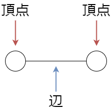
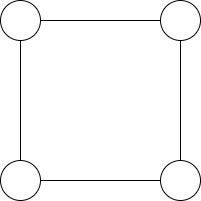
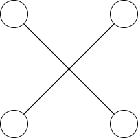
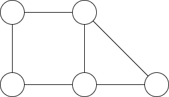


月刊組合せ論 Natori は面白そうな組合せ論のトピックを紹介していく企画です。今回はグラフ理論を扱います。

## 正多面体

みなさんは正多面体の定義、言えますか？

「すべての面が合同な正多角形である立体」ではないです。(双三角錐が反例です)

正多面体とは

- すべての面が合同な正多角形
- どの頂点に集まる面の数も同じ
- 凸である

をみたす立体です。

正多面体は 5 種類存在します。正四面体、正六面体 (立方体)、正八面体、正十二面体、正二十面体です。

正多面体が 5 種類しか存在しないことを証明します。展開図において 1 つの頂点の周りに集まる角度の和を考えるのが有名な証明ですが、ここではグラフ理論を使って証明します。

## グラフ

グラフは頂点と辺で構成されるものです。

頂点の集合を $V$、辺の集合を $E$ と書きます。組 $(V,E)$ をグラフと呼びます。

**平面グラフ**とは平面上に描かれた、辺が交差しないグラフのことです。例えば下のグラフは平面グラフです。

下のグラフは平面グラフではありません。

平面グラフの辺は直線だけでなく、曲線を使ってもよいです。上のグラフは辺を曲線にすることで平面グラフにすることが可能です。

正多面体の頂点と辺からグラフを作ります。形を変えると平面グラフにすることが可能です。正多面体の面を 1 つ外し、そこからぐいーっと引き延ばして平面に伸ばすイメージです。

## 握手補題

ある頂点 $v$ から伸びる辺の数を $v$ の**次数**といい、$\deg(v)$ で表します。このとき、$\sum_{v\in V}\deg(v)=2|E|$ という等式を握手補題といいます。$v$ と $w$ を結ぶ辺があったとき、この辺は $\deg(v)$ と $\deg(w)$ で 2 回現れていると考えられます。証明は容易な補題ですが、結構有用です。

## オイラーの公式

連結平面グラフ $(V,E)$ の頂点数を $|V|$、辺数を $|E|$、領域数を $f$ とすると、$|V|-|E|+f=2$ が成り立ちます。これはオイラーの公式と呼ばれています。

例えば上のグラフでは頂点数は 5、辺数は 6、領域数は 3 です (外側も領域に数えることに注意)。$5-6+3=2$ が確かに成り立っています。

証明をしましょう。辺の数 $|E|$ に関する帰納法を用います。辺の数が 0 のとき、連結性より頂点数は 1 で領域数は 1 なのでよいです。

グラフに閉路がない場合、このグラフは木となります。よって $|V|=|E|+1$ となります (これも帰納法で示せます)。領域数は 1 なので、$|V|-|E|+f=2$ となります。

グラフに閉路がある場合を考えます。閉路に含まれる辺 $e$ を 1 つとります。グラフから $e$ を取り除いても連結なままなので、帰納法の仮定が使えます。辺 $e$ を取り除いたグラフに $e$ を加えることで、辺の数は 1 つ増え、領域の数も 1 つ増えます。よって $|V|-|E|+f$ の値は変わらず 2 となります。

以上でオイラーの公式が示せましたが、1 つだけ注意します。「辺 $e$ を加えると領域の数が 1 つ増える」ことは直感的には自明ですが、ここでは「閉曲線は平面を内部と外部に分ける」という事実が用いられています。これは**ジョルダン曲線定理**と呼ばれており、証明は非常に大変であることが知られています。

## 証明

オイラーの公式を用いて正多面体が 5 種類であることを証明します。

どの頂点に対しても次数は等しいので、これを $d$ とします。面は正 $k$ 角形であるとします。頂点数を $n$、辺数を $m$、領域数を $f$ とします。

握手補題より $dn=2m$ です。また各辺はちょうど 2 つの領域と接するので $2m=kf$ となります (これも握手補題とみなせます)。

オイラーの公式より $2=n-m+f$ となるので、上の式と合わせて $\frac{1}{d}+\frac{1}{k}=\frac{1}{2}+\frac{1}{m}$ を得ます。ここで $d,k\ge 3$ および $\frac{1}{m}>0$ より、$d,k$ の少なくとも一方は 3 に等しいことがわかります。$d=3$ ならば $k\in \{3,4,5\}$、$k=3$ ならば $d\in \{3,4,5\}$ となるので、$(d,k)$ の組は 5 通りです。これらが正多面体と対応することは読者の演習問題とします。

## まとめ

正多面体が 5 種類であることをグラフ理論を用いて証明しました。筆者が初めてグラフ理論を勉強したときに面白いと思った内容なので、面白さが伝われば幸いです。

今後も月刊組合せ論 Natori では様々な組合せ論のトピックを紹介していきます。お楽しみに。

## 参考文献

- [正多面体が５種類しかないことの２通りの証明](https://manabitimes.jp/math/899)
- J.マトウシェク, J.ネシェトリル. 離散数学への招待・上.
- Harris, John M.; Hirst, Jeffry L.; Mossinghoff, Michael J. Combinatorics and graph theory. 2nd ed. Undergraduate Texts in Mathematics. Springer. (2008).
