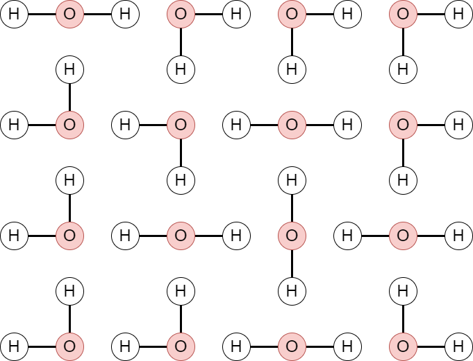
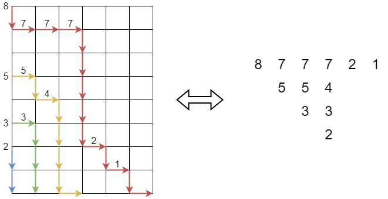


月刊組合せ論 Natori は面白そうな組合せ論のトピックを紹介していく企画です。今回の主役は交代符号行列と呼ばれるものです。

## 交代符号行列

交代符号行列は正方行列であって、成分が $0,1,-1$ のいずれかであり、次の条件を満たすものです。

- 各行・各列の和は 1
- 各行・各列の 0 でない成分は符号が交互に変わる

例を見てみましょう。

$$
\begin{pmatrix}
0 & 1 & 0 & 0 & 0 \\\
0 & 0 & 1 & 0 & 0 \\\
1 & -1 & 0 & 0 & 1 \\\
0 & 1 & -1 & 1 & 0 \\\
0 & 0 & 1 & 0 & 0
\end{pmatrix}
$$

3 行目に注目すると $1,-1,0,0,1$ となっており、和は 1 で、0 でない成分は符号が交互に変わっています。

3 次の交代符号行列をすべて求めてみると、次の 7 通りがあることがわかります。

$$
\begin{pmatrix}
1 & 0 & 0 \\\
0 & 1 & 0 \\\
0 & 0 & 1
\end{pmatrix},
\begin{pmatrix}
1 & 0 & 0 \\\
0 & 0 & 1 \\\
0 & 1 & 0
\end{pmatrix},
\begin{pmatrix}
0 & 1 & 0 \\\
1 & 0 & 0 \\\
0 & 0 & 1
\end{pmatrix},
\begin{pmatrix}
0 & 0 & 1 \\\
0 & 1 & 0 \\\
1 & 0 & 0
\end{pmatrix},\\\
\begin{pmatrix}
0 & 1 & 0 \\\
0 & 0 & 1 \\\
1 & 0 & 0
\end{pmatrix},
\begin{pmatrix}
0 & 0 & 1 \\\
1 & 0 & 0 \\\
0 & 1 & 0
\end{pmatrix},
\begin{pmatrix}
0 & 1 & 0 \\\
1 & -1 & 1 \\\
0 & 1 & 0
\end{pmatrix}
$$

7 つのうち 6 つは置換行列です (各行各列に 1 が一つだけあり、その他が 0 である行列)。一般に置換行列は交代符号行列となっているので、置換行列の一般化であるとみなせます。

なぜこのような行列を考えるのでしょうか。そのルーツは、ルイス・キャロルにあります。

## ルイス・キャロル

ルイス・キャロルはイギリスの作家で、代表作に「不思議の国のアリス」などがあります。ルイス・キャロルはペンネームで、本名をチャールズ・ラトウィッジ・ドジソンといいます。

実はドジソンは数学者でもありました。今回は数学者としての業績に注目していきます。

## Dodgson condensation

Dodgson condensation は行列式を求めるアルゴリズムです。$2\times 2$ 行列の行列式は

$$
\begin{vmatrix}
a & b \\\
c & d
\end{vmatrix}=ad-bc
$$

です。一般の $n\times n$ 行列の行列式を、$2\times 2$ 行列式だけを用いて計算することができます。

Dodgson condensation は次のようなアルゴリズムです。

- はじめ、$A=(a_{i,j})$ を与えられた $n\times n$ 行列、$B=(b_{i,j})$ をすべての成分が 1 の $(n-1)\times (n-1)$ 行列とする。
- $(n-1)\times (n-1)$ 行列 $A^{\prime}=(a^{\prime} _ {i,j})$、$(n-2)\times (n-2)$ 行列 $B^{\prime}=(b^{\prime}_{i,j})$ を次のように定める。
    - $a_{i,j}^{\prime}=(a_{i,j}a_{i+1,j+1}-a_{i,j+1}a_{i+1,j})/b_{i,j}$
    - $b_{i,j}^{\prime}=a_{i+1,j+1}$
- $(A,B)$ を $(A^{\prime},B^{\prime})$ で置き換える。
- この操作を $A$ が $1\times 1$ 行列になるまで繰り返す。
- このときの $A$ の要素が行列式である。

$a_{i,j}^{\prime}$ の計算に $2\times 2$ 行列式が使われています。

試しに

$$
A=\begin{pmatrix}
1 & 2 & 3 & -1 \\\
-2 & 1 & 2 & 0 \\\
3 & 2 & 2 & 1 \\\
1 & -1 & -3 & 2
\end{pmatrix}
$$

の行列式を求めてみましょう。はじめ

$$
A=\begin{pmatrix}
1 & 2 & 3 & -1 \\\
-2 & 1 & 2 & 0 \\\
3 & 2 & 2 & 1 \\\
1 & -1 & -3 & 2
\end{pmatrix}
,B=\begin{pmatrix}
1 & 1 & 1 \\\
1 & 1 & 1 \\\
1 & 1 & 1
\end{pmatrix}
$$

です。操作を行うと次のようになります。

$$
A=\begin{pmatrix}
5 & 1 & 2 \\\
-7 & -2 & 2 \\\
-5 & -4 & 7
\end{pmatrix}
,B=\begin{pmatrix}
1 & 2 \\\
2 & 2
\end{pmatrix}
$$

再び操作を行うと

$$
A=\begin{pmatrix}
-3 & 3 \\\
9 & -3
\end{pmatrix}
,B=(-2)
$$

再び操作を行うと

$$
A=(9), B=()
$$

となりました。こうして得られた 9 が元の行列 $A$ の行列式です。信じられない方は検算してみましょう。

ただし $B$ の要素に 0 が現れてしまう場合があり、この場合は計算ができません。行や列を入れ替えることで計算ができるようになる場合があります。

## 行列式

行列式と置換行列にはかかわりがあります。

$$
\det(A)=\sum_{\sigma\in S_n}\operatorname{sgn}(\sigma)a_{1\sigma(1)}\cdots a_{n\sigma(n)}
$$

この式を行列式の定義とする場合もあります。

$a_{1\sigma(1)}\cdots a_{n\sigma(n)}$ という項が現れますが、$(i,\sigma(i))$ 成分を 1 とし、その他の成分を 0 とした行列を考えるとこれは置換行列となります。

## 2×2 行列式の一般化

$2\times 2$ の行列式は $ad-bc$ でした。これを $ad+\lambda bc$ に置き換えて Dodgson condensation を行うとどうなるでしょう。$3\times 3$ の場合に計算してみましょう。

$$
A=\begin{pmatrix}
a_{11} & a_{12} & a_{13} \\\
a_{21} & a_{22} & a_{23} \\\
a_{31} & a_{32} & a_{33}
\end{pmatrix}
,B=\begin{pmatrix}
1 & 1 \\\
1 & 1
\end{pmatrix}
$$

$$
A=\begin{pmatrix}
a_{11}a_{22}+\lambda a_{12}a_{21} & a_{12}a_{23}+\lambda a_{13}a_{22} \\\
a_{21}a_{32}+\lambda a_{22}a_{31} & a_{22}a_{33}+\lambda a_{23}a_{32}
\end{pmatrix},
B=(a_{22})
$$

これより

$$
\begin{align*}
& [(a_{11}a_{22}+\lambda a_{12}a_{21})(a_{22}a_{33}+\lambda a_{23}a_{32})+\lambda(a_{12}a_{23}+\lambda a_{13}a_{22})(a_{21}a_{32}+\lambda a_{22}a_{31})]/a_{22} \\\
&= a_{11}a_{22}a_{33}+\lambda a_{12}a_{21}a_{33}+\lambda a_{11}a_{23}a_{32}+(\lambda^2+\lambda)a_{12}a_{21}a_{23}a_{32}/a_{22}\\\
&+\lambda^2 a_{13}a_{21}a_{32}+\lambda^2 a_{12}a_{23}a_{31}+\lambda^3 a_{13}a_{22}a_{31}
\end{align*}
$$

が答えとなります。$\lambda=-1$ の場合が通常の行列式なので、$a_{12}a_{21}a_{23}a_{32}/a_{22}$ という式が隠れていたということになります。

$\prod_{i,j}a_{ij}^{c_{ij}}$ という項に対して、$C=(c_{ij})$ という行列を対応させます。すると上の式から得られる行列は次の 7 通りです。

$$
\begin{pmatrix}
1 & 0 & 0 \\\
0 & 1 & 0 \\\
0 & 0 & 1
\end{pmatrix},
\begin{pmatrix}
0 & 1 & 0 \\\
1 & 0 & 0 \\\
0 & 0 & 1
\end{pmatrix},
\begin{pmatrix}
1 & 0 & 0 \\\
0 & 0 & 1 \\\
0 & 1 & 0
\end{pmatrix},
\begin{pmatrix}
0 & 1 & 0 \\\
1 & -1 & 1 \\\
0 & 1 & 0
\end{pmatrix},\\\
\begin{pmatrix}
0 & 0 & 1 \\\
1 & 0 & 0 \\\
0 & 1 & 0
\end{pmatrix},
\begin{pmatrix}
0 & 1 & 0 \\\
0 & 0 & 1 \\\
1 & 0 & 0
\end{pmatrix},
\begin{pmatrix}
0 & 0 & 1 \\\
0 & 1 & 0 \\\
1 & 0 & 0
\end{pmatrix},
$$

勘のいい方はお気づきかもしれませんが、これらは交代符号行列となっています。こうして、Dodgson condensation の一般化から交代符号行列が生まれたというわけです。

## 交代符号行列予想

$n\times n$ の交代符号行列がいくつあるかという問題が次に生まれました。$n=3$ の場合は 7 つです。調べてみると、$1,2,7,42,429,\ldots$ という数列になります。(OEIS の A005130 です)

一般項は次のように表されるのではないかという予想がなされました。


**交代符号行列予想**: $n\times n$ の交代符号行列の個数は
$$
\prod_{j=0}^{n-1}\frac{(3j+1)!}{(n+j)!}
$$
に等しい。


きれいな形をしています。いかにも組合せ論的に証明できそうな雰囲気がありますが、実は非常に難しい予想だったのです。

## 証明

交代符号行列予想は Zeilberger により証明されました。

Zeilberger, Doron. Proof of the alternating sign matrix conjecture. Electron. J. Comb. 3, No. 2, Research paper R13, 84 p. (1996) (https://www.combinatorics.org/ojs/index.php/eljc/article/view/v3i2r13)

論文をざっと眺めるだけでも感じ取れるように、非常に難解です。

## 四角い氷

このような図を考えてみましょう。

平面上に水素原子と酸素原子が並んでいて、線でつないで $\mathrm{H}_2\mathrm{O}$ を作ります。これは square ice と呼ばれています。

square ice において、このような操作を行いましょう。

- 折れ曲がっている　→　$0$
- 横向き　→　$+1$
- 縦向き　→　$-1$

この操作で行列を作ると、次のようになります。

$$
\begin{pmatrix}
1 & 0 & 0 & 0 \\\
0 & 0 & 1 & 0 \\\
0 & 1 & -1 & 1 \\\
0 & 0 & 1 & 0
\end{pmatrix}
$$

おわかりいただけたでしょうか。そう、交代符号行列です。実は交代符号行列と square ice は一対一に対応します。

square ice は **6 頂点模型**と呼ばれるものと関連します。このように交代符号行列は物理とも関連します。実際、Kuperberg による交代符号行列予想の証明も統計力学的なものでした。

## 組合せ論的証明

交代符号行列予想は証明されたわけですが、Combinatorialist としては組合せ論的な証明があるかどうかが気になりますよね。

関連する話題として、Descending Plane Partition を紹介します。次のようなものが例になっています。

| $8$ | $7$ | $7$ | $7$ | $2$ | $1$ |
| -------- | -------- | -------- | - | - | - |
| | $5$ | $5$ | $4$ | | |
| | | $3$ | $3$ | | |
| | | | $2$ | | |

ヤングタブローでは左端が揃っていましたが、DPP では 1 つずつずらしています。

DPP は次の条件を満たすものです。

- 各行について広義単調減少
- 各列について狭義単調減少
- 各行にある数の個数はその行の最大値より小さく、次の行の最大値以上

数が 3 以下である DPP を列挙しましょう。

- 空
- $2$
- $3$
- $3 \ 1$
- $3 \ 2$
- $3 \ 3$
- $\begin{matrix} 3 & 3 \\\ & 2\end{matrix}$

7 つあります。最大値が $n$ 以下の DPP の個数は

$$
\prod_{j=0}^{n-1}\frac{(3j+1)!}{(n+j)!}
$$

となることが知られています。交代符号行列予想を見直すとわかるように、交代符号行列と DPP は同じ個数だけ存在します！

そして、DPP の場合には組合せ論的証明が存在します。

詳しい説明は省きますが、図のように DPP と非交差経路の組が対応します。2022 年 9 月号でも紹介した LGV 公式を用いることで、DPP の個数が

$$
\det\left(\delta_{ij}+\binom{i+j}{j-1}\right)_{i,j=1}^{n-1}
$$

(ここで $\delta_{ij}$ はクロネッカーのデルタ) になることがわかり、計算することでお望みの式が得られるらしいです。(筆者は計算していません)

ということで DPP の場合には組合せ論的証明がありました。交代符号行列の場合はどうでしょう。交代符号行列と DPP の間に全単射を構成できれば、組合せ論的証明ができたことになります。もちろん統計力学的証明により個数が等しいことがわかっているので、全単射は存在します。全単射なら何でもよいというわけではなく、組合せ論的に「いい感じ」の全単射でないと喜べないわけです。

この問題は長らく未解決でしたが、最近になって

- Fischer, Ilse; Konvalinka, Matjaž. A bijective proof of the ASM theorem. I: The operator formula. Electron. J. Comb. 27, No. 3, Research Paper P3.35, 29 p. (2020).
- Fischer, Ilse; Konvalinka, Matjaž. A bijective proof of the ASM theorem. II: ASM enumeration and ASM-DPP relation. Int. Math. Res. Not. 2022, No. 10, 7203-7230 (2022)

という論文が発表されました。読んでいないので詳しくはわかりませんが、はじめての全単射的証明とのことです。

## おわりに

交代符号行列を通じて組合せ論の奥深さを感じていただけたでしょうか。

今後も月刊組合せ論 Natori では様々なトピックを紹介していきたいと思います。応援のほどよろしくお願いします！

## 参考文献

交代符号行列について詳しく知りたい方は

- Bressoud, David M. Proofs and confirmations. The story of the alternating sign matrix conjecture. Cambridge University Press. xv, 274 p. (1999).

を読みましょう。代数的組合せ論について基礎から丁寧に解説されています。

その他の参考文献はこちら。

- The Combinatorics of Alternating Sign Matrices (https://www.math.okayama-u.ac.jp/~mi/comb2018/talks/feb20/Behrend20180220final.pdf)
- How the Alternating Sign Matrix Conjecture Was Solved (https://www.ams.org/notices/199906/fea-bressoud.pdf)
