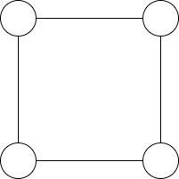
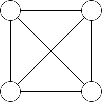
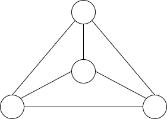
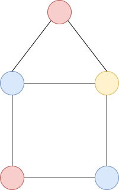
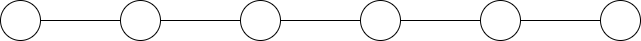
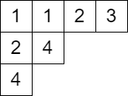
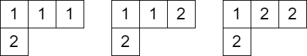


月刊組合せ論 Natori は面白そうな組合せ論のトピックを紹介していく企画です。今回は 2022 年のフィールズ賞受賞者である June Huh 氏 (許埈珥、ホ・ジュニとも書かれる) の業績を解説します。

高校中退を経てフィールズ賞を受賞するなど、生い立ちも注目を集めていますが、組合せ論に業績が多いということで今回は業績に注目していきたいと思います。

**注意**: 最先端の現代数学は非常に難解で、専門家にとっても解説することは難しい場合があります。それを素人である筆者が解説するのは無謀なことです。正確であるよう努めますが、誤りを含む可能性があります。正確な情報を知りたい方は本文中で提示される文献を参照してください。また誤りの指摘はいつでも受け付けます。

## 業績をひとことで

フィールズ賞の受賞理由は次のようになっています。

> For bringing the ideas of Hodge theory to combinatorics, the proof of the Dowling–Wilson conjecture for geometric lattices, the proof of the Heron–Rota–Welsh conjecture for matroids, the development of the theory of Lorentzian polynomials, and the proof of the strong Mason conjecture.

すなわち

- ホッジ理論のアイデアを組合せ論に導入した
- Dowling-Wilson 予想の証明
- Heron-Rota-Welsh 予想の証明
- ローレンツ多項式の理論の開発
- 強 Mason 予想の証明

が June Huh 氏の代表的な業績ということです。

## Read の予想

上のリストにはありませんが、まずは Read の予想について紹介します。その前にまず四色定理について説明します。

**グラフ**とは頂点と辺からなる図形です。辺は 2 つの頂点を結んでいます。以下、グラフといえば有限なものとします。

**平面グラフ**とは平面上に描かれた、辺が交差しないグラフのことです。例えば下のグラフは平面グラフです。

下のグラフは平面グラフではありません。

しかし、次のように頂点を移動すると平面グラフとなります。

このように頂点と辺の書き方を変えることで平面グラフとなるようなグラフのことを**平面的グラフ**といいます。

グラフの塗り分けとは、辺で結ばれている 2 頂点が同じ色にならないように頂点に色を塗ることです。例えば以下のグラフは 3 色で塗り分けることができます。

$n$ 色以下で塗り分けられるとき、$n$ **彩色可能**といいます。上のグラフは 3 彩色可能ですが、2 彩色可能ではありません。

以上の準備の下で、四色定理を述べることができます。


**定理** (四色定理): すべての平面的グラフは 4 彩色可能である。


四色定理に関連して、彩色多項式という概念が生まれました。グラフ $G$ に対して、$c_G(n)$ を $n$ 彩色の方法の数とします。$c_G(n)$ は $n$ に関する多項式となることが知られており、**彩色多項式**と呼ばれます。

例として以下の直線グラフの彩色多項式を求めてみましょう。

まず左端は好きな色で塗れるので、$n$ 通りあります。2 番目の頂点は異なる色で塗らなければならないので、$n-1$ 通りあります。3 番目の頂点は 2 番目の頂点と異なる色なので、これも $n-1$ 通りです。残りも同様なので、彩色多項式は

$$
c_G(n)=n(n-1)^5=n^6-5n^5+10n^4-10n^3+5n^2-n
$$

となります。

四色定理を彩色多項式を用いて述べると、任意の平面的グラフ $G$ に対して $c_G(4)>0$ ということになります。

前置きが長くなってしまいましたが、Read の予想について述べます。Read の予想は彩色多項式の係数から得られる数列に関する予想です。係数の絶対値を順に並べて数列を作ります。上の例では $1,5,10,10,5,1$ となります。Read の予想は次のような予想です。


**予想**: 彩色多項式の係数の絶対値からなる数列は unimodal である。すなわちある場所まで単調増加で、その先では単調減少になる。


この予想は 40 年近く未解決でしたが、当時大学院生の June Huh 氏によって証明されました。実際に証明されたのは次のより強い定理です。


**定理**: 彩色多項式の係数の絶対値からなる数列は対数凹 (log-concave) である。すなわちすべての $i$ に対して $a_i^2\ge a_{i-1}a_{i+1}$ をみたす。


グラフが一直線の場合、この数列は二項係数 $\binom{n}{0},\binom{n}{1},\ldots,\binom{n}{n}$ となります。二項係数の数列が log-concave な数列の代表例です。

証明は

Huh, June. Milnor numbers of projective hypersurfaces and the chromatic polynomial of graphs. J. Am. Math. Soc. 25, No. 3, 907-927 (2012).

をご覧ください。グラフ理論の問題でありながら、証明には代数幾何、特異点理論の手法が用いられています。

ちなみに、June Huh 氏は日本人のフィールズ賞受賞者である広中平祐氏と交流があり、代数幾何を教わっていました。突然代数幾何からグラフ理論に転向したように思うかもしれませんが、2 つの分野の関わりは他の数学者が示唆していたようです。

## Heron-Rota-Welsh 予想

Heron-Rota-Welsh 予想は上述の Read の予想をマトロイド上に一般化したものです。マトロイドは数学の様々な場面で現れる性質を抽出したものです。マトロイドを定義する前にその性質を見ていきましょう。

グラフが**森**であるとは、サイクルを含まないことをいいます。特に連結な森を木といいます。

$X,Y$ がグラフ $G$ の森であるような部分グラフで、辺の数は $Y$ より $X$ の方が多いとします。このとき、$X$ の辺であり $Y$ の辺でないようなある辺 $e$ について、$Y$ に $e$ を追加しても森のままとなります。

一方、ベクトル空間においても似たような命題が成り立ちます。$X,Y$ がベクトル空間 $V$ の線形独立部分集合で、$|X|>|Y|$ とします。このとき、あるベクトル $x\in X\setminus Y$ について $Y\cup\\{x\\}$ が線形独立となります。

両者の性質を抽出したものがマトロイドです。

有限集合 $E$ と その部分集合族 $\mathcal{F}$ が次の条件を満たすとき、$(E,\mathcal{F})$ を**マトロイド**といいます。

- $\emptyset\in\mathcal{F}$
- $X\in\mathcal{F}, Y\subseteq X$ ならば $Y\in\mathcal{F}$
- $X,Y\in\mathcal{F}, |X|>|Y|$ ならばある $x\in X\setminus Y$ について $Y\cup\\{x\\}\in\mathcal{F}$

例えばある行列 $A$ に対して、$E$ を $A$ の列ベクトル全体、$\mathcal{F}$ を $E$ の線形独立部分集合全体とすればマトロイドとなります。このようなマトロイドを **representable** マトロイドと呼びます。

このようにマトロイドは独立性を扱う概念です。$\mathcal{F}$ の元のことを**独立集合**と呼びます。

マトロイドから**特性多項式** (characteristic polynomial) と呼ばれる多項式が定まります。特性多項式はマトロイドがグラフに由来する場合は彩色多項式と一致することが知られています。そこで、次のような予想が生まれました。


**予想** (Helon-Rota-Welsh): マトロイドの特性多項式の係数の絶対値からなる数列は log-concave である。


Read の予想を解決した論文で、マトロイドが標数 0 の体上で representable という条件の下では証明されていました。しかし一般の場合にはこの手法は力不足でした。一般のマトロイドはグラフやベクトル空間に由来するとは限らず、どのような性質を持つか謎に包まれていました。その後も部分的な進展はありましたが、完全解決にはなかなか至りませんでした。

Adiprasito, Karim; Huh, June; Katz, Eric. Hodge theory for combinatorial geometries. Ann. Math. (2) 188, No. 2, 381-452 (2018).

において、Heron-Rota-Welsh 予想が証明されました。彼らはどのようなマトロイドにも背後には幾何学があることを明らかにしたのです (作り上げた、の方が適切かもしれません)。

ざっくり説明すると、マトロイドから「コホモロジー環」を作ることで証明されました。コホモロジーは次の性質をもつことが期待されます。

- Poincaré 双対性
- hard Lefschetz 定理
- Hodge-Riemann 関係

これらを**ケーラーパッケージ** (Kähler package) と呼ぶそうです。

マトロイドから作られた Chow ring と呼ばれるものがケーラーパッケージをみたすことを示し、Hodge-Riemann 関係から Heron-Rota-Welsh 予想を導くというのが論文での証明の流れのようです。

こうして、マトロイドのホッジ理論は組合せ論と幾何学をつなぐ大きな理論となり、その後も「log-concave な数列の背後にはホッジ理論的な構造が存在する」という信念のもとに発展を続けます。

## Dowling-Wilson 予想

マトロイドにはランク関数と呼ばれる重要な関数があります。マトロイド $(E,\mathcal{F})$ のランク関数 $r$ は $E$ の部分集合に対し非負整数値を対応させる関数で

$$
r(X)=\max\\{|Y|:Y\subseteq X, Y\in\mathcal{F}\\}
$$

により定義されるものです。これは劣モジュラ性という性質をみたすことが知られています。

$E$ の部分集合 $X$ が **flat** であるとは、すべての $e\in E\setminus X$ に対して $r(X\cup\\{e\\})>r(X)$ をみたすことをいいます。ランクが $i$ の flat の個数を $W_i$ とおきます。

次の予想は Dowling, Wilson の Top-Heavy 予想と呼ばれるものです。


**予想** (Dowling-Wilson): $0\le i\le j\le r(E)-i$ に対して $W_i\le W_j$ をみたす。


証明は

Tom Braden, June Huh, Jacob P. Matherne, Nicholas Proudfoot, Botong Wang, Singular Hodge theory for combinatorial geometries. [arXiv:2010.06088](https://arxiv.org/abs/2010.06088)

で与えられました。

証明には上述の

- Poincaré 双対性
- hard Lefschetz 定理
- Hodge-Riemann 関係

が登場します。また、マトロイドのカジュダン・ルスティック理論も関連する話題として登場します。カジュダン・ルスティック理論といえば元々は表現論の理論ですが、それのマトロイドにおける類似があるのは面白いですね。

なお、数列 $W_0,W_1,\ldots,W_{r(E)}$ は log-concave であることが予想されていますが、こちらは未解決のままのようです。

## 強 Mason 予想

$M$ を $n$ 元集合上のマトロイドとし、$I_k(M)$ を $M$ の $k$ 元独立集合の個数とします。例えば $M$ が $n$ 次単位行列から定まるマトロイドのとき、任意に $k$ 個の列ベクトルを選ぶと線形独立となっているので、$I_k(M)=\binom{n}{k}$ です。log-concave 性が期待できますね。実際にはより強い次の予想がありました。


**予想** (Mason): 
$$
\frac{I_k(M)^2}{\binom{n}{k}^2}\ge \frac{I_{k+1}(M)}{\binom{n}{k+1}}\frac{I_{k-1}(M)}{\binom{n}{k-1}}
$$


## ローレンツ多項式

最後にローレンツ多項式について簡単に紹介します。ローレンツ多項式は

Brändén, Petter; Huh, June. Lorentzian polynomials. Ann. Math. 192, No. 3, 821-891 (2020).

で導入されました。定義は読んでもよくわからなかったのでここには書きません。

ローレンツ多項式の理論により、強 Mason 予想が証明されました。なお

Nima Anari, Kuikui Liu, Shayan Oveis Gharan, Cynthia Vinzant, Log-Concave Polynomials III: Mason's Ultra-Log-Concavity Conjecture for Independent Sets of Matroids. [arXiv:1811.01600](https://arxiv.org/abs/1811.01600)

においても証明されています。こちらでは completely log-concave 多項式というものが用いられています。この 2 つは斉次多項式に対して同値であることが証明されています。

さて、筆者はヤング図形が好きなので、ヤング図形とローレンツ多項式の関連も紹介します。

ヤング図形のマスに正整数を書き込んだものであって

- 各行について広義単調増加
- 各列について狭義単調増加

となるものを**半標準タブロー**といいます。

ヤング図形 $\lambda$ 上の半標準タブローのうち、書き込まれた整数が $n$ 以下であるものからなる集合を $\text{SST}(\lambda,n)$ とします。例えば $\text{SST}((3,1),1)$ は空集合で、$\text{SST}((3,1),2)$ は次の $3$ つのタブローからなる集合です。

ここで $x_1,x_2$ という記号 (不定元) を導入して、タブローごとに $1$ の個数だけ $x_1$ をかけ、$2$ の個数だけ $x_2$ をかけた単項式を作ります。上の例ではそれぞれ $x_1^3x_2, x_1^2x_2^2, x_1x_2^3$ となります。これらの和を

$$
s_{(3,1)}(x_1,x_2)=x_1^3x_2+x_1^2x_2^2+x_1x_2^3
$$

とします。このようにしてできる多項式を**シューア多項式**といいます。

一般にシューア多項式 $s_{\lambda}(x_1,x_2,\ldots,x_n)$ は次のように定義されます。$T\in\text{SST}(\lambda,n)$ に対して、$T$ に書き込まれた整数 $i$ の個数を $c_i$ とするとき

$$
s_{\lambda}(x_1,x_2,\ldots,x_n)=\sum_{T\in \text{SST}(\lambda,n)}x_1^{c_1}\cdots x_n^{c_n}
$$

と定義します。

シューア多項式はローレンツ多項式になるとは限りませんが、正規化されたシューア多項式

$$
\sum_{T\in \text{SST}(\lambda,n)}\frac{x_1^{c_1}}{c_1!}\cdots \frac{x_n^{c_n}}{c_n!}
$$

はローレンツ多項式になることが証明されています。詳しくは

Huh, June; Matherne, Jacob P.; Mészáros, Karola; St. Dizier, Avery. Logarithmic concavity of Schur and related polynomials. Trans. Am. Math. Soc. 375, No. 6, 4411-4427 (2022).

をご覧ください。

## あとがき

unimodal な数列という素朴な対象から、これほどまでに奥深い数学が広がっているとは思いもよりませんでした。世界がつながるのはいつ見ても面白いです。

マトロイドや log-concave 数列についてはまだまだ奥が深そうなので今後の号でも取り上げたいと思っています。

これから現代数学がますます発展していくことを期待しています。

## 参考文献

まずは一般向けに書かれた以下の記事をおススメします。

- [A Path Less Taken to the Peak of the Math World](https://www.quantamagazine.org/a-path-less-taken-to-the-peak-of-the-math-world-20170627/)
- [He Dropped Out to Become a Poet. Now He’s Won a Fields Medal.](https://www.quantamagazine.org/june-huh-high-school-dropout-wins-the-fields-medal-20220705/)

また、フィールズ賞受賞者を決める ICM の解説も業績がまとまっていておススメです。

- https://www.mathunion.org/imu-awards/fields-medal/fields-medals-2022

以下はその他の参考文献です。

- [Hodge Theory of Matroids](https://www.ams.org/journals/notices/201701/rnoti-p26.pdf)
- [COMBINATORIAL APPLICATIONS OF THE HODGE–RIEMANN RELATIONS](https://web.math.princeton.edu/~huh/ApplicationsHR.pdf)
- Eur, Christopher. An Essence of independence: Recent works of June Huh on combinatorics and Hodge theory. [arXiv:2211.05724](https://arxiv.org/abs/2211.05724)
- Pitsoulis, Leonidas S. Topics in matroid theory. SpringerBriefs in Optimization. New York, NY: Springer. xiv, 127 p. (2014).

数学セミナー 2023 年 1 月号でフィールズ賞受賞者の業績が特集されました。そちらも読んでみましょう。