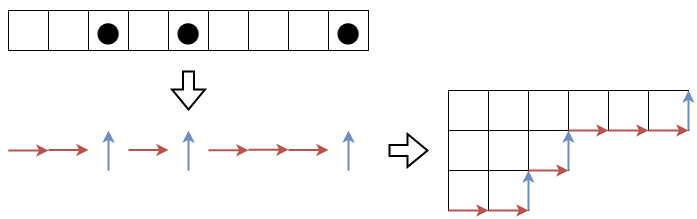
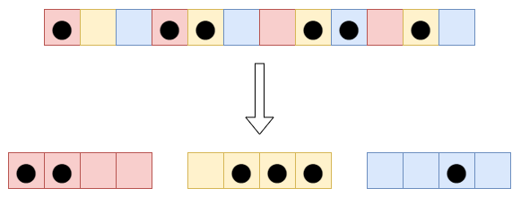
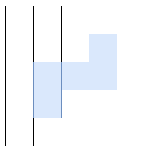
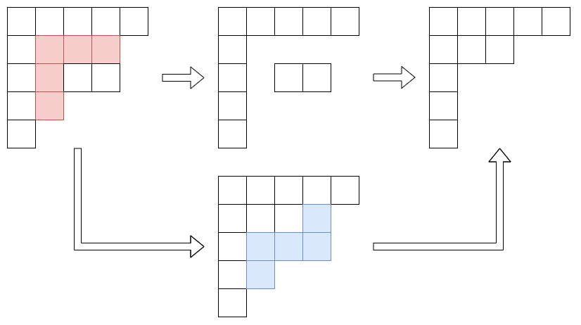
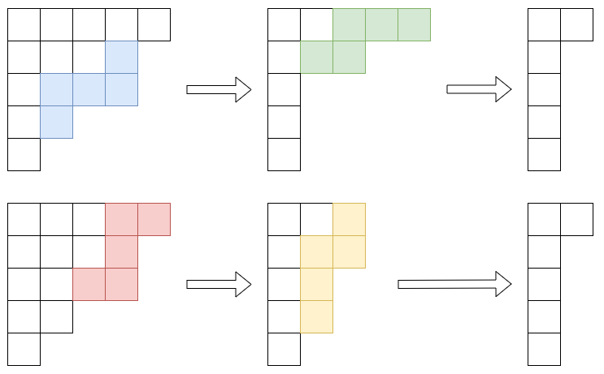

月刊組合せ論 Natori は面白そうな組合せ論のトピックを紹介していく企画です。あけましておめでとうございます。本年も月刊組合せ論 Natori をよろしくお願いいたします。新年一発目となる今回はヤング図形を扱っていきます。

## yukicoder

yukicoder のアドベントカレンダーにて次の問題を出題しました。

[No.2149 Vanitas Vanitatum](https://yukicoder.me/problems/no/2149)

以下ではこの問題の数学的な背景を解説していきます。

## 論文

この問題は論文を読んで得た知識を競プロ用に加工したものです。例えば

Eskin, Alex; Okounkov, Andrei. Pillowcases and quasimodular forms.

の式 (8) にこの問題の答えとなる式が書かれています。

実際に読んだのはこの論文ではないので書いてあることはよくわかっていませんが、代数幾何・数論・表現論・数理物理など様々な分野とかかわる論文です。

## マヤ図形

記事『[ヤング図形と競技プログラミング](https://zenn.dev/koboshi/articles/306304c0381c1e)』の図を使いまわします。

この図はマヤゲームの説明のときに使った図です。操作を逆にみると、与えられたヤング図形の境界線に注目することで、直線状に並んだマス目の上に黒石を置いた図形が得られます。この図形を**マヤ図形**といいます。Vanitas Vanitatum の解説ではマヤ図形は 0,1 列で表現されています。

次のように厳密に定義することも可能です。$\lambda=(\lambda_1,\ldots,\lambda_l)$ を分割 (すなわち広義単調減少な正整数列) とします。$\lambda_{l+1}=\lambda_{l+2}=\cdots=0$ としておきます。このとき、数直線上の座標 $\lambda_i-i$ に黒石を置いて得られる図形をマヤ図形といいます。上の図では $\lambda=(6,3,2)$ なので、座標 $5,1,-1,-4,-5,-6,\ldots$ に黒石が置かれます。十分左側ではすべてが黒石になり、十分右側ではすべてが空白となります。

## $t$-quotient

Vanitas Vanitatum の解説では 0,1 列を偶数番目の文字と奇数番目の文字に分けることで 2 つのヤング図形を作っています。これにもちゃんと名前があります。

$t$ を 2 以上の整数とします。いまマヤ図形は数直線上の黒石として表現されています。各 $i=0,1,\ldots,t-1$ に対して、$\bmod{t}$ で $i$ と合同な数を座標にもつマスを取り出すことで $t$ 個のマヤ図形からなる組が得られます。これを **$t$-quotient** といいます。

## $t$-core

ヤング図形からドミノを取り去る操作は、マヤ図形では黒石を 2 つ左に動かす操作です。これは 2-quotient を構成するマヤ図形の 1 つにおいて黒石を 1 つ左に動かす操作となります。

これを一般化すると、$t$-quotient を構成するマヤ図形の 1 つにおいて黒石を 1 つ左に動かす操作は、ヤング図形でサイズ $t$ の**リムフック**と呼ばれる図形を取り去る操作になります。

[ヤング図形と競技プログラミング](https://zenn.dev/koboshi/articles/306304c0381c1e)のマヤゲームの説明ではフックを抜いて左上に詰める操作が登場しますが、より直接的にはリムフックを抜く操作だということができます。

さて、ドミノを抜くことを一般化すると、サイズ $t$ のリムフックを抜いていくことになります。

操作を繰り返すと、これ以上リムフックを抜けないような図形になります。どのような順番で抜いても最後の図形は同じになることが示せます。この図形を **$t$-core** といいます。

2-core は $\emptyset, (1), (2,1), (3,2,1),\ldots$ になります。階段状の図形です。

## 対称群の指標表との関係

ところで、対称群の指標表とも関係があります。

[ヤング図形と競技プログラミング](https://zenn.dev/koboshi/articles/306304c0381c1e)にも書いた通り、$n$ 次対称群の指標表の値は 2 つの $n$ の分割 $\lambda,\mu$ を用いて $\chi_{\lambda}(C_{\mu})$ と表されます。ここで $\mu=(2,2,\ldots,2)$ としたときの $\chi_{\lambda}(C_{\mu})$ の絶対値が Vanitas Vanitatum の答えと等しくなります。

これは記事にも書いたムルナガン・中山の規則から従います。考えてみてください。

$\mu=(t,t,\ldots,t)$ の場合に一般化することもできます。

## おわりに

数学で勉強したことを競プロの問題として出題できて楽しかったです。またこのように知識をお届けしたいです。

今年も月刊組合せ論 Natori を頑張って書いていきたいと思っているので、応援のほどよろしくお願いいたします。

## 参考文献

- Stanley, Richard P. Enumerative combinatorics. Volume 2. Cambridge University Press. (1999).
- James, Gordon; Kerber, Adalbert. The representation theory of the symmetric group. Cambridge University Press (2009).
- [Border strip tableaux and the Littlewood map](https://www.symmetricfunctions.com/borderStripTableaux.htm#partitionQuotient)
- [【大学数学】学校で習わない「自由な割り算」 - 箱の並びを割る](https://zenn.dev/339/articles/9ca3b883a85508)
