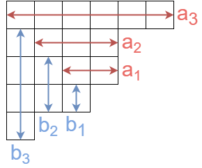

月刊組合せ論 Natori は面白そうな組合せ論のトピックを紹介していく企画です。今回はヤコビの三重積公式とオイラーの五角数定理について説明します。個人的にかなり美しい等式だと思っています。

## ヤコビの三重積公式

次の等式を**ヤコビの三重積公式**といいます。


$$
\prod_{i=1}^{\infty}(1+xq^i)(1+x^{-1}q^{i-1})(1-q^i)=\sum_{n\in\mathbb{Z}}q^{n(n+1)/2}x^n
$$


左辺は無限積、右辺は無限和です。この 2 つが等号で結ばれているのは面白いですね。

## 証明

証明方法は色々ありますが、組合せ論的なものを紹介します。

$$
f(x)=\prod_{i=1}^{\infty}(1+xq^i)(1+x^{-1}q^{i-1})
$$

とおきます。$f(x)$ を展開したときの $x^n$ の係数を $c_n=c_n(q)$ とします。つまり

$$
f(x)=\sum_{n\in\mathbb{Z}}c_nx^n
$$

ということです。ここで、$f(xq)=\frac{1+x^{-1}q^{-1}}{1+xq}f(x)=x^{-1}q^{-1}f(x)$ なので

$$
\sum_{n\in\mathbb{Z}}c_nx^nq^n=\sum_{n\in\mathbb{Z}}c_nx^{n-1}q^{-1}
$$

となります。$x^n$ の係数を比較して、$c_{n+1}=q^{n+1}c_n$ を得ます。$1+2+\cdots+n=\frac{n(n+1)}{2}$ なので、$c_n=q^{n(n+1)/2}c_0$ となります。あとは $c_0$ を求めればよいです。$f(x)$ を展開して

$$
c_0=\sum q^{a_1+\cdots+a_n+b_1+\cdots+b_n}
$$

(ここで和は $n\ge 0, 1\le a_1<\cdots<a_n, 0\le b_1<\cdots<b_n$ となるもの全体を動く) となります。数列 $a,b$ の組は次のようにヤング図形と一対一に対応します。

よって $c_0$ は分割数 $p(n)$ を用いて

$$
c_0=\sum_{\lambda:\text{分割}}q^{|\lambda|}=\sum_{n=0}^{\infty}p(n)q^n
$$

となることがわかりました。よく知られているように分割数の母関数は

$$
c_0=\prod_{i=1}^{\infty}\frac{1}{1-q^i}
$$

となります。以上により、ヤコビの三重積公式が得られました。

## オイラーの五角数定理

次の等式を**オイラーの五角数定理**といいます。


$$
\prod_{i=1}^{\infty}(1-q^i)=\sum_{n\in\mathbb{Z}}(-1)^nq^{n(3n+1)/2}
$$


左辺は分割数の母関数の逆数です。右辺には五角数が現れます。

この定理は競技プログラミングにおいても有用です。[この問題](https://atcoder.jp/contests/abc279/tasks/abc279_h)で用いられます。

ヤコビの三重積公式から証明することができます。新しい変数 $z$ を用意し、ヤコビの三重積公式に $q=z^3, x=-z^{-1}$ を代入することで、左辺は

$$
\prod_{i=1}^{\infty}(1-z^{3i-1})(1-z^{3i-2})(1-z^{3i})=\prod_{i=1}^{\infty}(1-z^i)
$$

右辺は

$$
\sum_{n\in\mathbb{Z}}z^{3n(n+1)/2}(-z^{-1})^n=\sum_{n\in\mathbb{Z}}(-1)^nz^{n(3n+1)/2}
$$

となり、オイラーの五角数定理が得られました。

なお、組合せ論を用いて直接オイラーの五角数定理を証明することも可能です。[英語版 Wikipedia](https://en.wikipedia.org/wiki/Pentagonal_number_theorem) をご覧ください。

## 分割数

オイラーの五角数定理の左辺が分割数 $p(n)$ の母関数の逆数であることから

$$
\sum_{n=0}^{\infty}p(n)x^n=\frac{1}{\prod_{i}(1-x^i)}=\frac{1}{\sum_{m\in\mathbb{Z}}(-1)^mx^{m(3m+1)/2}}
$$

が得られます。この式を使うと $p(1),p(2),\ldots,p(N)$ が時間計算量 $O(N\sqrt{N})$ で計算できます。

## おわりに

ヤコビの三重積公式はまだまだ面白いことがたくさんありますが、今回は割愛させていただきます。またいつか書くかもしれません。

今後も月刊組合せ論 Natori では様々なトピックを紹介していきたいと思います。応援のほどよろしくお願いします！

## 参考文献

- Flajolet, Philippe; Sedgewick, Robert. Analytic combinatorics. Cambridge: Cambridge University Press (2009).

ヤコビの三重積公式の証明を参考にした文献は忘れてしまいました…。