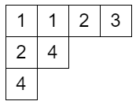
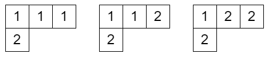
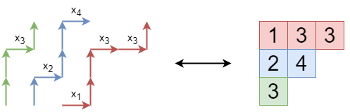


月刊組合せ論 Natori は面白そうな組合せ論のトピックを紹介していく企画です。今回は組合せ論・対称関数論を中心に幅広く活躍するシューア多項式について語っていきます。

## 半標準タブロー

ヤング図形のマスに正整数を書き込んだものであって

- 各行について広義単調増加
- 各列について狭義単調増加

となるものを**半標準タブロー**といいます。

## シューア多項式

ヤング図形 $\lambda$ 上の半標準タブローのうち、書き込まれた整数が $n$ 以下であるもの全体からなる集合を $\text{SST}(\lambda,n)$ とします。

$\text{SST}((3,1),1)$ は空集合で、$\text{SST}((3,1),2)$ は次の $3$ つのタブローからなる集合です。

ここで $x_1,x_2$ という記号 (不定元) を導入して、タブローごとに $1$ の個数だけ $x_1$ をかけ、$2$ の個数だけ $x_2$ をかけた単項式を作ります。上の例ではそれぞれ $x_1^3x_2, x_1^2x_2^2, x_1x_2^3$ となります。これらの和を

$$
s_{(3,1)}(x_1,x_2)=x_1^3x_2+x_1^2x_2^2+x_1x_2^3
$$

とします。このようにしてできる多項式を**シューア多項式**といいます。

一般にシューア多項式 $s_{\lambda}(x_1,x_2,\ldots,x_n)$ は次のように定義されます。$T\in\text{SST}(\lambda,n)$ に対して、$T$ に書き込まれた整数 $i$ の個数を $c_i$ とするとき

$$
s_{\lambda}(x_1,x_2,\ldots,x_n)=\sum_{T\in \text{SST}(\lambda,n)}x_1^{c_1}\cdots x_n^{c_n}
$$

と定義します。ぜひ手ごろな例で計算してみましょう。

いくつか計算してみると、$s_{\lambda}$ が対称多項式となっていることに気づくと思います。定義からは非自明ですね。組合せ論的には Bender-Knuth involution というものを使えば証明できるらしいですが、今回は別の方法で証明しましょう。

## 代数的定義

次の 2 つの行列式を考えます。

$$
\begin{align*}
\Delta_1&=\det\begin{pmatrix} x_1^4 & x_2^4 \\\ x_1 & x_2 \end{pmatrix} \\\
\Delta_2&=\det\begin{pmatrix} x_1 & x_2 \\\ 1 & 1 \end{pmatrix}
\end{align*}
$$

計算すると

$$
\begin{align*}
\Delta_1 &= x_1^4x_2-x_1x_2^4=x_1x_2(x_1-x_2)(x_1^2+x_1x_2+x_2^2) \\\
\Delta_2 &= x_1-x_2
\end{align*}
$$

となります。$\Delta_1$ は $\Delta_2$ で割り切れるので比を計算すると、$\Delta_1/\Delta_2=x_1^3x_2+x_1^2x_2^2+x_1x_2^3$ となります。これは上で計算した $s_{(3,1)}(x_1,x_2)$ と等しいです。

このように、シューア多項式は 2 つの行列式の比として定義することも可能です。$\alpha=(a_1,a_2,\ldots,a_n)$ に対して $A_{\alpha}(x_1,x_2,\ldots,x_n)=\det(x_i^{a_j})$ とおきます。$\delta_n=(n-1,n-2,\ldots,1,0)$ とおき、$\lambda+\delta_n=(\lambda_1+n-1,\lambda_2+n-2,\ldots,\lambda_{n-1}+1,\lambda_n)$ とするとき

$$
\frac{A_{\lambda+\delta_n}(x_1,x_2,\ldots,x_n)}{A_{\delta_n}(x_1,x_2,\ldots,x_n)}
$$

をシューア多項式の定義とすることもあります。2 つの定義が同値であることがわかれば、2 つの世界を行き来することで様々な性質がわかります。例えば、行列式の性質から $x_i$ と $x_j$ を入れ替えると $A_{\alpha}(x_1,x_2,\ldots,x_n)$ は $-1$ 倍となるので、シューア多項式は分母分子で打ち消しあって不変となります。こちらの定義では対称多項式であることが簡単に示せます。

## ヤコビ・トゥルーディ公式

定義の同値性を示す鍵となるのが次のヤコビ・トゥルーディ公式です。

$$
s_{\lambda}(x_1,\ldots,x_n)=\det(h_{\lambda_i-i+j}(x_1,\ldots,x_n))
$$

ここで $h_k(x_1,\ldots,x_n)$ は**完全対称多項式**で、次のように定義されます。

$$
h_k(x_1,\ldots,x_n)=\sum_{1\le i_1\le i_2\le\cdots\le i_k\le n}x_{i_1}x_{i_2}\cdots x_{i_k}
$$

ヤコビ・トゥルーディ公式の証明には LGV 公式を用います。LGV 公式については [2022 年 9 月号](../202209/)をご覧ください。


**定理** (LGV): 条件「$i_1<i_2, j_1>j_2$ ならば $a_{i_1}$ から $b_{j_1}$ へのパスと $a_{i_2}$ から $b_{j_2}$ へのパスは必ず交わる」を仮定する。このとき
$$
\det M(a,b)=\sum_{(P_1,\ldots,P_n)}w(P_1)\cdots w(P_n)
$$
が成り立つ。ここで和は $P_i$ が $a_i$ から $b_i$ へのパスでどの 2 つも互いに交わらないもの全体をわたる。


グラフを次のように構成します。$V=\\{(i,j)\in\mathbb{Z}^2\mid 1\le i\le (十分大きな値), 1\le j\le n\\}$ とし、$(i,j)$ から $(i+1,j)$ に重み $x_j$ の辺を張り、$(i,j)$ から $(i,j+1)$ に重み 1 の辺を張ります。

このとき、$\sum_{P:(i,1)\to (i+k,n)}w(P)=h_k(x)$ となります。

$a_i=(n+1-i,1), b_i=(\lambda_i+n+1-i, n) \ (i=1,\ldots,n)$ とおくと、LGV 公式の左辺は $\det(h_{\lambda_j-j+i})=\det(h_{\lambda_i-i+j})$ になります。

パス $P_i\colon a_i\to b_i$ について $w(P_i)=x_{j_1}\cdots x_{j_k} \ (j_1\le j_2\le \cdots\le j_k)$ のとき、$i$ 行目の数字を $j_1,\ldots,j_k$ としたタブローを作ります。パスが互いに交わらないことはタブローの列の狭義増加性に対応します。よってこれは半標準タブローです。逆に半標準タブローから互いに交わらないパスの組を復元できるので、LGV 公式の右辺は $\sum_{T\in \mathrm{SST}(\lambda,n)}x_1^{c_1}\cdots x_n^{c_n}=s_{\lambda}(x)$ となります。

これでヤコビ・トゥルーディ公式が示されました。

## 同値性の証明

$a_i^{\prime}=(n+1-i,i)$ とおくと、互いに交わらないパス $P_i\colon a_i\to b_i$ において $a_i$ から $a_i^{\prime}$ までまっすぐ上に進むことがわかります。よって始点を $a_i^{\prime}$ に変更しても影響なく、上の結果から $\det M(a^{\prime},b)=s_{\lambda}(x)$ となります。

$(i,j)$ から $(i+1,j)$ への辺の重みを $x_j-x_{i+j}$ に変更します。ただし $x_{n+1}=x_{n+2}=\cdots=0$ とします。$a_i^{\prime}$ から $b_i$ へのパスにおいて影響はないので、引き続き $\det M(a^{\prime},b)=s_{\lambda}(x)$ です。

$a_i^{\prime\prime}=(1,i)$ とします。このとき $M(a^{\prime\prime},b)=M(a^{\prime\prime},a^{\prime})M(a^{\prime},b)$ が成り立ちます。$\det M(a^{\prime\prime},a^{\prime})=\prod_{i<j}(x_i-x_j)=A_{\delta_n}(x)$ となります。$\det M(a^{\prime\prime},b)$ を計算するために次の補題を用います。

$$
\sum_{P:(1,t)\to (m,n)}w(P)=(x_t-x_{n+1})(x_t-x_{n+2})\cdots (x_t-x_{m+n-1})
$$

これは $m+n$ に関する帰納法でわかります。これより $\det M(a^{\prime\prime},b)=\det(x_i^{\lambda_j+n-j})=A_{\lambda+\delta_n}(x)$ となります。よって $s_{\lambda}(x)=A_{\lambda+\delta_n}(x)/A_{\delta_n}(x)$ が得られ、シューア多項式の 2 つの定義が同値であることがわかりました。

## おわりに

シューア多項式の基本的な部分を解説しました。まだまだ面白い話題がいっぱいあるので、今後の号でも取り上げる予定です。

## 参考文献

- Prasad, Amritanshu. An introduction to Schur polynomials. Grad. J. Math. 4, No. 2, 62-84 (2019).
- Xiong, Rui. Schur Polynomials through Lindström Gessel Viennot Lemma. arXiv. https://arxiv.org/abs/2003.09215
