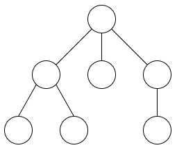

月刊組合せ論 Natori は面白そうな組合せ論のトピックを紹介していく企画です。今回はカタラン数と畳み込みについて考えます。

## カタラン数の基礎

カタラン数は次の漸化式により定義される数列です。

$$
C_0=1, C_{n+1}=\sum_{i=0}^nC_iC_{n-i}
$$

これは $1,1,2,5,14,42,\ldots$ という数列です。この数列の母関数は

$$
C(x)=\sum_{n=0}^{\infty}C_nx^n=\frac{1-\sqrt{1-4x}}{2x}
$$

です。カタラン数 $C_n$ は

- 長さ $2n$ の正しい括弧列の個数
- 頂点数 $n+1$ の木の個数
- 頂点数 $2n+1$ の二分木の個数
- 対角線をまたがないグリッドの経路の個数

などに等しいです。

今回考えるのは、母関数のべき乗 $C(x)^k$ から得られる数列です。$C(x)^k$ の $x^n$ の係数を $[x^n]C(x)^k$ と表します。

## 木と括弧列の対応

木から括弧列を作る方法をみます。ここで木は根付き木で子の順序を区別します。

深さ優先探索を行って、進むときに `(`、戻るときに `)` を追加します。正確には次のようなアルゴリズムです。

- 根から出発する。
- まだ訪問していない子があるとき、そのうち最初の子に移動する。`(` を追加する。
- そうでないとき、親に戻る。`)` を追加する。

次の木の場合、得られる括弧列は `(()())()(())` です。

このようにして頂点数 $n+1$ の木と長さ $2n$ の正しい括弧列の間の全単射を作ることができます。よって個数は $C_n$ です。

## 森の数え上げ

頂点数が $n+3$ で連結成分が 3 個の森を数え上げてみましょう。ただし連結成分の順序も区別します。連結成分の頂点数を $a+1, b+1, c+1$ とすると、木の個数はそれぞれ $C_a, C_b, C_c$ となります。よって

$$
\sum_{a+b+c=n}C_aC_bC_c
$$

が答えとなります。これは畳み込みの形をしており、$[x^n]C(x)^3$ に等しくなります。同様に頂点数が $n+k$ で連結成分が $k$ 個の森の個数は $[x^n]C(x)^k$ となります。

## ラグランジュ反転公式

いよいよ $[x^n]C(x)^k$ を求めます。ラグランジュ反転公式を用います。


**定理**: $\phi(u)=\sum_{k\ge 0}\phi_ku^k$ は $\phi_0\ne 0$ をみたすとし、$y=y(x)$ は $y=x\phi(y)$ をみたすとする。このとき

$$
[x^n]y(x)^k=\frac{k}{n}[u^{n-k}]\phi(u)^n
$$

が成り立つ。


証明は Analytic Combinatorics などを参照してください。

$y(x)=xC(x)=\frac{1-\sqrt{1-4x}}{2}, \phi(u)=\frac{1}{1-u}$ とすると仮定をみたすので

$$
[x^n]\left(\frac{1-\sqrt{1-4x}}{2}\right)^k=\frac{k}{n}\binom{2n-k-1}{n-k}
$$

が成り立ちます。ここで $\phi(u)^n$ の係数は負の二項定理を用いて計算します。よって

$$
[x^n]C(x)^k=[x^{n+k}]\left(\frac{1-\sqrt{1-4x}}{2}\right)^k=\frac{k}{n+k}\binom{2n+k-1}{n}
$$

となります。

## 問題

以下では解法のネタバレを含みます。

### yukicoder No.1662 (ox) Alternative

問題リンク：[https://yukicoder.me/problems/no/1662](https://yukicoder.me/problems/no/1662)

長さ $2n$ の括弧列であって `)(` を挿入できない箇所が $k$ 個あるようなものを数え上げる必要があります。直接畳み込みの形に持ち込むこともできますが、森の数え上げとの全単射を作りましょう。挿入できない箇所で括弧列を分割します。例えば `(()())()(())` の場合 `(()())`, `()`, `(())` の 3 つになります。それぞれ左端の `(` と右端の `)` を削除すると、`()()`, 空文字列, `()` になります。これらを木に変換することで、3 つの連結成分からなる森が得られます。別の言い方をすると、木において根を削除するということになります。

### 京都大学プログラミングコンテスト 2020 M - Many Parentheses

問題リンク：[https://atcoder.jp/contests/kupc2020/tasks/kupc2020_m](https://atcoder.jp/contests/kupc2020/tasks/kupc2020_m)

長さが $2\times K$ でない括弧列の母関数が $C(x)-C_Kx^K$ であることから、答えは $[x^M] (C(x)-C_Kx^K)^N$ です。二項定理を用いて展開すると

$$
[x^M]C(x)^N-\binom{N}{1}C_K[x^{M-K}]C(x)^{N-1}+\binom{N}{2}C_K^2[x^{M-2K}]C(x)^{N-2}-\cdots
$$

となります。この式は包除原理からも得ることができます。

### Xmas Contest 2022 D - Dichotomy

問題リンク：[https://atcoder.jp/contests/xmascon22/tasks/xmascon22_d](https://atcoder.jp/contests/xmascon22/tasks/xmascon22_d)

これも $[x^n]C(x)^k$ の計算に帰着されるそうです。(筆者は解いていません)

## おわりに

カタラン数の母関数のべき乗について解説しました。競技プログラミングでたまに見かけるテクニックなので、覚えておくとよいことがあるかもしれません。

今後も月刊組合せ論 Natori では様々な組合せ論のトピックを扱っていきます。

## 参考文献

- Flajolet, Philippe; Sedgewick, Robert. Analytic combinatorics. Cambridge University Press (2009).
- [[Tutorial] Catalan Numbers and Catalan Convolution](https://codeforces.com/blog/entry/87585)
- [グリッドの最短経路の数え上げまとめ - かんプリンの学習記録](https://kanpurin.hatenablog.com/entry/2021/09/15/220913)
