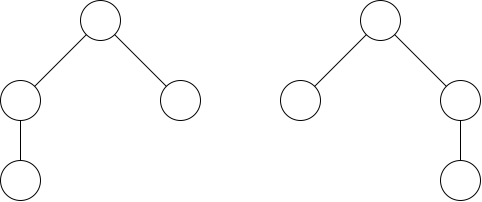
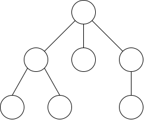

+++
title = "【月刊組合せ論 Natori】森の数え上げとカタラン数の畳み込み【2023 年 4 月号】"
date = 2023-04-01
tags = ["数え上げ", "競プロ"]
+++






月刊組合せ論 Natori は面白そうな組合せ論のトピックを紹介していく企画です。今回はカタラン数と畳み込みについて考えます。

## 木の数え上げ

木は根付き木で子の順序を区別します。次の 2 つの木は異なるものと考えます。

頂点数が $n+1$ 個の木の個数を $C_n$ とおきます。

上の図は 7 頂点の木です。根から出る辺のうち最も左のものを削除すると、3 頂点の木と 4 頂点の木になります。このように、木は頂点数がより少ない木を組み合わせて作れると考えると次のような漸化式が成り立つことがわかります。

$$
C_{n+1}=\sum_{i=0}^n C_iC_{n-i}
$$

この漸化式と $C_0=1$ により数列 $(C_n)$ が計算できます。計算すると $1,1,2,5,14,42,\ldots$ という数列になります。

$C_n$ は**カタラン数**と呼ばれており、

- 頂点数 $n+1$ の木の個数
- 頂点数 $2n+1$ の二分木の個数
- 長さ $2n$ の正しい括弧列の個数
- 正 $n+2$ 角形の三角形分割の個数

などに等しいです。個数がカタラン数に等しくなるオブジェクトはたくさん知られており、まさに数え上げ組合せ論の中心であると言えます。

## 森の数え上げ

頂点数が $n+3$ で連結成分が 3 個の森を数え上げてみましょう。ただし連結成分の順序も区別します。連結成分の頂点数を $a+1, b+1, c+1$ とすると、木の個数はそれぞれ $C_a, C_b, C_c$ となります。よって

$$
\sum_{a+b+c=n}C_aC_bC_c
$$

が答えとなります。一般にこのような形の式を**畳み込み**といいます。

ここで母関数を用います。カタラン数の母関数を

$$
C(x)=\sum_{i=0}^{\infty}C_ix^i
$$

とおくと、答えは $C(x)^3$ における $x^n$ の係数に等しくなります。この値を $[x^n]C(x)^3$ と書きます。

同様に頂点数が $n+k$ で連結成分が $k$ 個の森の個数は $[x^n]C(x)^k$ となります。

## ラグランジュ反転公式

$[x^n]C(x)^k$ を求めます。ラグランジュ反転公式を用います。


形式的冪級数 $\phi(u)=\sum_{k\ge 0}\phi_ku^k$ は $\phi_0\ne 0$ をみたすとし、$y=y(x)$ は $y=x\phi(y)$ をみたすとする。このとき

$$
[x^n]y(x)^k=\frac{k}{n}[u^{n-k}]\phi(u)^n
$$

が成り立つ。


証明は  や  などを参照してください。

$y(x)=xC(x)$ とおきます。カタラン数の漸化式

$$
C_{n+1}=\sum_{i=0}^n C_iC_{n-i}
$$

から、$y-y^2=x$ が成り立ちます。よって、$\phi(u)=1/(1-u)$ とおくとラグランジュ反転公式の仮定をみたします。したがって

$$
[x^n](xC(x))^k=\frac{k}{n}[u^{n-k}]\left(\frac{1}{1-u}\right)^n
$$

が得られます。右辺に負の二項定理を用いることで

$$
[x^n](xC(x))^k=\frac{k}{n}\binom{2n-k-1}{n-k}
$$

となります。よって

$$
[x^n]C(x)^k=[x^{n+k}](xC(x))^k=\frac{k}{n+k}\binom{2n+k-1}{n}
$$

が得られました。

特に $k=1$ とすれば、カタラン数が

$$
C_n=\frac{1}{n+1}\binom{2n}{n}
$$

という閉じた式で表せることがわかります。

## 問題

競技プログラミングでは $[x^n]C(x)^k$ の計算を用いる問題がたまに出題されます。そのような問題を一部紹介します。

解法のネタバレを含むのでご注意ください。

### yukicoder No.1662 (ox) Alternative

問題リンク：[https://yukicoder.me/problems/no/1662](https://yukicoder.me/problems/no/1662)

正しい括弧列の個数もカタラン数です。`)(` を挿入できない箇所が $k$ 個あるような括弧列の個数を数える必要がありますが、森の数え上げと同様にできます。

### 京都大学プログラミングコンテスト 2020 M - Many Parentheses

問題リンク：[https://atcoder.jp/contests/kupc2020/tasks/kupc2020_m](https://atcoder.jp/contests/kupc2020/tasks/kupc2020_m)

長さが $2\times K$ でない括弧列の母関数が $C(x)-C_Kx^K$ であることから、答えは $[x^M] (C(x)-C_Kx^K)^N$ です。二項定理を用いて展開すると

$$
[x^M]C(x)^N-\binom{N}{1}C_K[x^{M-K}]C(x)^{N-1}+\binom{N}{2}C_K^2[x^{M-2K}]C(x)^{N-2}-\cdots
$$

となります。各項を具体的に計算できます。

### Xmas Contest 2022 D - Dichotomy

問題リンク：[https://atcoder.jp/contests/xmascon22/tasks/xmascon22_d](https://atcoder.jp/contests/xmascon22/tasks/xmascon22_d)

これも $[x^n]C(x)^k$ の計算に帰着されるそうです。（筆者は解いていません）

## おわりに

カタラン数の畳み込みについて解説しました。競技プログラミングでたまに見かけるテクニックなので、覚えておくとよいことがあるかもしれません。

今後も月刊組合せ論 Natori では様々な組合せ論のトピックを扱っていきます。

## 参考文献

