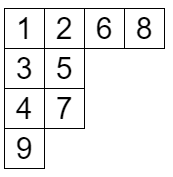
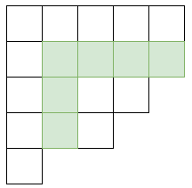


月刊組合せ論 Natori は面白そうな組合せ論のトピックを紹介していく企画です。今回はヤング図形好きなら外せない、フック長公式について深掘りしていきます。

## フック長公式

フック長公式は標準タブローの個数を数える公式です。標準タブローはヤング図形のマスに 1 から $n$ までの正の整数を一回ずつ書き込んだもので、各行・各列について単調増加なものです。

フックとは、あるマスとその右・下にあるマスからなる集合です。

フック長公式によると、標準タブローの個数は

$$
\frac{n!}{\prod_{(i,j)\in\lambda} h(i,j)}
$$

により求められます。ここで $h(i,j)$ はフック長、すなわちフックに含まれるマスの個数です。$\lambda$ を明示して $h_{\lambda}(i,j)$ と書くこともあります。すべてのマスについてフック長を計算し、その総積で $n!$ を割った値が標準タブローの個数ということです。

以下ではフック長公式の証明をいくつか紹介します。1 つ目の証明のみ詳述し、残りは概略を述べるだけとします。

## 確率論的証明

この証明が恐らくもっとも有名ではないでしょうか。

$\lambda$ 上の標準タブローの個数を $D_{\lambda}$ とおき、$F_{\lambda}=\frac{n!}{\prod_{(i,j)\in\lambda}h(i,j)}$ とおきます。

$\lambda$ の**隅**とは、右にも下にもマスがないようなマスをいいます。最大の数 $n$ が書き込まれるのは隅です。この隅を削除するとサイズ $n-1$ の標準タブローが得られます。よって $D_{\lambda}$ は次の漸化式を満たします。

$$
D_{\lambda}=\sum_{\mu\nearrow\lambda}D_{\mu}
$$

ここで $\mu\nearrow\lambda$ は $\lambda$ から隅を 1 個削除することで $\mu$ が得られることを表しています。このような $\mu$ 全体について和をとるという意味です。

$\lambda=(1)$ のとき $D_{\lambda}=F_{\lambda}=1$ なので、$F_{\lambda}$ が同じ漸化式

$$
F_{\lambda}=\sum_{\mu\nearrow\lambda}F_{\mu}
$$

をみたすことを示せばよいです。この式を $\sum\frac{F_{\mu}}{F_{\lambda}}=1$ と書き換えます。この式を確率的に解釈していきましょう。

ヤング図形 $\lambda$ 上の**フックウォーク**を定義します。

- まず $\lambda$ のマスを一様ランダムに 1 つ選び、$(x_1,y_1)$ とします。
- 次に $(x_1,y_1)$ に関するフックから $(x_1,y_1)$ を除いた集合が空でないとき、その中から一様ランダムにマスを 1 つ選び、$(x_2,y_2)$ とします。
- これを繰り返します。

選んだマスを並べた $(x_1,y_1),(x_2,y_2),\ldots, (x_k,y_k)$ をフックウォークと呼びます。フックウォークの終点 $(x_k,y_k)$ は隅となります。このとき次の命題が成り立ちます。


**命題**: 隅 $(a,b)$ に対して、フックウォークの終点が $(a,b)$ となる確率は $\frac{F_{\mu}}{F_{\lambda}}$ である。ここで $\mu$ は $\lambda$ から $(a,b)$ を除いた図形である。


必ず終点が隅になることから確率の総和は 1 なので、この命題から示すべき式が従います。

命題を証明します。$(i,j)$ が隅 $(a,b)$ と同じ行にも列にもないとき $h_{\lambda}(i,j)=h_{\mu}(i,j)$ であることに注意すると

$$
\begin{align*}
\frac{F_{\mu}}{F_{\lambda}} &= \frac{(n-1)!/\prod_{(i,j)\in \mu}h_{\mu}(i,j)}{n!/\prod_{(i,j)\in \lambda}h_{\lambda}(i,j)} \\\
&= \frac{1}{n}\frac{\prod_{(i,j)\in\lambda}h_{\lambda}(i,j)}{\prod_{(i,j)\in\mu}h_{\mu}(i,j)} \\\
&= \frac{1}{n}\prod_{i=1}^{a-1}\frac{h_{\lambda}(i,b)}{h_{\lambda}(i,b)-1}\prod_{j=1}^{b-1}\frac{h_{\lambda}(a,j)}{h_{\lambda}(a,j)-1} \\\
&= \frac{1}{n}\prod_{i=1}^{a-1}\left(1+\frac{1}{h_{\lambda}(i,b)-1}\right)\prod_{j=1}^{b-1}\left(1+\frac{1}{h_{\lambda}(a,j)-1}\right)
\end{align*}
$$

となります。展開すると

$$
\begin{gather*}
\frac{F_{\mu}}{F_{\lambda}}=\frac{1}{n}\sum_{A\subseteq\\{1,\ldots,a-1\\}}\sum_{B\subseteq\\{1,\ldots,b-1\\}}Q(A,B) \\\
Q(A,B)=\prod_{i\in A}\frac{1}{h_{\lambda}(i,b)-1}\prod_{j\in B}\frac{1}{h_{\lambda}(a,j)-1}
\end{gather*}
$$

となります。

ここで部分集合 $A,B$ に対して、フックウォークの始点が $(\min(A\cup\\{a\\}), \min(B\cup\\{b\\}))$、終点が $(a,b)$ になるという条件の下で、フックウォークの行番号の集合が $A\cup\\{a\\}$、列番号の集合が $B\cup\\{b\\}$ になる条件付き確率を $P(A,B)$ とします。$P(A,B)=Q(A,B)$ を示せば命題が示されます。

$|A|+|B|$ に関する帰納法を用います。$A$ または $B$ が空集合のときは簡単にわかるので、そうでないとします。$x_1=\min A, y_1=\min B$ とおきます。$P(A,B)=\frac{1}{h_{\lambda}(x_1,y_1)-1}(P(A\setminus\\{x_1\\}, B)+P(A,B\setminus\\{y_1\\}))$ です。帰納法の仮定より

$$
\begin{align*}
P(A\setminus\\{x_1\\}, B) &= Q(A\setminus\\{x_1\\}, B) \\\
&= \prod_{i\in A\setminus\\{x_1\\}}\frac{1}{h_{\lambda}(i,b)-1}\prod_{j\in B}\frac{1}{h_{\lambda}(a,j)-1} \\\
&= (h_{\lambda}(x_1,b)-1)Q(A,B)
\end{align*}
$$

同様に

$$
P(A,B\setminus\\{y_1\\})=(h_{\lambda}(a,y_1)-1)Q(A,B)
$$

となるので

$$
P(A,B)=\frac{h_{\lambda}(x_1,b)-1+h_{\lambda}(a,y_1)-1}{h_{\lambda}(x_1,y_1)-1}Q(A,B)=Q(A,B)
$$

となります。

## 全単射

全単射を用いた証明がいくつかあります。$F_{\lambda}$ を標準タブローの個数とします。分母を払って $n!=F_{\lambda}\prod_{(i,j)}h(i,j)$ を示せばよいです。ここで $a(i,j)$ を $(i,j)$ より右にあるマスの個数、$l(i,j)$ を $(i,j)$ より下にあるマスの個数とすると、$h(i,j)=a(i,j)+l(i,j)+1$ となります。ゆえに $-l(i,j)$ 以上 $a(i,j)$ 以下の整数の個数は $h(i,j)$ です。マス $(i,j)$ に書かれている数が $-l(i,j)$ 以上 $a(i,j)$ 以下であるようなタブローをフックタブローと呼ぶことにします。

標準タブローの個数が $F_{\lambda}$、フックタブローの個数が $\prod_{(i,j)}h(i,j)$ であることから、標準タブローとフックタブローの組が順列と一対一対応することを示せばよいです。

詳しくは Sagan の教科書で解説されています。

## 表現論

ヤング図形は対称群の表現論と深くかかわります。例えば対称群 $S_n$ の既約表現はサイズ $n$ のヤング図形と一対一に対応し、$\lambda$ に対応する既約表現の次元は $\lambda$ 上の標準タブローの個数と等しくなります。

フロベニウスの指標公式と呼ばれるものがあり、そこから証明することができるようです。『テンソル代数と表現論』を参照してください。

## 複素解析

複素解析を用いた証明もあります。以下の文献で解説されています。

[ヤング図形の組合せ論講義](http://www.math.aoyama.ac.jp/users/kyo/preprint/CPower_textbook_combinatorics_2020.pdf)

## 幾何学

幾何学な証明は

- Pak, Igor. Hook length formula and geometric combinatorics. Sémin. Lothar. Comb. 46, B46f, 13 p. (2001).

にあるようです。(読んでいないのでわかりません……)

## おわりに

今回はフック長公式の様々な証明を紹介しました。1 つの公式にいろいろな証明があるのは面白いですね。

今後も月刊組合せ論 Natori では様々なトピックを紹介予定なので、応援のほどよろしくお願いいたします。

## 参考文献

- 池田岳. テンソル代数と表現論. 東京大学出版会. (2022).
- Romik, Dan. The surprising mathematics of longest increasing subsequences. Cambridge University Press. (2015).
- Sagan, Bruce E. The symmetric group. Representations, combinatorial algorithms, and symmetric functions. 2nd ed. Springer. (2001).
