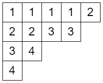

月刊組合せ論 Natori は面白そうな組合せ論のトピックを紹介していく企画です。今回は対称多項式の世界に足を踏み入れてみましょう。

## シューア多項式

シューア多項式については過去に記事にしました。ぜひお読みください。

[【月刊組合せ論 Natori】シューア多項式とヤコビ・トゥルーディ公式【2023 年 3 月号】](../202303/)

ここでは定義のみ紹介します。$\lambda$ を分割、$x$ を $(x_1,\ldots,x_n)$ の略記とし、$\mathrm{SSYT}(\lambda,n)$ を形が $\lambda$ で書かれている数字が $n$ 以下の半標準タブロー全体の集合とします。シューア多項式を

$$
s_{\lambda}(x)=\sum_{T\in\mathrm{SSYT}(\lambda,n)}x^T
$$

と定義します。ここで $T$ に $i$ が $\mu_i$ 回書かれているとき、$x^T=x_1^{\mu_1}\cdots x_n^{\mu_n}$ です。

## モノミアル対称多項式

例えば対称多項式に $x^3yz$ という単項式があるとき、$xy^3z$ や $xyz^3$ も現れなければなりません。単項式を一個決めたとき、現れるべき単項式をすべて集めた対称多項式を**モノミアル対称多項式**といいます。

厳密な定義はこうです。$\lambda$ を分割とするとき

$$
m_{\lambda}(x)=\sum_{\mu:\lambda \text{の並べ替え}}x^{\mu}
$$

と定義します。ここで $x^{\mu}=x_1^{\mu_1}\cdots x_n^{\mu_n}$ です。

$s_{\lambda}$ を $m_{\mu}$ の線形結合として表したときの $m_{\mu}$ の係数は、$s_{\lambda}$ における $x^{\mu}$ の係数と等しいです。これは形が $\lambda$ で $i$ が $\mu_i$ 回書かれている半標準タブローの個数となります。これを $K_{\lambda\mu}$ とおくと

$$
s_{\lambda}(x)=\sum_{\mu}K_{\lambda\mu}m_{\mu}(x)
$$

となります。この $K_{\lambda\mu}$ は**コストカ数**と呼ばれます。

## Hall-Littlewood 多項式

シューア多項式とモノミアル対称多項式をつなぐのが **Hall-Littlewood 多項式**です。新たに $t$ というパラメータを導入します。

Hall-Littlewood 多項式は

$$
P_{\lambda}(x_1,\ldots,x_n;t)=\frac{1}{v_{\lambda}(t)}\sum_{\sigma\in S_n}\sigma\left(x_1^{\lambda_1}\cdots x_n^{\lambda_n}\prod_{1\le i<j\le n}\frac{x_i-tx_j}{x_i-x_j}\right)
$$

により定義されます。ここで $\lambda$ に現れる $i$ の個数を $m_i(\lambda)$ とおき、$t$ 階乗を

$$
[m]_t!=[m]_t[m-1]_t\cdots [1]_t \quad ([k]_t=1+t+\cdots+t^{k-1})
$$

と定義するとき

$$
v_{\lambda}(t)=\prod_{i=0}^{\infty}[m_i(\lambda)]_t!
$$

とします。また $\sigma\in S_n$ は $x_i$ の置換として作用します。

$t=0$ のときシューア多項式、$t=1$ のときモノミアル対称多項式となります。

例: $P_{(3,1)}(x_1,x_2;t)=x_1^3x_2+(1-t)x_1^2x_2^2+x_1x_2^3$

## Kostka-Foulkes 多項式

シューア多項式を Hall-Littlewood 多項式の線形結合として表すことができます。そのときの係数が **Kostka-Foulkes 多項式**です。

式で書くと次のようになります。$K_{\lambda\mu}(t)$ が Kostka-Foulkes 多項式です。

$$
s_{\lambda}(x)=\sum_{\mu}K_{\lambda\mu}(t)P_{\mu}(x;t)
$$

$t=1$ を代入すると

$$
s_{\lambda}(x)=\sum_{\mu}K_{\lambda\mu}(1)m_{\mu}(x)
$$

になることから、$K_{\lambda\mu}(1)$ は Kostka 数になることがわかります。

Kazhdan-Lusztig 多項式の理論から、Kostka-Foulkes 多項式 $K_{\lambda\mu}(t)$ の係数は非負整数であることがわかります。combinatorialist としては、係数をある集合の要素数として組合せ論的に解釈したくなりませんか？

Lascoux と Schützenberger は、この問題を charge と呼ばれる量を導入することで解決しました。charge の定義は後回しにして、結果を先に紹介します。

$$
K_{\lambda\mu}(t)=\sum_{T\in\mathrm{SSYT}(\lambda,\mu)}t^{\mathrm{charge}(T)}
$$

すなわち、$K_{\lambda\mu}(t)$ の $t^k$ の係数は、形が $\lambda$ でウェイトが $\mu$ の (すなわち $i$ が $\mu_i$ 回書かれている) 半標準タブローであって、charge が $k$ に等しいものの個数となります。

## charge の定義

それでは charge を定義しましょう。

### 順列に対する charge

$w$ を順列とします。このとき $w$ の charge は、$j$ が $j+1$ より前に現れるような $j$ に関する $n-w_j$ の総和として定義されます。

例えば $w=31425$ のとき、条件を満たす $j$ は $1,2,3$ なので charge は $(5-3)+(5-1)+(5-4)=7$ です。

### 数列に対する charge

次に重複がある数列について考えます。ただし (1 の個数)≧(2 の個数)≧… という条件を付けます。

- $i=1$ とする。右から左に読む。
- $i$ が現れたとき、そこに印をつけ $i$ を 1 増やす。
- 左端に到着したとき、再び右端に戻る。
- 最大値に印をつけたとき、印のつけた数を取り出して順列を得る。残った数からなる数列に再び最初の操作を行う。
- これをすべての数が取り出されるまで繰り返す。

例えば 21314132 で試してみましょう。印をつけた数を太字にします。まず右から左に読むと **2**1314**1**32 となり、右に戻って再び読むと **2**131**413**2 となります。取り出される順列は 2413 となり、残った数列は 1312 です。残った数列に同じ操作を行うと 1**312** となります。取り出される順列は 312 です。最後に 1 が残り、そのまま取り出されます。よって 21314132 から 2413, 312, 1 が取り出されました。

このとき、charge は取り出された順列の charge の総和として定義されます。上の例では 2413, 312, 1 の charge の和が 21314132 の charge となります。

### 半標準タブローに対する charge

形が $\lambda$、ウェイトが $\mu$ の半標準タブローが与えられたとき、一番下の行から始めて行を連結することで語を得ることができます。この語の charge をタブローの charge と定義します。$\mu$ は分割、すなわち $\mu_1\ge \mu_2\ge\cdots$ をみたすので、(1 の個数)≧(2 の個数)≧… をみたします。

例えば次の半標準タブローから得られる数列は 434223311112 です。この数列の charge がタブローの charge となります。

## charge の正体

charge が定義できましたが、この定義を見てもなんやとしか思いませんよね。非常にミステリアスです。

別の観点から charge を理解する試みがあります。次のような観点があります。

- 結晶グラフ
- energy function
- affine Grassmannian

それぞれ以下の論文をご覧ください。

- Lascoux, Alain; Leclerc, Bernard; Thibon, Jean-Yves; Crystal graphs and $q$-analogues of weight multiplicities for the root system $A_n$. Lett. Math. Phys. 35, No. 4, 359-374 (1995).
- Nakayashiki, Atsushi; Yamada, Yasuhiko; Kostka polynomials and energy functions in solvable lattice models. Sel. Math., New Ser. 3, No. 4, 547-599 (1997).
- Patimo, Leonardo; Charges via the Affine Grassmannian. arXiv:2106.02564.

## 一般化

ここで紹介した Hall-Littlewood 多項式と Kostka-Foulkes 多項式は A 型です。他のルート系に一般化することができます。定義は割愛します。

A 型の Kostka-Foulkes 多項式は charge を用いて表せましたが、一般化された Kostka-Foulkes 多項式についてこのようなことができるかという問題は未解決です。具体的には次のような未解決問題です。

1. $\mathrm{SSYT}(\lambda,\mu)$ の代わりとなる集合 $S(\lambda,\mu)$ を見つける。
2. $K_{\lambda\mu}(t)=\sum_{T\in S(\lambda,\mu)}t^{\mathrm{charge}(T)}$ をみたす関数 $\mathrm{charge}$ を見つける。

C 型の場合部分的に解決されています。以下の論文をご覧ください。

- Dołęga, Maciej; Gerber, Thomas; Torres, Jacinta; A positive combinatorial formula for symplectic Kostka-Foulkes polynomials. I: Rows. J. Algebra 560. (2020).
- Lecouvey, Cédric; Lenart, Cristian; Combinatorics of generalized exponents. Int. Math. Res. Not. 2020 (2020).
- Patimo, Leonardo; Torres, Jacinta; Atoms and charge in type $C_2$. arXiv:2303.15560.

## おわりに

Hall-Littlewood 多項式、Kostka-Foulkes 多項式を紹介して、最後には未解決問題にも触れました。

皆さんも未解決問題に挑んでみませんか？

## 参考文献

- Désarménien, J.; Leclerc, B.; Thibon, J.-Y. Hall-Littlewood functions and Kostka-Foulkes polynomials in representation theory. Sémin. Lothar. Comb. 32, B32c, 38 p. (1994).
- Butler, Lynne M. Subgroup lattices and symmetric functions. Mem. Am. Math. Soc. 539, 160 p. (1994).
- Macdonald, Ian Grant; Symmetric functions and Hall polynomials. 2nd ed. Oxford: Clarendon Press. x, 475 p. (1995).