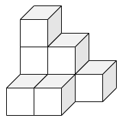
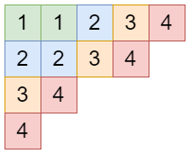
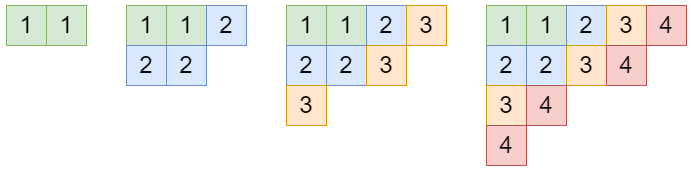


月刊組合せ論 Natori は面白そうな組合せ論のトピックを紹介していく企画です。今回は美しく輝く公式の 1 つ、平面分割の母関数について考えていきます。

## 平面分割の母関数

**平面分割**とは平面上の非負整数列 $(a_{ij})_{i,j=1}^{\infty}$ であって、次の条件を満たすものです。

1. $a_{ij}\ge a_{i+1,j}$
2. $a_{ij}\ge a_{i,j+1}$
3. $a_{ij}$ の総和は有限

例えば

$$
\begin{pmatrix}
3 & 2 & 1 & 0 & \cdots \\\
1 & 1 & 0 & 0 & \cdots \\\
0 & 0 & 0 & 0 & \cdots \\\
\vdots & \vdots & \vdots & \vdots & \ddots
\end{pmatrix}
$$

は平面分割です。総和は 8 なので、8 の平面分割といいます。

座標 $(i,j)$ に $a_{ij}$ 個の箱を積み上げることで平面分割を可視化することができます。これは 3 次元ヤング図形ともいいます。

$n$ の平面分割の個数を $pp(n)$ とおきます。今回証明するのは次の公式です。


**定理**: 平面分割の母関数は
$$
\sum_{n=0}^{\infty}pp(n)x^n=\prod_{m=1}^{\infty}\frac{1}{(1-x^m)^m}
$$


この公式は**マクマホンの公式**とも呼ばれています。

参考までに 2 次元の場合も見てみましょう。$p(n)$ を分割数とすると、母関数は

$$
\sum_{n=0}^{\infty}p(n)x^n=\prod_{m=1}^{\infty}\frac{1}{1-x^m}
$$

となります。ぱっと見では似ている式です。しかしその背後にある構造は大きく異なります。マクマホンの公式の方が「深い」公式だと思っています。なお、4 次元以上の分割の母関数ではこのような表示は見つかっていないようです。

## 平面分割の特徴づけ

マクマホンの公式を示すために、平面分割について調べていきます。平面分割を斜めに切るという操作が重要です。

例として次の平面分割を考えます。

$$
\begin{pmatrix}
5 & 4 & 2 & 1 & \cdots \\\
3 & 3 & 1 & 1 & \cdots \\\
2 & 1 & 1 & 0 & \cdots \\\
2 & 1 & 0 & 0 & \cdots \\\
\vdots & \vdots & \vdots & \vdots & \ddots
\end{pmatrix}
$$

主対角線の数字を拾うと $(5,3,1,0,\ldots)$ となります。これは (通常の) 分割です。

1 つ右の対角線を見ると $(4,1,0,0,\ldots)$ となります。2 つの分割の間にはどのような関係があるでしょうか。

隣り合う対角線について得られる分割を $\lambda=(\lambda_1,\lambda_2,\ldots), \mu=(\mu_1,\mu_2,\ldots)$ とします。このとき $\lambda_1\ge \mu_1\ge \lambda_2\ge \mu_2\ge\cdots$ が成り立ちます。この関係を**交錯**と呼び、記号で $\lambda \succ \mu$ と表します。

主対角線から右に進んでいくと、交錯しながら減少していき最終的に $(0)$ になります。上の例では $(5,3,1)\succ (4,1)\succ (2,1)\succ (1)\succ (0)$ です。下に進んでいく場合も同様です。

これを数式で書くと、平面分割は

$$
\\{(0)=\lambda^{(0)}\prec \lambda^{(1)}\prec\cdots\prec \lambda^{(m)}=\mu^{(n)}\succ\cdots \mu^{(1)}\succ\mu^{(0)}=(0)\\}
$$

と同一視されます。$m,n$ を固定すれば、これは 0 でない成分だけを見たとき $m\times n$ 長方形の内部に含まれる平面分割となります。

## 半標準タブローとシューア多項式

シューア多項式については過去に記事にしました。ぜひお読みください。

[【月刊組合せ論 Natori】シューア多項式とヤコビ・トゥルーディ公式【2023 年 3 月号】](../202303/)

シューア多項式は次のような多項式でした。

$$
s_{\lambda}(x)=\sum_{T\in\mathrm{SSYT}(\lambda,n)}x^T
$$

この式に登場する半標準タブロー $T\in\mathrm{SSYT}(\lambda,n)$ について考えていきましょう。

このタブローを、何もないところから始めて、$1,2,3,4$ の順に加えていくことで作ります。

タブローが成長していますね。形に注目すると、$(2), (3,2), (4,3,1), (5,4,2,1)$ となります。

実は $(2)\prec (3,2)\prec (4,3,1)\prec (5,4,2,1)$ という交錯関係があります。このように、半標準タブローの集合 $\mathrm{SSYT}(\lambda,n)$ は

$$
\\{(0)=\lambda^{(0)}\prec\lambda^{(1)}\prec\cdots\prec\lambda^{(n)}=\lambda\\}
$$

と同一視されます。ここで $\lambda^{(i)}$ は $i$ 以下の数のみに注目して得られる半標準タブローです。

平面分割の章でやったことを思い出すと、平面分割は同じ形の半標準タブローの組と同一視できます。

## コーシーの等式

マクマホンの公式の証明にあたって、次のコーシーの等式を用います。

$$
\sum_{\lambda}s_{\lambda}(x_1,\ldots,x_m)s_{\lambda}(y_1,\ldots,y_n)=\prod_{i=1}^m\prod_{j=1}^n\frac{1}{1-x_iy_j}
$$

この等式は RSK 対応を用いて証明できます。いつか記事にするかもしれません。

## 証明

いよいよマクマホンの公式を証明します。

平面分割を

$$
\\{(0)=\lambda^{(0)}\prec \lambda^{(1)}\prec\cdots\prec \lambda^{(m)}=\mu^{(n)}\succ\cdots \mu^{(1)}\succ\mu^{(0)}=(0)\\}
$$

と見たとき、箱の数は

$$
|\lambda^{(1)}|+\cdots+|\lambda^{(m-1)}|+|\mu^{(1)}|+\cdots+|\mu^{(n-1)}|+\frac12(|\lambda^{(m)}|+|\mu^{(n)}|)
$$

であることに注意します。

シューア多項式については

$$
s_{\lambda}(x_1,\ldots,x_m)=\sum x_1^{|\lambda^{(1)}|}x_2^{|\lambda^{(2)}|-|\lambda^{(1)}|}\cdots x_m^{|\lambda^{(m)}|-|\lambda^{(m-1)}|}
$$

が成り立ちます。ここで右辺の和は

$$
\\{(0)=\lambda^{(0)}\prec\lambda^{(1)}\prec\cdots\prec\lambda^{(n)}=\lambda\\}
$$

に関するものです。$x_i=q^{m-i+1/2}$ を代入することで

$$
s_{\lambda}(q^{m-1/2}, q^{m-3/2},\ldots,q^{1/2})=\sum q^{|\lambda^{(1)}|+\cdots+|\lambda^{(m-1)}|+|\lambda^{(m)}|/2}
$$

となります。同様に $y_i=q^{n-i+1/2}$ とします。コーシーの等式より

$$
\begin{align*}
\sum q^{|\lambda^{(1)}|+\cdots+|\lambda^{(m-1)}|+|\mu^{(1)}|+\cdots+|\mu^{(n-1)}|+\frac12(|\lambda^{(m)}|+|\mu^{(n)}|)} &= \prod_{i=1}^m\prod_{j=1}^n\frac{1}{1-q^{m+n-i-j+1}} \\\
&= \prod_{i=1}^m\prod_{j=1}^n\frac{1}{1-q^{i+j-1}}
\end{align*}
$$

となります。ここで $m,n\to\infty$ とします。左辺は平面分割全体をわたる和と考えられるので

$$
\sum_{n=0}^{\infty}pp(n)q^n
$$

となります。右辺は $i+j-1=k$ をみたす $(i,j)$ が $k$ 通りあることから

$$
\prod_{k=1}^{\infty}\frac{1}{(1-q^k)^k}
$$

となります。この 2 つを等式で結べば、マクマホンの公式が得られます。

## おわりに

平面分割は組合せ論を超えて数理物理などともつながる面白い対象です。みなさんもぜひ勉強してみてください。

## 参考文献

- Betea, D.; Wheeler, M. Refined Cauchy and Littlewood identities, plane partitions and symmetry classes of alternating sign matrices. J. Comb. Theory, Ser. A 137, 126-165 (2016).
- 高崎金久, 線形代数と数え上げ 増補版. 日本評論社 (2021).
