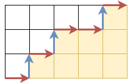

月刊組合せ論 Natori は面白そうな組合せ論のトピックを紹介していく企画です。今回は代数的組合せ論で非常に重要な $q$ 二項係数の基礎を解説します。

## 最短経路の個数

まずは次の問題を考えてみましょう。


右に 1 進む、または上に 1 進むということを繰り返して、点 $(0,0)$ から $(m,n)$ に到達する方法は何通りありますか。


有名問題なので、どこかで見たことがある人も多いかもしれません。移動回数が $m+n$ 回で、そのうちの $m$ 個を右、$n$ 個を上にするので、答えは二項係数 $\binom{m+n}{m}$ です。

## 最短経路と面積

この問題に少しアレンジを加えてみましょう。最短経路は長方形の内部を通るので、長方形は 2 つに分けられます。下側の部分の面積を考えてみましょう。

上の図の場合、下側の部分の面積は 8 です。

$(m,n)=(2,3)$ の場合にすべての最短経路について下側の面積を求めてみます。すると次のような分布になりました。

| 下側の面積 | 個数 |
| -------- |  -------- |
| 0 | 1 |
| 1 | 1 |
| 2 | 2 |
| 3 | 2 |
| 4 | 2 |
| 5 | 1 |
| 6 | 1 |

これを 1 つにまとめる方法として、多項式を考えるという方法があります。変数は慣習で $x$ ではなく $q$ を用います。$q^k$ の係数を下側の面積が $k$ である経路の個数とした多項式を考えます。$(m,n)=(2,3)$ の場合

$$
1+q+2q^2+2q^3+2q^4+q^5+q^6
$$

となります。

$q=1$ を代入すると係数の和を求めることになります。これは最短経路の総数となるので、$\binom{m+n}{m}$ です。この意味で、この多項式は二項係数の一般化になっていると考えられます。この多項式を**ガウス多項式**または **q 二項係数**といい、$\binom{m+n}{m}_q$ と表します。

$$
\begin{bmatrix} m+n \\ m\end{bmatrix}_q
$$

と表されることもあります。

## $q$ 二項係数の性質

$q$ 二項係数の性質を見ていきます。

まず係数は対称になっています。これは長方形の上側と下側の対応を考えれば明らかです。

また、$\binom{m+n}{m}_q=\binom{m+n}{n}_q$ が成り立ちます。これは長方形の縦と横を入れ替えたものを考えればよいです。

通常の二項係数は 2 つの二項係数の和で表されます。$q$ 二項係数バージョンでは次の等式が成り立ちます。

$$
\binom{m+n}{m}_q=\binom{m+n-1}{m}_q+q^n\binom{m+n-1}{m-1}_q
$$

これは経路の最後のステップで場合分けすればわかります。この式を用いると、様々な式が帰納的に証明できます。例えば

$$
\binom{m+n}{m}_q=\frac{[m+n]_q!}{[m]_q![n]_q!}
$$

が証明できます。ここで $[n]_q!$ は $q$ 階乗で、$q$ 整数 $[n]_q=1+q+\cdots+q^{n-1}$ を用いて $[n]_q!=[1]_q[2]_q\cdots [n]_q$ と定義されます。$q$ 階乗や $q$ 整数は $q=1$ のとき通常の階乗、整数に一致するので、上の等式は二項係数の表示の一般化となっています。

最後に、二項係数といえばやはり二項定理です。$q$ 二項係数の場合、次の $q$ 二項定理が成り立ちます。

$$
(1+xq)(1+xq^2)\cdots(1+xq^n)=\sum_{i=0}^n\binom{n}{i}_q q^{i(i+1)/2}x^i
$$

証明します。左辺の $x^i$ の係数が $\binom{n}{i}_qq^{i(i+1)/2}$ であることを示せばよいです。$x^i$ の係数は、左辺の各因子において右側の項を $i$ 回選ぶことと対応します。選んだ項を $xq^{a_1},\ldots,xq^{a_i} \ (a_1<\cdots<a_i)$ とします。$b_j=a_j-j$ とおくと、$0\le b_1\le \cdots\le b_i\le n-i$ となり、$q^{a_1+\cdots+a_i}=q^{i(i+1)/2}q^{b_1+\cdots+b_i}$ となります。$i$ 番目の右向きの矢印の高さを $b_i$ とすることで、広義単調増加列 $b$ はグリッド上の経路と一対一に対応し、$b_1+\cdots+b_i$ はその経路の下側の面積となります。よって $q$ 二項係数が現れます。

## 競技プログラミングにおける $q$ 二項係数

競技プログラミングにおいて $q$ 二項係数は上級者向けの知識となっています。例えば以下のような問題と関係しています。

- [MojaCoder Grid partitioning](https://mojacoder.app/users/_kanpurin_/problems/kanpurin006)
- [AtCoder Regular Contest 145 F - Modulo Sum of Increasing Sequences](https://atcoder.jp/contests/arc145/tasks/arc145_f)
- [AtCoder Beginner Contest 278 Ex - make 1](https://atcoder.jp/contests/abc278/tasks/abc278_h)

特に make 1 の解説で詳しく扱われています。

## おわりに

今回は $q$ 二項係数の基礎を解説しました。筆者はあまり理解できていませんが、$q$ 数え上げの世界は非常に広いです。今後も扱うかもしれません。

## お知らせ

一年にわたり続けてきた月刊組合せ論 Natori ですが、研究と修士論文執筆に集中するため、しばらくの間お休みさせていただきます。

落ち着いてきたら復活する予定ですので、そのときはまた応援のほどよろしくお願いします！

## 参考文献

- Bressoud, David M. Proofs and confirmations. The story of the alternating sign matrix conjecture. Spectrum Series. Cambridge: Cambridge University Press. xv, 274 p. (1999).
- [メモ: q-二項係数 - noshi91のメモ](https://noshi91.hatenablog.com/entry/2023/07/07/023853)
