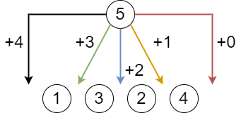


月刊組合せ論 Natori は面白そうな組合せ論のトピックを紹介していく企画です。今回は転倒数が $k$ に等しい順列の個数を求めたいと思います。

## 転倒数

長さ $n$ の順列とは $(1,2,\ldots,n)$ の順列のこととします。

順列 $p=(p_1,p_2,\ldots,p_n)$ の**転倒数**とは、$1\le i<j\le n$ かつ $p_i>p_j$ をみたす組 $(i,j)$ の個数です。例えば順列 $(1,4,2,3)$ の転倒数は 2 です。

転倒数が $k$ の順列を構築する問題を紹介します。(厳密には順列ではないですが、似たようなものです。)

https://yukicoder.me/problems/no/1619

この記事では構築ではなく数え上げを考えていきます。

## 表

長さ $n$ の順列であって転倒数が $k$ であるものの個数を $b(n,k)$ とおきます。表は次のようになります。

| n\k | 0 | 1 | 2 | 3 | 4 | 5 | 6 | 7 | 8 | 9 | 10 |
| - | - | - | - | - | - | - | - | - | - | - | - |
| 1 | 1 |
| 2 | 1 | 1 |
| 3 | 1 | 2 | 2 | 1 |
| 4 | 1 | 3 | 5 | 6 | 5 | 3 | 1
| 5 | 1 | 4 | 9 | 15 | 20 | 22 | 20 | 15 | 9 | 4 | 1 |

この表を見て簡単に気が付くことがあります。

- $b(n,k)\ne 0$ となる $k$ の最大値は $\frac{n(n-1)}{2}$ : 転倒数が最大となるのは $(n,n-1,\ldots,2,1)$ のときだからです。
- 左右対称 : 順列を反転させる行為が全単射になります。

次の節では具体的に値を求める方法を考えていきます。

## 動的計画法

転倒数が $k$ である長さ $n+1$ の順列の個数 $b(n+1,k)$ を動的計画法で求めます。(すなわち漸化式を求めます。)

長さ $n+1$ の順列は長さ $n$ の順列に $n+1$ を挿入することで得られます。

$n+1$ を右端に挿入すると転倒数は増えず、右端から 1 つ隣に挿入すると転倒数は 1 増加し、…、左端に挿入すると転倒数は $n$ 増加します。

このことから、長さ $n+1$ で転倒数が $k$ である順列は長さ $n$ で

- 転倒数が $k$ の順列
- 転倒数が $k-1$ の順列
- …
- 転倒数が $k-n$ の順列

に挿入を行うことで得られます。これより、漸化式は

$$
b(n+1,k)=b(n,k)+b(n,k-1)+\cdots+b(n,k-n)
$$

となります。これで、時間計算量 $O(n^2k)$ の解法が得られました。

ここで $k$ を $k-1$ に置き換えた式

$$
b(n+1,k-1)=b(n,k-1)+\cdots+b(n,k-n)+b(n,k-n-1)
$$

に注目すると

$$
b(n+1,k)=b(n+1,k-1)+b(n,k)-b(n,k-n-1)
$$

という漸化式が得られます。これで時間計算量 $O(nk)$ で求めることができます。

## 母関数

みんな大好き母関数を考えましょう。$\mathrm{inv}(p)$ を $p$ の転倒数として

$$
f_n(z)=\sum_{k=0}^{n(n-1)/2} b(n,k)z^k=\sum_{p\in S_n}z^{\mathrm{inv}(p)}
$$

とおきます。漸化式

$$
b(n+1,k)=b(n,k)+b(n,k-1)+\cdots+b(n,k-n)
$$

を用いると

$$
\begin{align*}
f_{n+1}(z) &= \sum_{k\ge 0}b(n+1,k)z^k \\\
&= \sum_{k\ge 0}(b(n,k)+b(n,k-1)+\cdots+b(n,k-n))z^k \\\
&= \sum_{k\ge 0}b(n,k)(z^k+z^{k+1}+\cdots+z^{k+n}) \\\
&= (1+z+z^2+\cdots+z^n)\sum_{k\ge 0}b(n,k)z^k \\\
&= (1+z+z^2+\cdots+z^n)f_n(z)
\end{align*}
$$

となるので、これより

$$
f_n(z)=(1+z)(1+z+z^2)\cdots (1+z+z^2+\cdots+z^{n-1})
$$

となります。これは $n$ の階乗の $q$ 類似となっています (ここでは $q$ ではなく $z$ を用いていますが)。

この等式を組合せ論的に解釈してみましょう。$1,2,\ldots,n$ の順に挿入していくことで順列を作ります。まず $1$ を置きます。$2$ を挿入するとき、$1$ の右にするか左にするかによって、転倒数が 0 または 1 増えます。これが $(1+z)$ に対応します。$3$ を挿入するとき、どの位置に挿入するかによって転倒数が $0,1,2$ のいずれかの値だけ増えます。これが $(1+z+z^2)$ に対応します。このようにして上の等式を得ることもできます。

## オイラーの五角数定理

[【月刊組合せ論 Natori】ヤコビの三重積公式とオイラーの五角数定理【2023 年 2 月号】](https://combinatorics-fun.vercel.app/natori/202302/)で紹介したオイラーの五角数定理は次の等式です。

$$
(1-z)(1-z^2)(1-z^3)\cdots =\sum_{j\in\mathbb{Z}}(-1)^jz^{(3j^2+j)/2}
$$

この式を $g(z)$ とおきます。

## 転倒数と五角数

$b(n,k)$ の母関数は

$$
\begin{align*}
f_n(z) &= (1+z)(1+z+z^2)\cdots (1+z+z^2+\cdots+z^{n-1}) \\\
&= \prod_{j=1}^n \frac{1-z^j}{1-z}
\end{align*}
$$

でした。$g_n(z)=\prod_{j=1}^n(1-z^j), h_n(z)=(1-z)^{-n}$ とおくと、$f_n(z)=g_n(z)h_n(z)$ です。$f_n(z)$ における $z^k$ の係数 $b(n,k)$ を求めたいです。

$n\ge k$ を仮定すると、$g_n(z)$ を $g(z)$ に置き換えてもよいです。すなわち $g(z)h_n(z)$ における $z^k$ の係数も $b(n,k)$ です。$g(z)$ は上述の通りです。$h_n(z)$ は負の二項定理より

$$
h_n(z)=(1-z)^{-n}=\sum_{k\ge 0}\binom{n+k-1}{k}z^k
$$

と表せます。これらを合わせると、$b(n,k)$ は次のように表せることがわかります。


**定理**: $n\ge k$ とする。転倒数が $k$ である長さ $n$ の順列の個数は
$$
b(n,k)=\sum_j(-1)^j\binom{n+k-d_j-1}{k-d_j}
$$
に等しい。ここで $j$ は五角数 $d_j=(3j^2+j)/2$ が $k$ 以下となる範囲を動く。


なお競技プログラミングにおいては、$(1-z)(1-z^2)\cdots (1-z^n)$ を形式的べき級数の exp, log を用いて計算することで $b(n,k)$ を求めることができるそうです。この方法は $n\ge k$ でない場合も使えます。

## おわりに

順列の世界は奥深いですね。

長らくおやすみをいただいていた月刊組合せ論 Natori ですが、ようやく復活することができました。更新は不定期になるかもしれませんが、今後も応援のほどよろしくお願いします。

## 参考文献

- Bóna, Miklós. Combinatorics of permutations. 3rd ed.
