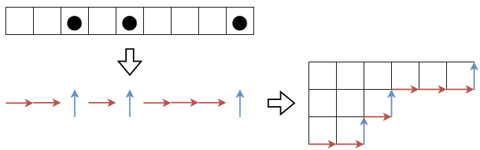
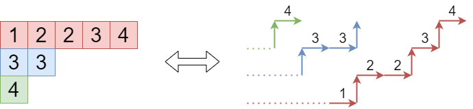

月刊組合せ論 Natori は面白そうな組合せ論のトピックを紹介していく企画です。今回は半標準ヤングタブローの個数を求める公式について解説します。

## 半標準ヤングタブロー

ヤング図形のマスに正整数を書き込んだものであって

- 各行について広義単調増加
- 各列について狭義単調増加

となるものを**半標準ヤングタブロー**といいます。[シューア多項式とヤコビ・トゥルーディ公式【2023 年 3 月号】](../202303/)もご覧ください。

分割 $\lambda=(\lambda_1,\ldots,\lambda_n)$ に対する半標準ヤングタブローの集合を $\mathrm{SSYT}(\lambda,n)$ とし、その要素数を $d_{\lambda}(n)$ とします。ここで $\lambda$ の成分は $0$ を含んでもよいものとし、タブローに書き込む数は $n$ 以下であるものとします。

## この公式を覚えましょう！

半標準ヤングタブローの個数を求めたくなったとき、この公式を使いましょう。

$$
d_{\lambda}(n)=\prod_{1\le i<j\le n}\frac{\lambda_i-\lambda_j+j-i}{j-i}
$$

証明をします。2023 年 3 月号でも述べたように、シューア多項式は

$$
s_{\lambda}(x_1,\ldots,x_n)=\sum_{T\in\mathrm{SSYT}(\lambda,n)}x^T
$$

および

$$
s_{\lambda}(x_1,\ldots,x_n)=\frac{A_{\lambda+\delta_n}(x_1,\ldots,x_n)}{A_{\delta_n}(x_1,\ldots,x_n)}
$$

という 2 つの表示をもちます (ここで $\delta_n=(n-1,\ldots,1,0), A_{\alpha}(x_1,\ldots,x_n)=\det(x_i ^ {\alpha_j})$ です)。1 つ目の等式から $d_{\lambda}(n)=s_{\lambda}(1,1,\ldots,1)$ です。2 つ目の等式に $x_1=\cdots=x_n=1$ を代入したいところですが、そのままでは $\frac{0}{0}$ になってしまいます。そこで $s_{\lambda}(1,q,q^2,\ldots,q^{n-1})$ を計算します。分母は Vandermonde 行列式

$$
A_{\delta_n}(x_1,\ldots,x_n)=
\begin{vmatrix}
x_1^{n-1} & \cdots & x_1 & 1 \\
x_2^{n-1} & \cdots & x_2 & 1 \\
\vdots & \ddots & \vdots & \vdots \\
x_n^{n-1} & \cdots & x_n & 1
\end{vmatrix}
=\prod_{1\le i<j\le n}(x_i-x_j)
$$

なので

$$
A_{\delta_n}(1,q,q^2,\ldots,q^{n-1})=\prod_{1\le i<j\le n}(q^{i-1}-q^{j-1})
$$

となります。一方で

$$
A_{\lambda+\delta_n}(1,q,q^2,\ldots,q^{n-1})=
\begin{vmatrix}
1 & 1 & \cdots & 1 \\
q^{\lambda_1+n-1} & q^{\lambda_2+n-2} & \cdots & q^{\lambda_n} \\
q^{2(\lambda_1+n-1)} & q^{2(\lambda_2+n-2)} & \cdots & q^{2\lambda_n} \\
\vdots & \vdots & \ddots & \vdots \\
q^{(n-1)(\lambda_1+n-1)} & q^{(n-1)(\lambda_2+n-2)} & \cdots & q^{(n-1)\lambda_n}
\end{vmatrix}
$$

となり、$A_{\delta_n}$ とは形が少し異なりますがこれも Vandermonde 行列式です。よって

$$
A_{\lambda+\delta_n}(1,q,q^2,\ldots,q^{n-1})=\prod_{1\le i<j\le n}(q^{\lambda_j+n-j}-q^{\lambda_i+n-i})
$$

となります。これらを合わせて

$$
s_{\lambda}(1,q,q^2,\ldots,q^{n-1})=\prod_{1\le i<j\le n}\frac{q^{\lambda_j+n-j}-q^{\lambda_i+n-i}}{q^{i-1}-q^{j-1}}
$$

となります。$q\to 1$ の極限をとります。$(q^n-1)/(q-1)\to n$ であることを用いると

$$
d_{\lambda}(n)=\prod_{1\le i<j\le n}\frac{\lambda_j-j-\lambda_i+i}{i-j}
$$

となり、上で掲げた式が得られました。

## フック容量公式

フック容量公式 (hook content formula) も有名です。マス $(i,j)\in\lambda$ におけるフック長を $h(i,j)$ とします。また、容量を $c(i,j)=j-i$ により定めます。このとき

$$
d_{\lambda}(n)=\prod_{(i,j)\in\lambda}\frac{n+c(i,j)}{h(i,j)}
$$

が成り立ちます。これを先ほどの等式を用いて証明しましょう。

再び記事『[ヤング図形と競技プログラミング](https://zenn.dev/koboshi/articles/306304c0381c1e)』の図を使いまわしますが、ヤング図形はマヤ図形とみなすことができます。

$l_i=\lambda_i+n-i$ とおきます。$M=\{l_1,\ldots,l_n\}$ はマヤ図形と対応します (つまり $l_i$ は黒丸の位置と対応します)。いま

$$
\begin{gather*}
\prod_{1\le i<j\le n}(\lambda_i-\lambda_j+j-i)=\prod_{1\le i<j\le n}(l_i-l_j)=\prod_{\substack{0\le q<p \\ p,q\in M}}(p-q) \\
\prod_{1\le i<j\le n}(j-i)=\prod_{0\le q<p<n}(p-q)
\end{gather*}
$$

となります。またマヤゲームのところで説明した通り、フックを引き抜く操作は黒石を左側の空きマスに移動させることと対応します。このことからフックは左側の空きマスと右側の黒石のペアとして表現できます。よって

$$
\prod_{(i,j)\in\lambda}h(i,j)=\prod_{\substack{0\le q<p \\ p\in M, q\notin M}}(p-q)
$$

となります。以上より

$$
\begin{align*}
d_{\lambda}(n)\prod_{(i,j)\in \lambda}h(i,j) &= \frac{\prod_{0\le q<p; \ p,q\in M}(p-q)\prod_{0\le q<p; \ p\in M, q\notin M}(p-q)}{\prod_{0\le q<p<n}(p-q)} \\
&= \frac{\prod_{0\le q<p; \ p\in M}(p-q)}{\prod_{0\le q<p<n}(p-q)} \\
&= \prod_{i=1}^n\frac{l_i!}{(n-i)!} \\
&= \prod_{i=1}^n(\lambda_i+n-i)(\lambda_i+n-i-1)\cdots (n-i+1) \\
&= \prod_{(i,j)\in\lambda}(n+c(i,j))
\end{align*}
$$

が得られました。

## LGV 公式

半標準ヤングタブローと非交差経路の対応をもとに、LGV 公式を用いて $d_{\lambda}(n)$ を求める方法もあります。

大雑把に説明すると、横向きの辺の高さとマスに書かれている数が対応します。

厳密には次のようになります。$i=1,2,\ldots,n$ に対して $a_i=(0,i), b_i=(\lambda_i+n-i, n)$ とするとき、$a_i$ から $b_i$ への非交差経路の組が半標準ヤングタブローと一対一対応します。上の図は $\lambda=(5,2,1,0)$ の場合です。

このような非交差経路の組の個数は LGV 公式より

$$
\det\left[\binom{\lambda_j+n-j+n-i}{n-i}\right]
$$

となります。ここで

$$
\binom{\lambda_j+n-j+n-i}{n-i}=\frac{(\lambda_j+2n-i-j)\cdots (\lambda_j+n-j+2)(\lambda_j+n-j+1)}{(n-i)!}
$$

なので行列式は

$$
\begin{align*}
&=\frac{1}{0!1!\cdots (n-1)!}\det[(\lambda_j+2n-i-j)\cdots (\lambda_j+n-j+1)] \
&=\frac{\det[(\lambda_j+n-j+1)^{i-1}]}{0!1!\cdots (n-1)!}
\end{align*}
$$

となります。ここで最後の等式は行基本変形を行うことで得られます。分母・分子ともに Vandermonde 行列式なので、計算すると

$$
d_{\lambda}(n)=\prod_{1\le i<j\le n}\frac{\lambda_i-\lambda_j+j-i}{j-i}
$$

が再び得られます。

## 競技プログラミングへの応用

競技プログラミングにおいてもこの公式を使うことで解ける問題があります。(出題したのは自分ですが……)

[yukicoder No.2556 Increasing Matrix](https://yukicoder.me/problems/no/2556)

## おわりに

半標準ヤングタブローの個数を求める公式について解説しました。

これからも組合せ論の様々な話題をお届けしていく予定なので、応援のほどよろしくお願いします！

## 参考文献

- Stanley, Richard P. Enumerative combinatorics. Volume 2. 2nd edition. Cambridge Studies in Advanced Mathematics (2023).
- Noumi, Masatoshi. Macdonald Polynomials. Springer (2023).
