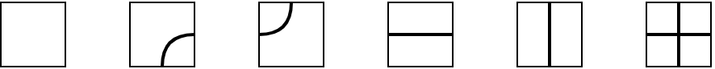


月刊組合せ論 Natori は面白そうな組合せ論のトピックを紹介していく企画です。今回はシューベルト多項式を扱います。

## シューベルト多項式の基礎

シューベルト多項式は組合せ論や幾何学などで活躍する多項式です。タイトルにもある通り、この記事では組合せ論に限って扱います。

まずは対称群について復習します。$S_n$ を $n$ 次対称群、すなわち $\{1,2,\ldots,n\}$ の置換全体とします。$s_i=(i,i+1)\in S_n$ を隣接互換とします。$S_n$ の任意の元は $s_i$ たちの積として表されます。$w\in S_n$ をそのように表したときに現れる隣接互換の最小個数を $\ell(w)$ で表し、長さといいます。そのときの $w$ の表示を最短表示といいます。$w$ の最短表示は一意的とは限りません。例えば

$$
\begin{pmatrix} 1 & 2 & 3 & 4 \\\ 4 & 2 & 1 & 3 \end{pmatrix}=s_3s_2s_1s_2=s_1s_3s_2s_1
$$

のように 2 通りの最短表示で表すことができる場合があります。

次は対称多項式を考えます。$f\in\mathbb{Z}[x_1,\ldots,x_n], w\in S_n$ のとき、$wf\in\mathbb{Z}[x_1,\ldots,x_n]$ を $(wf)(x_1,\ldots,x_n)=f(x_{w(1)},\ldots,x_{w(n)})$ により定めます。すべての $w$ に対して $wf=f$ となるような多項式 $f$ を対称多項式といいます。

多項式 $f$ に対して、$\partial_i(f)=\frac{f-s_if}{x_i-x_{i+1}}$ により多項式 $\partial_i(f)$ が定まります。作用素 $\partial_i$ を差分商作用素といいます。これは次の性質をみたします。

- $\partial_i^2=0$
- $|i-j|>1$ ならば $\partial_i\partial_j=\partial_j\partial_i$
- $\partial_i\partial_{i+1}\partial_i=\partial_{i+1}\partial_i\partial_{i+1}$

$w\in S_n$ の最短表示の一つを $s_{i_1}\cdots s_{i_l}$ としたとき、$\partial_w=\partial_{i_1}\cdots \partial_{i_l}$ と定めます。これが最短表示のとり方によらないことは上の性質から示せます。

シューベルト多項式は $S_n$ の元で添字づけられた多項式の族です。$w_0$ を $S_n$ の長さ最大の元とします。これは

$$
w_0=\begin{pmatrix} 1 & 2 & \cdots & n-1 & n \\\ n & n-1 & \cdots & 2 & 1 \end{pmatrix}
$$

です。シューベルト多項式は $w\in S_n$ に対して

$$
\mathfrak{S} _ w(x)=\partial_{w^{-1}w_0}(x_1^{n-1}x_2^{n-2}\cdots x_{n-1})
$$

により定義されます。例えば $w=3142$ のとき、$w^{-1}w_0=3142=s_2s_1s_3$ なので

$$
\begin{align*}
\mathfrak{S}_{3142}(x) &= \partial_2\partial_1\partial_3(x_1^3x_2^2x_3) \\\
&= \partial_2\partial_1(x_1^3x_2^2) \\\
&= \partial_2(x_1^2x_2^2) \\\
&= x_1^2(x_2+x_3)
\end{align*}
$$

となります。計算途中では $x_n$ が現れることもありますが、最終的には $x_n$ は現れないことに注意します。

関連する多項式として、二重シューベルト多項式も定義します。これは $x_1,\ldots,x_n,y_1,\ldots,y_n$ に関する多項式です。まず

$$
\mathfrak{S} _ {w_0}(x,y)=\prod_{i+j<n+1}(x_i-y_j)
$$

とおき

$$
\mathfrak{S} _ {w}(x,y)=\partial_{w^{-1}w_0}^{(x)}\mathfrak{S}_{w_0}(x,y)
$$

と定めます。ここで $\partial^{(x)}$ は変数 $x_1,\ldots,x_n$ に作用する差分商作用素であることを表します。この $\mathfrak{S}_{w}(x,y)$ を二重シューベルト多項式といいます。$y_i$ にすべて 0 を代入すると通常のシューベルト多項式が得られます。

## Stanley 予想

$\mathfrak{S}_w(x)$ は $x_i$ に関する単項式の非負整数係数の線形結合として表せます。係数は組合せ論的に意味があるのではないかと考えられます。これについては Stanley による次の予想（解決済み）があります。

$w\in S_n$ に対して、$R(w)=\\{(i_1,\ldots,i_{\ell(w)})\mid s_{i_1}\cdots s_{i_{\ell(w)}}=w\\}$ を最短表示の集合とします。$a\in R(w)$ に対して、正整数の列 $b$ が $a$-compatible であるとは

- $b$ は $a$ と同じ長さ (すなわち $\ell(w)$)
- $b$ は広義単調増加
- $b_i\le a_i$
- $a_i<a_{i+1}$ ならば $b_i<b_{i+1}$

をみたすことです。$a$-compatible な $b$ からなる集合を $C(a)$ とします。このとき

$$
\mathfrak{S} _ w(x)=\sum_{a\in R(w)}\sum_{b\in C(a)}x_{b_1}\cdots x_{b_{\ell(w)}}
$$

と表せるという主張が Stanley の予想です。

$w=3142$ の場合、最短表示は $s_2s_1s_3$ のみであり、$(2,1,3)$-compatible な $b$ は $(1,1,2)$ と $(1,1,3)$ の 2 つです。よって $\mathfrak{S}_{3142}(x)=x_1^2x_2+x_1^2x_3$ となり、上での計算と一致します。

## Pipe dream

$a$-compatible な $b$ に対して、マス目を用意し、$b_i$ 行 $a_i-b_i+1$ 列目に印をつけます。$a=(2,1,3),b=(1,1,2)$ の場合、$(1,2),(1,1),(2,2)$ に印がつきます。印のついたマスは $x+y\le n$ の領域上にあるので、マス目をこの範囲に限って考えてもよいです。

さて、印のついたマスに十字線を、印のついていないマスに交差しない線を書き込みましょう。

上の例では次のような図形が得られます。

このような図形を pipe dream といいます。RC グラフと呼ばれることもあります。厳密には pipe dream には次のようなものです。

- $i$ 行目の左端から出発した曲線は、$w(i)$ 列目の上端に到着する。
- どの 2 本の曲線も 2 回以上交わることはない。

2 番目の性質は最短表示であることから来ています。置換をあみだくじとして表すことを考えると、pipe dream はそれの亜種であると見なせます。

シューベルト多項式は pipe dream 上の和として

$$
\mathfrak{S} _ w(x)=\sum_{D\in PD(w)}x_{i_1}\cdots x_{i_l}
$$

と表せます。ここで $i_1,\ldots,i_l$ は十字のマスがある行の番号です。

より一般に、二重シューベルト多項式は $(i_k,j_k)$ を十字のマスの行・列番号とすることで

$$
\mathfrak{S} _ w(x,y)=\sum_{D\in PD(w)}(x_{i_1}-y_{j_1})\cdots (x_{i_l}-y_{j_l})
$$

と表せることが知られています。

## Bumpless pipe dream

bumpless pipe dream は比較的最近導入された新しい図形です。BPD はもっと広く使えるものですが、ここでは（二重）シューベルト多項式に限って考えます。

正方形のマス目を考えます。マス目への線の書き込み方は次の 6 通りです。

pipe dream と比べて、交わる十字線はありますが交わらない二曲線はありません。

$w\in S_n$ に対して

- $i$ 行目の右端から出発した曲線は $w(i)$ 列目の下端に到着する。
- どの 2 本の曲線も 2 回以上交わることはない。

をみたす図形を bumpless pipe dream といいます。$w=3142$ の場合は次の 2 通りがあります。

二重シューベルト多項式は BPD 上の和として

$$
\mathfrak{S} _ w(x,y)=\sum_{D\in BPD(w)}(x_{i_1}-y_{j_1})\cdots (x_{i_l}-y_{j_l})
$$

と表せることが知られています。ここで $(i_k,j_k)$ は空白のマスを表します。上の例では

$$
\mathfrak{S}_{3142}(x,y)=(x_1-y_1)(x_1-y_2)(x_3-y_2)+(x_1-y_1)(x_1-y_2)(x_2-y_1)
$$

となります。$y$ を 0 にすれば通常のシューベルト多項式となります。

## PD と BPD の間の全単射

シューベルト多項式には 2 種類の表示があることがわかりました。

$$
\mathfrak{S} _ w(x)=\sum_{D\in PD(w)}x_{i_1}\cdots x_{i_l}=\sum_{D\in BPD(w)}x_{i_1}\cdots x_{i_l}
$$

$x_i=1$ を代入すれば $|PD(w)|=|BPD(w)|$ がわかるので、$PD(w)$ と $BPD(w)$ の間にいい感じの全単射があることを期待したくなります。$D\in PD(w)$ に対して $\mathrm{weight} _ {PD}(D)=x_{i_1}\cdots x_{i_l}$ ($i_k$ は十字のマスの行番号)、$D\in BPD(w)$ に対して $\mathrm{weight} _ {BPD}(D)=x_{i_1}\cdots x_{i_l}$ ($i_k$ は空白のマスの行番号) としたとき、全単射 $\phi\colon PD(w)\to BPD(w)$ であって $\mathrm{weight} _ {PD}(D)=\mathrm{weight} _ {BPD}(\phi(D))$ が任意の $D\in PD(w)$ に対して成り立つようなものが欲しいです。

Gao, Huang の論文では、モンク公式を保つという意味で "canonical" な全単射が構成されています。

## Hybrid pipe dream

PD と BPD の間の全単射をより詳しく理解するために、hybrid pipe dream と呼ばれる図形が Knutson, Udell により導入されました。

## Kohnert 図形

最後に、Kohnert によるシューベルト多項式の表示を紹介します。

置換 $w\in S_n$ の Rothe diagram とは、$n\times n$ のマス目において座標 $(w(i),i)$ とその右側および上側にあるマスをすべて取り除いて得られる図形です。例えば $w=3142$ の場合次のようになります。

Rothe diagram に操作を行います。ある行の最も右にあるマスを選び、それを下の空きスペースに動かすことができます (他のマスを飛び越えてもよい)。上の例では可能な操作は次の 1 通りのみです。

操作を非負整数回行うことで得られる図形の集合を $KD(w)$ とおきます。$D\in KD(w)$ に対して、$y$ 座標が $i$ のマスの個数を $m_i(D)$ とおくとき、シューベルト多項式は次のように表せることが知られています。

$$
\mathfrak{S} _ w(x)=\sum_{D\in KD(w)}x_1^{m_1(D)}\cdots x_n^{m_n(D)}
$$

Assaf は $KD(w)$ と $PD(w)$ の間にウェイトを保つ全単射を構成することでこの表示を証明しました。

## おわりに

シューベルト多項式の組合せ論的表示を紹介しました。拾いきれなかった話題もたくさんあります。ぜひ皆さんもシューベルト多項式を調べてみてください！

今後も月刊組合せ論 Natori では様々な楽しい話題をお届けする予定なので、応援のほどよろしくお願いいたします。

## 参考文献

- 前野俊昭, Schubert 多項式とその仲間たち, 数学書房.
- Assaf, Sami H. A bijective proof of Kohnert’s rule for Schubert polynomials. Combinatorial Theory 2, No. 1, Paper No. 5, 9 p. (2022).
- Bergeron, Nantel; Billey, Sara. rc-graphs and Schubert polynomials. Exp. Math. 2, No. 4, 257-269 (1993).
- Gao, Yibo; Huang, Daoji. The Canonical Bijection between Pipe Dreams and Bumpless Pipe Dreams. International Mathematics Research Notices, Volume 2023, Issue 21, November 2023.
- Knutson, Allen. Schubert polynomials, pipe dreams, equivariant classes, and a co-transition formula. 2022.
- Knutson, Allen; Udell, Gabe. Interpolating between classic and bumpless pipe dreams. Séminaire Lotharingien de Combinatoire 89B (2023).
- Lam, Thomas; Lee, Seung Jin; Shimozono, Mark. Back stable Schubert calculus. Compos. Math. 157, No. 5, 883-962 (2021).
