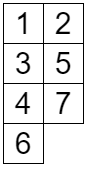
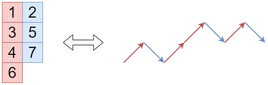
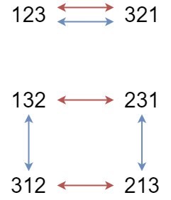
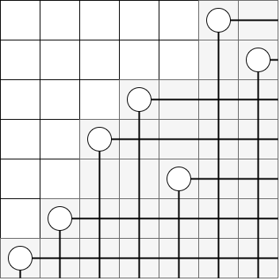

月刊組合せ論 Natori は面白そうな組合せ論のトピックを紹介していく企画です。今回は pattern avoidance と呼ばれるものに入門していきます。あの数列も登場します！

## 最長増加部分列の長さが 2 以下の順列

$(1,2,\ldots,n)$ の順列 $A$ に対して、**増加部分列**とは $i_1<i_2<\cdots<i_k$ かつ $A_{i_1}<A_{i_2}<\cdots<A_{i_k}$ をみたすような部分列 $(A_{i_1},A_{i_2},\ldots,A_{i_k})$ のことです。**最長増加部分列**とは、長さ $k$ が最大となる増加部分列です。

最長増加部分列の長さが 1 となる順列は $(n,n-1,\ldots,2,1)$ のみです。では最長増加部分列の長さが 2 以下の順列はいくつあるでしょうか。$n=3$ のときは、$(1,3,2),(2,1,3),(2,3,1),(3,1,2),(3,2,1)$ の 5 つが条件を満たします。プログラミングに自信のある方はぜひ計算して答えを推測してみてください。

## 全単射の構成

最長増加部分列の長さが 2 以下の順列の個数が「あの数」になることを証明しましょう。「あの数」は「あれ」の個数と等しいので、「あれ」との間に全単射を構成します。

ロビンソン・シェンステッド対応のことを復習しておきます。記事「[ヤング図形と競技プログラミング](https://zenn.dev/koboshi/articles/306304c0381c1e)」もよろしくお願いします。

ロビンソン・シェンステッド対応は順列 $A$ と、同じ形の標準タブローの組 $(P,Q)$ との間の全単射です。$P,Q$ の形を $\lambda$ とすると、ヤング図形 $\lambda$ は次の性質を満たすことが知られています。

- $\lambda$ の 1 行目の箱の個数は $A$ の最長増加部分列の長さに等しい
- $\lambda$ の 1 列目の箱の個数は $A$ の最長減少部分列の長さに等しい

最長増加部分列の長さが 2 以下であることは、$\lambda$ が高々 2 列であることと同値です。このような $\lambda$ 上の標準タブローとして、次のようなものがあります。

高々 2 列の標準タブローを用いて次のような操作を行います。$1,2,\ldots,n$ の順に数字を見ていき、数字が

- 1 列目にあるならば、右上に進む
- 2 列目にあるならば、右下に進む

という移動を行います。上で挙げたタブローの場合次のようになります。

標準タブローの性質より、この経路は開始地点より下に行きません。また、始点と終点の高さの差は 1 列目と 2 列目の箱の個数の差に等しいです。

いまロビンソン・シェンステッド対応により、順列 $A$ から 2 つのタブロー $(P,Q)$ を得ていました。タブロー $P,Q$ からこのように経路を作ると、2 本の終点の高さは等しくなります。そこで、片方の左右を反転して、2 本の経路を繋げます。すると長さ $2n$ の経路で、始点と終点の高さが等しく、始点より下に行かないものができます。このような経路を **Dyck 経路**といいます。Dyck 経路は 45 度回転させれば、$(0,0)$ から $(n,n)$ への (右または上に進む) 経路で領域 $y\ge x$ 上にあるものとなります。

逆にこのような経路からタブローの組 $(P,Q)$ を作ることは容易で、ロビンソン・シェンステッド対応の逆写像から順列 $A$ を得ることができます。

以上により最長増加部分列の長さが 2 以下となる $(1,2,\ldots,n)$ の順列と、$(0,0)$ から $(n,n)$ への経路で領域 $y\ge x$ 上にあるものとの間の全単射が得られました。その個数は「あの数」、すなわちカタラン数となります。

## pattern avoidance

最長増加部分列の長さが 2 以下の順列のことを、123-avoiding ともいいます。これは $i_1<i_2<i_3$ を選んだときに $A_{i_1},A_{i_2},A_{i_3}$ が $1,2,3$ と同じ順序にならないという意味です。同様に、1234-avoiding は最長増加部分列の長さが 3 以下という意味です。

他のパターンも作れます。321-avoiding は最長減少部分列の長さが 2 以下という意味です。132-avoiding や 3142-avoiding なども考えられます。3142-avoiding とは $i_1<i_2<i_3<i_4$ であって $A_{i_2}<A_{i_4}<A_{i_1}<A_{i_3}$ となるものが存在しないということです。

今回は長さ 3 の pattern avoidance について考えます。$3!=6$ なので、次の 6 通りが考えられます。

- 123-avoiding
- 132-avoiding
- 213-avoiding
- 231-avoiding
- 312-avoiding
- 321-avoiding

左右反転を考えれば 123-avoiding と 321-avoiding の順列の個数が等しいことがわかります。また $A_i$ を $n+1-A_i$ に置き換えるという全単射を考えることもできます。よってこれらの順列の間には次のような全単射が存在します。

## 123-avoiding と 132-avoiding

123-avoiding な順列と 132-avoiding な順列の間に全単射を構成します。

[2024 年 6 月号](../202406/)でも紹介した Rothe diagram を考えます。下の図は 132-avoiding な順列 6743521 に対する Rothe diagram です。

これを見ると、白い部分はヤング図形 $(5,5,3,2,2,1)$ になっています。実は、白い部分がヤング図形になることと順列が 132-avoiding であることは同値です。また、このときのヤング図形は $(n-1,\ldots,2,1)$ のヤング図形に含まれます。このようなヤング図形は境界を見ることで領域 $y\ge x$ 上の $(0,0)$ から $(n,n)$ へ向かう経路と対応します。これが 132-avoiding な順列と経路の間の全単射です。

123-avoiding な順列と経路の間の全単射は既に作ってあったので、組み合わせることで 123-avoiding な順列と 132-avoind な順列の間に全単射を構成することができます。

## まとめ

以上より、$C_n$ をカタラン数とすると

- 123-avoiding な長さ $n$ の順列の個数は $C_n$
- 132-avoiding な長さ $n$ の順列の個数は $C_n$
- 213-avoiding な長さ $n$ の順列の個数は $C_n$
- 231-avoiding な長さ $n$ の順列の個数は $C_n$
- 312-avoiding な長さ $n$ の順列の個数は $C_n$
- 321-avoiding な長さ $n$ の順列の個数は $C_n$

となることがわかりました。すべてカタラン数になるのは面白いですね。

## おわりに

長さ 4 以上の pattern avoidance も盛んに研究されています。私もいずれ勉強してみたいです。

月刊組合せ論 Natori では組合せ論の面白そうなトピックを紹介していきます。応援のほどよろしくお願いいたします。

## 参考文献

Kitaev, Sergey. Patterns in permutations and words.  Springer (2011).