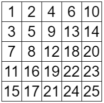
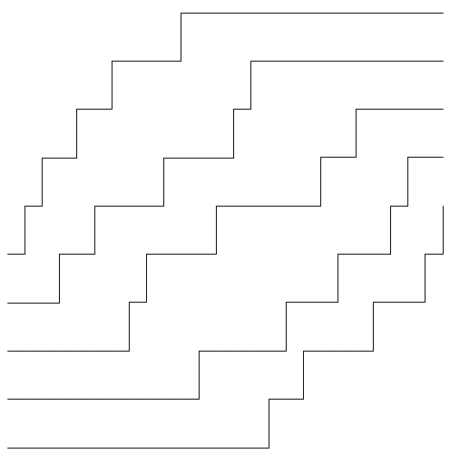
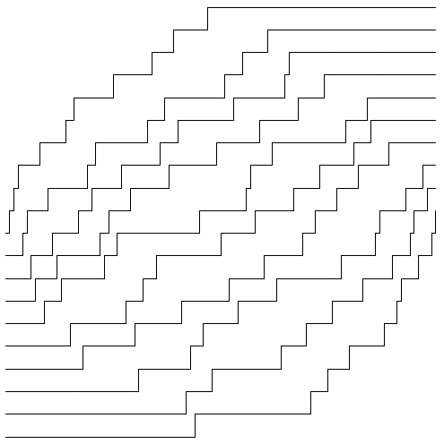
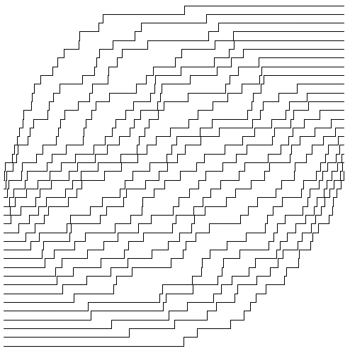
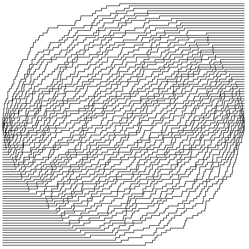

月刊組合せ論 Natori は面白そうな組合せ論のトピックを紹介していく企画です。今回は $N\times N$ 型のヤングタブローにおいて $N\to\infty$ としたときにどうなるかを考えていきます。

## ヤングタブロー

$N\times N$ のマス目があります。ここに $1$ から $N^2$ までの整数を 1 つずつ、次の条件を満たすように書き込みます。

- 各行について単調増加
- 各列について単調増加

例えば $N=5$ のときは次のようになります。



このようなものをヤングタブローといいます。ヤングタブローの中から一様ランダムに 1 つ選んだとき、どのような形になるかを考えます。勿論このままではただの正方形なので、うまく可視化する必要があります。さらに $N\to\infty$ としたときどうなるかを考えます。このようなことを扱う分野を**漸近的組合せ論** (asymptotic combinatorics) というそうです。

## ヤングタブローの可視化

与えられたヤングタブローに対して $N$ 個のグラフを描きます。時刻 0 において $i$ 番目のグラフは高さ $N-i$ にあるものとします。

$k=1,2,\ldots,N^2$ の順に次の操作を行います。

- $k$ がタブローの $i$ 行目にあるとき、時刻 $k$ において $i$ 番目のグラフの高さを 1 増やす。

上のタブローでは次のようなグラフになります。



タブローの単調増加性より、どの 2 本も交わりません。

このグラフは Processing で描画しました。次のようなコードです。

```processing
size(500, 500);
background(255);

int[][] a = { { 1,2,4,6,10 },{ 3,5,9,13,14 },{ 7,8,12,18,20 },{ 11,16,19,22,23 },{ 15,17,21,24,25 }};
int n = a.length;

float dx = 480.0 / (n * n);
float dy = 480.0 / (2 * n - 1);

for (int i = 0; i < n; i++) {
  float y = 10 + dy * n + dy * i;
  float x = 10;
  int j = 0;
  for (int k = 1; k <= n * n; k++) {
    line(x, y, x + dx, y);
    x += dx;
    if (j < n && a[i][j] == k) {
      j++;
      line(x, y, x, y - dy);
      y -= dy;
    }
  }
}
```

それでは $N\to\infty$ としたとき、どのようなグラフになるかを調べていきましょう。

## サンプリング

ここで問題となるのが、ヤングタブローを一様ランダムに選ぶにはどうすればよいかということです。$N$ が大きくなるにつれ、ヤングタブローの個数は膨大になります。

そこで役立つのがフック長公式の証明です。確率を用いた証明ではフックウォークと呼ばれるものが用いられていますが、これが役に立ちます。過去に公開した記事をご覧ください。

[【月刊組合せ論 Natori】フック長公式【2023 年 5 月号】](../202305/)

$\lambda$ 上のヤングタブローの個数を $F_{\lambda}$ とします。$\lambda$ から角 $c$ を除いた図形を $\mu$ とするとき、フックウォークの終点が $c$ となる確率が $\frac{F_{\mu}}{F_{\lambda}}$ となることを示していました。このことから、次のようなアルゴリズムによってヤングタブローを一様ランダムに選ぶことができます。

- 箱の総数が $n$ のヤング図形を考える。
- フックウォークを行い、終点に $n$ を書く。
- 残りの図形に再びフックウォークを行い、終点に $n-1$ を書く。
- これを繰り返す。

これを正方形ヤング図形の場合にコードにしたものが次のものになります。(本当はこれも Processing で書きたかったのですが、慣れていないので Kotlin で書きました)

```kotlin
fun main() {
    val n = 10
    val a = Array(n) { Array(n) { 0 } }
    val cells = mutableSetOf<Pair<Int, Int>>()
    for (i in 0 until n) {
        for (j in 0 until n) {
            cells.add(i to j)
        }
    }
    for (num in n * n downTo 1) {
        val firstCell = cells.random()
        var x = firstCell.first
        var y = firstCell.second
        while (true) {
            val candidates = mutableListOf<Pair<Int, Int>>()
            for (i in x + 1 until n) {
                if (a[i][y] == 0) {
                    candidates.add(i to y)
                } else {
                    break
                }
            }
            for (j in y + 1 until n) {
                if (a[x][j] == 0) {
                    candidates.add(x to j)
                } else {
                    break
                }
            }
            if (candidates.isEmpty()) {
                break
            }
            val choice = candidates.random()
            x = choice.first
            y = choice.second
        }
        a[x][y] = num
        cells.remove(x to y)
    }
    print("{ ")
    print(a.map { "{ ${it.joinToString(",")} }" }.joinToString(","))
    println("};")
}
```

上の Processing のコードの a の定義を、このコードの出力で置き換えればよいです。

## いざ実行

まずは $N=10$ で実行してみましょう。



なるほど。

次は $N=20$ で実行してみましょう。



おや？

次は $N=50$ で実行してみましょう。



おやおや？

何やら円が見えますね。円の内側で動いており、外側ではほとんど動かないようです。これが $N\to\infty$ としたときに見えてくる形です。このような現象は六角形のひし形タイル張りや、アステカダイヤモンドのドミノタイル張りなどでも現れ、**arctic circle theorem** と呼ばれています。直訳すると北極圏定理でしょうか。

## おわりに

組合せ論と確率論の関係というと、高校数学では当たり前という感じがしますが、大学数学では非自明で、奥深く、豊かな関係があります。この辺りももっと知りたいです。

## 参考文献

- Romik, Dan. Arctic circles, domino tilings and square Young tableaux. Ann. Probab. 40, No. 2, 611-647 (2012).
- Romik, Dan. The surprising mathematics of longest increasing subsequences. Cambridge University Press. (2015).
