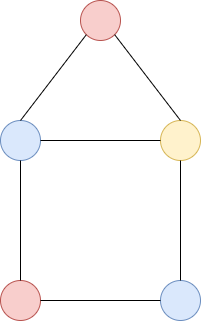

月刊組合せ論 Natori は面白そうな組合せ論のトピックを紹介していく企画です。今回は彩色対称関数に関する未解決問題である Stanley-Stembridge 予想を紹介します。

## 彩色対称関数

彩色数や彩色多項式については過去記事で少し解説しました。

[【月刊組合せ論 Natori】June Huh 氏の業績を解説【2022 年 12 月号】](../202212/)

グラフ $G=(V,E)$ の彩色多項式 $c_G(n)$ とは、グラフの頂点を $n$ 色のうちのいずれかで塗る方法であって、隣り合う 2 頂点が異なる色で塗られているものの個数です。

彩色対称関数は Stanley によって導入されました。色の集合を $\mathbb{P}=\{1,2,\ldots\}$ とします。色塗りのことを関数 $\kappa\colon V\to\mathbb{P}$ だと思うことにします。$x=(x_1,x_2,\ldots)$ を変数とします。彩色対称関数は

$$
X_G(x)=\sum_{\kappa}\prod_{v\in V}x_{\kappa(v)}
$$

により定義されます。ここで $\kappa$ は前述の通り隣り合う 2 頂点が異なる色であるような塗り方です。

例えば $\kappa$ を次のような塗り方とします。

赤が 1、青が 2、黄色が 3 であるとするとき、$X_G(x)$ に $x_1^2x_2^2x_3$ という項が現れることになります。

$X_G(\underbrace{1,\ldots,1}_n,0,0,\ldots)$ は彩色多項式 $c_G(n)$ に等しいことがわかります。このことから彩色対称関数は彩色多項式より多くの情報をもっていることがわかります。

## 基底

対称関数のなす空間には代表的な基底があります。それは

- $m_{\lambda}$ : モノミアル対称関数
- $h_{\lambda}$ : 完全対称関数
- $e_{\lambda}$ : 基本対称関数
- $p_{\lambda}$ : べき和対称関数
- $s_{\lambda}$ : シューア対称関数

です。彩色対称関数もまた、これらの基底の線形結合として表すことができます。

線形結合として表したとき、係数が非負整数になることがあります。このとき何か特別な意味があるのではないかと期待できます。例えばシューア関数は対称群の既約表現と対応するので、シューア関数の非負整数線形結合として表せるということは、対称群の表現と対応することが期待されます。

では彩色対称関数はシューア関数の非負整数線形結合として表せるでしょうか？

長いので以降は $s$-positive ということにします ($e$-positive なども同様)。

まず $G$ を完全グラフ $K_n$ とします。すると $X_G(x)=n!e_n=n!s_{(1,\ldots,1)}$ となります。よって $e$-positive であり $s$-positive でもあります。

では次のようなグラフではどうでしょうか。

このグラフは爪 (claw) と呼ばれています。実は $X_G=4e_4+5e_{31}-2e_{22}+e_{211}$ となります。係数に $-2$ が現れるので $e$-positive ではありません。$s$-positive でもありません。

## 比較不能性グラフ

$P$ を半順序集合とします。$P$ から次のようにグラフを作ります。頂点集合は $P$ と同一とし、$u,v\in P$ に対して $u\le v$ でも $v\le u$ でもないとき辺を張ります。このグラフを $\mathrm{inc}(P)$ とし、比較不能性グラフと呼ぶことにします。

$P$ が次の図を induced subposet して含まないとき、$P$ は $(3+1)$-free といいます。

$P$ がこの図のような poset であるとき、$\mathrm{inc}(P)$ は爪となります。爪は $e$-positive でなかったので、$(3+1)$-free poset から得られるグラフ $\mathrm{inc}(P)$ は $e$-positive でない可能性が減っていると考えられます。

そして本題の Stanley-Stembridge 予想とは、このとき必ず $e$-positive になるという予想です。


**予想** (Stanley-Stembridge): $P$ が $(3+1)$-free poset ならば、比較不能性グラフ $\mathrm{inc}(P)$ の彩色対称関数は $e$-positive である。


なお $s$-positive であることは Gasharov によって証明されています。一般に $e$-positive ならば $s$-positive なので、この結果は Stanley-Stembridge 予想よりも弱い結果ということになります。

## 証明？

Stanley-Stembridge 予想は長くの間未解決問題でしたが、最近になって証明が発表されました。

https://arxiv.org/abs/2410.12758

まだプレプリントの段階なので正しいかはわかりませんが、正しければ一大ニュースですね。

## その他の話題

Hessenberg 多様体との関連など、近年では彩色対称関数の研究はますます盛り上がっています。それも解説したかったのですが、時間がなかったのでまたいつか解説したいと思います。
