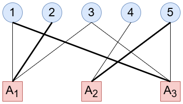
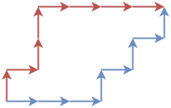


月刊組合せ論 Natori は面白そうな組合せ論のトピックを紹介していく企画です。今回は横断マトロイドを紹介していきます。

なおこの記事は[組合せ論 Advent Calendar 2024](https://adventar.org/calendars/10062) の 1 日目の記事です。参加者を募集しております。

## マトロイドの基礎

マトロイドの基礎は以下の記事に書きましたのでご覧ください。

[【月刊組合せ論 Natori】マトロイドに入門しよう【2024 年 7 月号】](../202407/)

## 横断と二部グラフ

$A_1,\ldots,A_n$ は有限集合 $S$ の部分集合であるとします。

$S$ の $n$ 元部分集合 $X=\\{x_1,\ldots,x_n\\}$ が $A=(A_1,\ldots,A_n)$ の**横断**であるとは、ある置換 $\sigma\in S_n$ について、$x_i\in A_{\sigma(i)}$ がすべての $i$ について成り立つことです。同様に、$S$ の $k$ 元部分集合 $Y=\\{y_1,\ldots,y_k\\}$ が $A$ の**部分横断**であるとは、ある単射 $\sigma\colon \\{1,\ldots,k\\}\to \\{1,\ldots,n\\}$ について、$y_i\in A_{\sigma(i)}$ がすべての $i$ について成り立つことです。単射性より $k\le n$ が必要です。

例えば $A_1=\\{1,2,3\\}, A_2=\\{4,5\\}, A_3=\\{1,3,5\\}$ とします。$\\{1,2,5\\}$ は $1\in A_3, 2\in A_1, 5\in A_2$ であることから横断です。この横断の部分集合 $\\{1,3\\}$ は部分横断になります。一方 $\\{1,2,3\\}$ は $A_2$ の元がないので横断ではありません。

この状況は二部グラフにより表現することができます。$A$ の添字集合を $J=\\{1,\ldots,n\\}$ とするとき、頂点集合を非交和 $J\sqcup S$ とし、$j\in J$ と $s\in S$ は $s\in A_j$ のときに辺で結ばれるとします。この二部グラフにおいて（部分）横断はマッチングと対応します。

これより、集合系 $A=(A_1,\ldots,A_n)$ の横断を考えることと、二部グラフのマッチングを考えることが同じことになるので、どちらも使っていきます。

## 横断マトロイド

二部グラフ $G=(S\sqcup T, E)$ に対して、$G$ から得られる $S$ 上の**横断マトロイド**を定義します。$S$ 上のマトロイドなので $S$ の部分集合からなる集合 $\mathcal{I}$ を定義します。$S$ の部分集合 $X$ に対して、$X$ の頂点をすべて使うようなマッチングが存在するとき、かつそのときに限り $X\in \mathcal{I}$ とします。

言い換えると、部分横断を独立集合とするということです。

これが実際にマトロイドであることを確かめる必要があります。「$X,Y\in \mathcal{I}, |X|>|Y|$ ならばある $x\in X\setminus Y$ について $Y\cup\\{x\\}\in \mathcal{I}$」のみ確かめればよいです。間に合わなかったので証明は他の文献に丸投げします。

## 格子路マトロイド

横断マトロイドの具体例を 2 種類見ていきます。

まず、グリッド上に始点・終点の等しい 2 つの格子路（右または上に進むもの）をとります。赤い格子路は青い格子路より上にあるとします。

この 2 つの格子路を固定して、内部（境界も含む）に新たに格子路をとります。この格子路にはどのような特徴があるでしょうか？

ここで、格子路は上に進むタイミングで特徴づけられることに注意します。上の図では、赤い格子路は $1,3,4$ 回目の移動で上に進み、青い格子路は $4,6,8$ 回目の移動で上に進んでいます。すると、新しい格子路は次をみたす $(x_1,x_2,x_3)$ として特徴づけられます。

- $1\le x_1\le 4$
- $3\le x_2\le 6$
- $4\le x_3\le 8$
- $x_1<x_2<x_3$

いま、$A_1=\\{1,2,3,4\\}, A_2=\\{3,4,5,6\\}, A_3=\\{4,5,6,7,8\\}$ とおきます。実は、赤と青の格子路の内部にある格子路は、$(A_1,A_2,A_3)$ の横断と一対一に対応します。横断 $(x_1,x_2,x_3)$ と、$x_i$ 回目に上に移動する格子路が対応します。読者の中には $x_2\in A_1, x_1\in A_2$ のようになってしまうのではないかと心配する声もあるかもしれませんが、このときは $x_1\in A_1, x_2\in A_2$ も成り立つので、常に単調増加になるように選び出すことができます。

このようにして得られるマトロイドを**格子路マトロイド** (lattice path matroid) といいます。

## bicircular matroid

もう 1 つの横断マトロイドの例として bicircular マトロイドを紹介します。

$G=(V,E)$ をグラフとします。独立集合を「各連結成分のサイクルの個数は高々 1 つ」とすることで $E$ 上のマトロイドとなります。これを **bicircular マトロイド**といいます。

頂点 $v\in V$ を端点にもつ辺の集合を $A_v$ とおき、$(A_v)_{v\in V}$ という集合系を考えれば、上記のマトロイドが横断マトロイドであることがわかります。（たぶん）

bicircular という名前の由来ですが、極小従属集合（サーキットともいう）がサイクルを 2 つ含むことが由来です。

bicircular マトロイドと格子路マトロイドはある意味対照的な存在だと言われています。

## 競技プログラミングにおける例

横断マトロイドが競技プログラミングに登場する例を見ていきましょう。

まずは[この問題](https://atcoder.jp/contests/aising2020/tasks/aising2020_e)です。横断マトロイドに対する貪欲法になっているはずです (ちゃんと解いてないですが……)。

bicircular マトロイドが出題された例として[この問題](https://atcoder.jp/contests/jsc2019-qual/tasks/jsc2019_qual_e)があります。[こちらの解説](https://maspypy.com/atcoder-jsc2019%E4%BA%88%E9%81%B8-e-card-collector-%EF%BC%88%E3%83%9E%E3%83%88%E3%83%AD%E3%82%A4%E3%83%89%EF%BC%89)が大変参考になります。

格子路マトロイドは出題されたことがあるのでしょうか。

## おわりに

筆者はヤング図形や格子路が大好きなので、格子路マトロイドという存在に惹かれました。理解するために調べて記事にしてみました。格子路マトロイドにはまだまだ面白いことがいっぱいありそうです。

これからも月刊組合せ論 Natori では面白そう！と思った組合せ論のトピックを紹介していくので、応援のほどよろしくお願いします。

また、12 月はアドベントカレンダーの記事をたくさん書く予定なのでそちらのチェックもよろしくお願いします。

## 参考文献

- Pitsoulis, Leonidas S. Topics in matroid theory. SpringerBriefs in Optimization. Springer. (2014).
- Joseph E. Bonin, An Introduction to Matroid Theory Through Lattice Paths.
- Anna de Mier, Transversal matroids.
