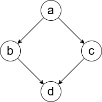
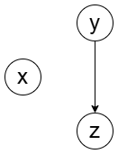
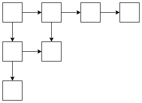
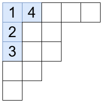


月刊組合せ論 Natori は面白そうな組合せ論のトピックを紹介していく企画です。今回は組合せ論の有名な未解決問題である $\frac13$-$\frac23$ 予想を解説します。

あけましておめでとうございます。去年の 12 月はアドベントカレンダーでたくさん記事を書きましたが、今年もたくさん書いていきたいです。

## 1/3-2/3 予想とは

半順序をもつ集合のことを poset といいます。

たとえば上のような poset では、$a\le b, a\le c, b\le d, c\le d$ が成り立っています。一方 $b,c$ は比較できません。

関係を追加して全順序集合（チェインといいます）にすることを考えます。DAG をトポロジカルソートするといった方がわかりやすい人もいるかもしれません。

上の図では $b\le c$ または $c\le b$ を追加するとチェインになります。

次のような poset を考えましょう。

ここから得られるチェインは $x\le y\le z, y\le x\le z, y\le z\le x$ の 3 通りです。

元の poset において比較不能な 2 元 $x,y$ に対して、チェインの中から一様ランダムに選んだとき、$x\le y$ となる確率を $\mathbf{P}(x\le y)$ とします。最初の図では $\mathbf{P}(b\le c)=\frac12$ です。2 番目の図では　$\mathbf{P}(x\le y)=\frac13$ であり、逆向きにすると $\mathbf{P}(y\le x)=\frac23$ になります。

さて、$\frac13$-$\frac23$ 予想を述べる準備が整いました。


**予想**: チェインでない poset において
$$
\frac13\le \mathbf{P}(x\le y)\le \frac23
$$
となる $x,y$ が存在する。


上の例から、$\frac13,\frac23$ より区間を狭めることはできないことがわかります。

Kahn, Saks により

$$
\frac{3}{11}\le \mathbf{P}(x\le y)\le \frac{8}{11}
$$

の場合、Brightwell, Felsner, Trotter により

$$
\frac{5-\sqrt{5}}{10}\le \mathbf{P}(x\le y)\le \frac{5+\sqrt{5}}{10}
$$

の場合が証明されていますが、$\frac13$-$\frac23$ 予想は未解決です。

## ヤング図形の場合

特別な poset に対しては $\frac13$-$\frac23$ 予想が成り立つことが証明されています。ここではヤング図形から得られる poset を扱います。これは Olson, Sagan による結果ですが、ここで紹介する証明は Chan, Pak, Panova によるものです。

ヤング図形から定まる poset とは、次のようなものです。

ではこのような poset から得られるチェインとは何でしょうか？

チェインにおいて $i$ 番目に小さいマスに $i$ と書き込むことで、これは標準ヤングタブローとなります。つまりこの場合、チェインとは標準ヤングタブローのことです。

では証明に入ります。ヤング図形を $\lambda$ として、マス $(1,2)$ に何が書かれるかに注目します。$\lambda$ が $l$ 行のとき、マス $(1,2)$ に書かれる数の候補は $2,3,\ldots,l+1$ です。マス $(1,2)$ に $k$ が書かれたとき、$1,2,\ldots,k-1$ は 1 列目に書かれています。

チェイン（標準ヤングタブロー）の中から一様ランダムに選んだとき、マス $(1,2)$ に $k$ が書かれている確率を $q_k$ とします。


**補題**: $q_2\ge q_3\ge\cdots\ge q_{l+1}$ かつ $q_2+q_3+\cdots+q_{l+1}=1$


後者は明らかですね。前者を考えます。1 から $k$ までのマスを削除して得られる歪ヤング図形を $\lambda/\mu_k$ とします。標準（歪）ヤングタブローの個数を $f(\lambda/\mu)$ としたとき

$$
q_k=\frac{f(\lambda/\mu_k)}{f(\lambda)}
$$

となります。$\lambda/\mu^{k+1}\subset \lambda/\mu^k$ が成り立つことから、詳しく解析しなくても $q_k\ge q_{k+1}$ は明らかです。こうして補題が証明されました。

ちなみに、標準ヤングタブローの個数はフック長公式で表せる一方、標準歪ヤングタブローの個数は成瀬のフック長公式で表せます（[【月刊組合せ論 Natori】EDPC-T Permutation を深掘り【2022 年 9 月号】](../202209/) を参照）。論文にはこれらを用いた証明も載っています。

では補題を用いてヤング図形に対する $\frac13$-$\frac23$ 予想を証明します。比較するのはマス $(1,2)$ とマス $(k,1)$ です。$p_k$ をマス $(k,1)$ の数字の方が大きい確率とします。マス $(k,1)$ の数字の方が大きいとき、マス $(1,2)$ の候補は $2,3,\ldots,k$ なので

$$
p_k=q_2+\cdots+q_k
$$

が成り立ちます。$p_2$ はマス $(1,2)$ と $(2,1)$ を比較しますが、共役図形を考えることで $p_2\le \frac12$ と仮定してよいです。$p_2\ge \frac13$ のときはよいので、$p_2<\frac13$ の場合のみ考えます。このとき補題より

$$
\frac13>p_2=q_2\ge q_3\ge\cdots\ge q_{l+1}
$$

かつ

$$
q_2+\cdots+q_{l+1}=1
$$

となるので、$p_l=1-q_{l+1}>\frac23$ となります。

- $p_2<\frac13$
- $p_l>\frac23$
- 列 $(p_k) _ {2\le k\le l}$ は単調増加で、増加量は $p_k-p_{k-1}=q_k<\frac13$

以上を合わせると、ある $k$ について

$$
\frac13\le p_k\le \frac23
$$

となることがわかります。これで証明完了です。

## 発展

Chan, Pak, Panova の論文ではもっといろいろ調べられているので、気になる方は読んでみてください。

記事の記法が論文とは一部異なっているので注意が必要です。

## おわりに

2025 年も組合せ論をしていきましょう！

新しいことを模索するために Natori の更新頻度は減るかもしれませんがご了承ください。その代わりに数学に関する創作は続けていく予定です。

## 参考文献

- Chan, Swee Hong, Igor Pak, and Greta Panova. 2021. “Sorting Probability for Large Young Diagrams.” Discrete Analysis, November. https://doi.org/10.19086/da.30071.
