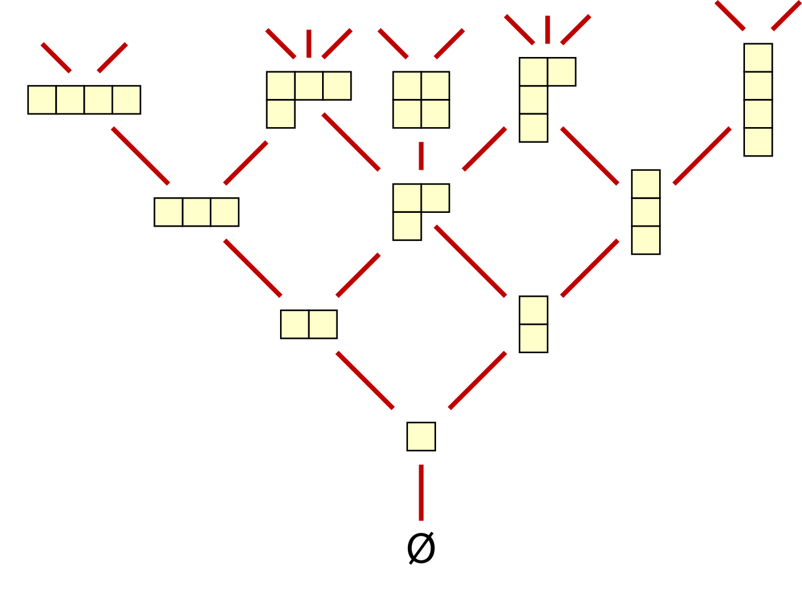


月刊組合せ論 Natori は面白そうな組合せ論のトピックを紹介していく企画です。今回はヤング図形の束を見ていきましょう。

## 不思議な等式

ヤング図形 $\lambda$ 上の標準タブローの個数を $f_{\lambda}$ とします。このとき

$$
n!=\sum_{\lambda\in\mathrm{Par}(n)}(f_{\lambda})^2
$$

が成り立ちます。これは不思議な等式で、多くの数学者を魅了してきました。

この等式の解釈はいくつかあります。有名なものはロビンソン・シェンステッド対応です。これは長さ $n$ の順列と、サイズ $n$ の同じ形の標準タブローの組との間の全単射です。個数を比較することで上の等式が導出されます。

ここでは別の方法で上の等式を解釈します。

## ヤング図形の束

ヤング図形の束、ヤング束を紹介します。

ヤング図形 $\mu$ に箱をいくつか加えることで新しいヤング図形 $\lambda$ を得たとき、$\mu\le\lambda$ とします。これによりヤング図形全体は poset となります。さらに束 (lattice) になります。これを**ヤング束**といいます。図にすると次のようになります。

(Wikipedia より)

ヤング図形の形式的な和からなる空間を考えます。$U(\lambda)$ を $\lambda$ に箱を 1 個付け加えることで得られるヤング図形の和とします。例えば $U((2,1))=(3,1)+(2,2)+(2,1,1)$ です。また、$D(\lambda)$ を $\lambda$ から箱を 1 個取り除くことで得られるヤング図形の和とします。例えば $D((2,1,1))=(2,1)+(1,1,1)$ です。$U,D$ を線形作用素だと思うと、次の式が成り立ちます。


**命題**: $DU-UD=I$ が成り立つ。ここで $I$ は恒等写像である。


証明するには、ヤング図形の角に注目します。

(赤い丸の個数)-(青い丸の個数)=1 であることを用いると、上の命題が証明できます。そしてこれはマヤ図形を考えればわかります。

いま、$D^nU^n\emptyset$ を考えます。$\emptyset$ に $U$ を $n$ 回適用することは、1 個ずつ箱を加えることで得られるヤング図形の列 $\emptyset\to\lambda^{(1)}\to\cdots\to\lambda^{(n)}$ を考えることに対応します。これは標準タブローを考えることと同じです。よって

$$
U^n\emptyset=\sum_{\lambda\in\mathrm{Par}(n)}f_{\lambda}\lambda
$$

です。同様に $D^n\lambda$ は $\lambda$ から 1 個ずつ箱を除くことに対応するので、これも標準タブローと同じです。よって

$$
D^nU^n\emptyset=\sum_{\lambda\in\mathrm{Par}(n)}(f_{\lambda})^2\emptyset
$$

が得られました。

一方、$DU-UD=I$ と $D\emptyset=0$ を用いた計算により

$$
D^nU^n\emptyset=n!\emptyset
$$

が示せます。これにより最初にあげた等式の証明が得られました。

## differential poset

Stanley はこのような性質をもつ poset を研究しました。

一般の poset $P$ において、$y$ が $x$ をカバーするとは、$x<y$ であり、かつ $x<z<y$ をみたす $z$ が存在しないことをいいます。$U(x)$ を $x$ をカバーするような $y$ の和、$D(y)$ を $y$ がカバーするような $x$ の和とします。

poset $P$ が **differential poset** であるとは

- $P$ は $\emptyset$ をもつ locally finite, graded poset である。
- $DU-UD=I$

をみたすことをいいます。ヤング束は differential poset です。

他の例として、ヤング・フィボナッチ束があります。扱う対象は 1,2 からなる数列で、$y$ が $x$ をカバーするという関係を

- $x$ の左端の 1 を 2 に変えたものが $y$ である、または
- $x$ の左端の 1 よりも左に 1 を挿入したものが $y$ である（$x$ が 1 を含まないときはどこに挿入してもよい）

により定めます。

(Wikipedia より)

ヤング・フィボナッチ束も differential poset です。このことから、$\emptyset$ から $x$ への経路の個数を $g_x$ とおくとき

$$
n!=\sum_{x,\mathrm{sum}(x)=n}(g_x)^2
$$

という式が成り立ちます。

この式をロビンソン・シェンステッド対応のように解釈できないか、と考えたくなりますね。実際に、順列とヤング・フィボナッチタブローと呼ばれるものの組との間の全単射を構成することができます。

## r-differential poset

$r$ を正の整数として、$DU-UD=I$ を $DU-UD=rI$ に置き換えたものを $r$-differential poset といいます。この場合、$D^nU^n\emptyset=r^nn!$ となることが示せます。

$n!$ は対称群の位数でしたが、$2^nn!$ は超八面体群の位数です。対称群、超八面体群はそれぞれ $A$ 型、$BC$ 型のワイル群です。さらに $r\ge 3$ のとき $r^nn!$ はある複素鏡映群の位数となります。

この場合にロビンソン・シェンステッド対応にあたるものを考えてみませんか？

## おわりに

最初にあげた等式やロビンソン・シェンステッド対応は本当に不思議なもので、その魅力はまだまだ尽きません。そのようなことを今後も発信できればと思います。

## 参考文献

- 山田裕史, 組合せ論トレイル, 日本評論社, 2024.
- Stanley, Richard P. Enumerative combinatorics. Volume 1. Cambridge University Press.
- Nzeutchap, Janvier. Young-Fibonacci insertion, tableauhedron and Kostka numbers. J. Comb. Theory, Ser. A 116, No. 1, 143-167 (2009).