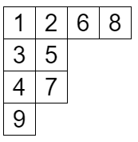
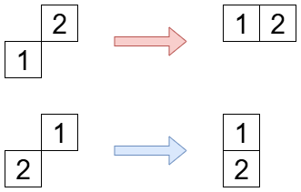
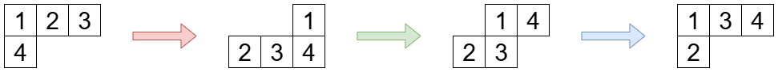

月刊組合せ論 Natori は面白そうな組合せ論のトピックを紹介していく企画です。今回はフック長公式の q 類似を扱います。

7 月はヤング図形強化月間としていたので、ヤング図形に関する文献をたくさん読んでいました。やはりヤング図形はいいですね。

## フック長公式（復習）

フック長公式は以下の記事で解説しています。

[【月刊組合せ論 Natori】フック長公式【2023 年 5 月号】](../202305/)

ヤング図形 $\lambda$ に対する標準ヤングタブローとは、$\lambda$ の各マスに $1,2,\ldots,n$ ($n=|\lambda|$) を書き込んだものであって、各行・各列について単調増加となるものです。

$\lambda$ 上の標準ヤングタブローの個数 $f^{\lambda}$ は次の公式で表せることが知られています。これをフック長公式といいます。

$$
f^{\lambda}=\frac{n!}{\prod_{\square\in\lambda} h_{\lambda}(\square)}
$$

ここで $h_{\lambda}(\square)$ はマス $\square$ に対するフック長です。

## q 類似を考える

正整数 $n$ の $q$ 類似は $[n]_q=\frac{1-q^n}{1-q}$ で、階乗 $n!$ の $q$ 類似は $[n]_q!=[1]_q[2]_q\cdots [n]_q$ です。$q\to 1$ の極限で元に戻るようなものを $q$ 類似といいます。

順列の場合、転倒数や major index といった statistics があります。これらを用いた母関数を考えると

$$
\sum_{p\in S_n}q^{\mathrm{inv}(p)}=\sum_{p\in S_n}q^{\mathrm{maj}(p)}=[n]_q!
$$

が成り立ちます。このように、$q$ 類似はある量を用いて数え上げを精密化すること、と捉えることもできます。

以下の記事もご覧ください。

[【月刊組合せ論 Natori】Mahonian statistics【2024 年 10 月号】](../202410/)

## タブローの statistics

タブローの statistics を 2 つ紹介します。

まず、タブロー $T$ の降下点集合 $\mathrm{Des}(T)$ を、$i$ が書かれたマスが $i+1$ が書かれたマスより上の行にあるような $i$ の集合とします。例えば

の場合、降下点集合は $\{2,3,6,8\}$ です。

そして $\mathrm{maj}(T)=\sum_{i\in\mathrm{Des}(T)}i$ と定義します。

次に、タブロー $T$ の転倒集合を、$i<j$ かつ $j$ が書かれたマスが $i$ が書かれたマスの左下（同じ行・列はダメ）にあるような $(i,j)$ の組からなる集合とします。そして $\mathrm{inv}(T)$ を転倒集合の要素数とします。

いよいよ、$q$ 類似を考えます。つまり

$$
\begin{gather*}
\sum_{T\in\mathrm{SYT}(\lambda)}q^{\mathrm{maj}(T)} \\
\sum_{T\in\mathrm{SYT}(\lambda)}q^{\mathrm{inv}(T)}
\end{gather*}
$$

を考えます。順列の場合と異なり、この 2 つは異なります。

よい公式は maj の場合しか知られていないそうです。


**定理**: $b(\lambda)=\sum_i (i-1)\lambda_i$ とおくと

$$
\sum_{T\in\mathrm{SYT}(\lambda)}q^{\mathrm{maj}(T)}=\frac{q^{b(\lambda)}[n]_q!}{\prod_{\square\in\lambda}[h_{\lambda}(\square)]_q}
$$

が成り立つ。


証明の鍵となるのは、シューア関数と fundamental quasisymmetric function (Gessel quasisymmetric function ともいう) です。$S$ を $\{1,2,\ldots,n-1\}$ の部分集合としたとき

$$
L_S=\sum_{\substack{i_1\le i_2\le\cdots\le i_n \\ i_j<i_{j+1} \text{ if } j\in S}}x_{i_1}x_{i_2}\cdots x_{i_n}
$$

を fundamental quasisymmetric function といいます。このとき

$$
s_{\lambda}=\sum_{T\in \mathrm{SYT}(\lambda)}L_{\mathrm{Des}(T)}
$$

が成り立ちます。この式は今回は認めることにします。いつかこの式を解説する記事を書くかもしれません。

特殊値を計算しましょう。

$$
L_S(1,q,q^2,\ldots)=\sum q^{(i_1-1)+(i_2-1)+\cdots+(i_n-1)}
$$

を計算します。例えば $S=\{1,3\}$ のとき $i_1<i_2\le i_3<i_4$ なので、$r_1=i_1-1, r_2=i_2-2, r_3=i_3-2, r_4=i_4-3$ とおけば $0\le r_1\le r_2\le r_3\le r_4$ となります。このように $j\in S$ か $j\not\in S$ かで場合分けして $r_j$ を $i_j$ からいくらか引いた値とすれば

$$
L_S(1,q,q^2,\ldots)=\sum_{0\le r_1\le r_2\le\cdots\le r_n} q^{r_1+\cdots+r_n+e(S)}
$$

となります。ここで $e(S)=\sum_{j\in S}(n-j)$ です。分割数の母関数を考えるのと同様にして

$$
L_S(1,q,q^2,\ldots)=\frac{q^{e(S)}}{(1-q)(1-q^2)\cdots(1-q^n)}
$$

がわかります。これを先ほどの等式に代入すると

$$
s_{\lambda}(1,q,q^2,\cdots)=\frac{\sum_{T\in \mathrm{SYT}(\lambda)}q^{\mathrm{comaj}(T)}}{(1-q)(1-q^2)\cdots(1-q^n)}
$$

が得られます。ここで $\mathrm{comaj}(T)=\sum_{j\in\mathrm{Des}(T)}(n-j)$ です。

左辺を別の方法で計算します。以下の記事の結果を用います。

[【月刊組合せ論 Natori】半標準ヤングタブローの個数【2024 年 5 月号】](../202405/)

次の公式を証明していました。

$$
s_{\lambda}(1,q,q^2,\ldots,q^{n-1})=\prod_{1\le i<j\le n}\frac{q^{\lambda_j+n-j}-q^{\lambda_i+n-i}}{q^{i-1}-q^{j-1}}
$$

上記の記事では $q\to 1$ の極限をとってからフック容量公式を導いていましたが、極限をとらずに同様の計算を行うことで

$$
s_{\lambda}(1,q,q^2,\ldots,q^{n-1})=q^{b(\lambda)}\prod_{\square\in\lambda}\frac{[n+c(\square)]_q}{[h_{\lambda}(\square)]_q}
$$

がわかります。いま $n\to\infty$ とすると、$(1-q^{n+c(\square)})\to 1$ となることから

$$
s_{\lambda}(1,q,q^2,\ldots)=q^{b(\lambda)}\prod_{\square\in\lambda}\frac{1}{(1-q)[h_{\lambda}(\square)]_q}
$$

となります。2 つの式を合わせることで

$$
\sum_{T\in\mathrm{SYT}(\lambda)}q^{\mathrm{comaj}(T)}=\frac{q^{b(\lambda)}[n]_q!}{\prod_{\square\in\lambda}[h_{\lambda}(\square)]_q}
$$

が得られました。最後に maj と comaj の分布が等しいことを示します。これは、標準ヤングタブロー $T$ の降下点集合が $\mathrm{Des}(T)=\{d_1,\ldots,d_k\}$ であるとき、$\mathrm{Des}(T^*)=\{n-d_k,\ldots,n-d_1\}$ となるようなタブロー $T^*$ を対応させることができればよいです。

ここで登場するのが、**evacuation** という全単射です。これは標準ヤングタブロー $T$ が与えられたとき、次のようにして新たなタブローを出力するものです。

1. $T$ の各成分 $i$ を $n+1-i$ に置き換える。
2. 180°回転する。
3. スライド操作により標準ヤングタブローにする。

ここでスライド操作とは、次の 2 種類の操作です。英語の文献では jeu de taquin と呼ばれています。

操作によって単調増加性は保たれています。これを繰り返すことで歪ヤングタブローから通常のヤングタブローを得ることができます。得られるタブローはスライド操作を行う順番によらないことが知られています。

evacuation の例を載せます。

1, 2 の操作で降下点集合が $\{n-d_k,\ldots,n-d_1\}$ になり、3 の操作では降下点集合は不変なので、evacuation が条件を満たすことがわかります。なお二回 evacuation を行うと元に戻ることから、全単射であることもわかります。

よって maj と comaj の分布が等しいことがわかり

$$
\sum_{T\in\mathrm{SYT}(\lambda)}q^{\mathrm{maj}(T)}=\frac{q^{b(\lambda)}[n]_q!}{\prod_{\square\in\lambda}[h_{\lambda}(\square)]_q}
$$

が示されました。

## q フックウォーク

フック長公式の記事ではフックウォークを用いて公式を証明しました。$q$ 類似も $q$ フックウォークと呼ばれるものを用いて証明できるようです。詳しくは Kerov の論文をご覧ください。

## 成瀬のフック長公式の q 類似

記念すべき Natori の初回では成瀬のフック長公式を紹介しました。

[【月刊組合せ論 Natori】EDPC-T Permutation を深掘り【2022 年 9 月号】](../202209/)

これは歪ヤング図形 $\lambda/\mu$ 上の標準タブローの個数を求める公式で、次のようなものでした。

$$
f^{\lambda/\mu}=|n|!\sum_{E\in\mathcal{E}}\prod_{\square\in\lambda\setminus E}\frac{1}{h_{\lambda}(\square)}
$$

ここで $n=|\lambda/\mu|$ であり、$\mathcal{E}$ は $\lambda/\mu$ 上の excited diagrams の集合です。

この式の $q$ 類似を考えます。まず、今回 fact として認めた式は歪ヤング図形でも成り立ちます。

$$
s_{\lambda/\mu}=\sum_{T\in \mathrm{SYT}(\lambda/\mu)}L_{\mathrm{Des}(T)}
$$

同様の計算で

$$
s_{\lambda/\mu}(1,q,q^2,\ldots)=\frac{\sum_{T\in\mathrm{SYT}(\lambda/\mu)}q^{\mathrm{maj}(T)}}{(1-q)(1-q^2)\cdots(1-q^n)}
$$

がわかります。シューア関数については次の式が成り立つことが知られています。

$$
s_{\lambda/\mu}(1,q,q^2,\ldots)=\sum_{E\in\mathcal{E}}\prod_{(i,j)\in\lambda\setminus E}\frac{q^{\lambda'_j-i}}{1-q^{h_{\lambda}(i,j)}}
$$

以上より

$$
\sum_{T\in\mathrm{SYT}(\lambda/\mu)}q^{\mathrm{maj}(T)}=[n]_q!\sum_{E\in\mathcal{E}}\prod_{(i,j)\in\lambda\setminus E}\frac{q^{\lambda_j'-i}}{[h_{\lambda}(i,j)]_q}
$$

が成り立ちます。

詳しくは Morales, Pak, Panova の論文をご覧ください。

## おわりに

ヤング図形強化月間ということでヤング図形に関する記事を書きました。過去記事を見返すと、ヤング図形の記事が多いですね。それだけ大好きな概念ということです。

これからも組合せ論の好きな概念を追いかけていきたいので、応援よろしくお願いします。

## 参考文献

- Kerov, S. A q-analog of the hook walk algorithm for random Young tableaux. J. Algebr. Comb. 2, No. 4, 383-396 (1993).
- Morales, Alejandro H.; Pak, Igor; Panova, Greta. Hook formulas for skew shapes. I: q-analogues and bijections. J. Comb. Theory, Ser. A 154, 350-405 (2018).
- Stanley, Richard P. Enumerative combinatorics. Volume 2. Cambridge University Press. (1999).
