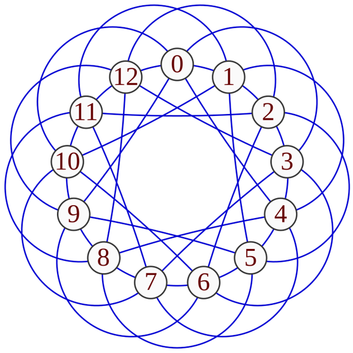

月刊組合せ論 Natori は面白そうな組合せ論のトピックを紹介していく企画です。今回は Paley グラフを扱います。

## Paley グラフ

$p$ を 4 で割って 1 余る素数とします。Paley グラフとは有限体 $\mathbb{F}_p=\{0,1,\ldots,p-1\}$ を頂点集合とし、頂点 $x,y$ は $x-y=z^2$ となる $z\in\mathbb{F}_p\setminus\{0\}$ が存在するときに辺で結ばれるような無向グラフです。

平方数を $p$ で割った余りを平方剰余といいます。これは整数論で重要な概念です。Paley グラフはグラフ理論と整数論の合わせ技というわけです。

なぜ $p$ を 4 で割ると 1 余る素数とするのでしょうか。いま無向グラフを考えているので、$x$ から $y$ へ辺があることと $y$ から $x$ へ辺があることは同値です。つまり $x-y, y-x$ がともに平方剰余ということです。$y-x=(-1)(x-y)$ なので $(-1)$ が平方剰余でなければなりませんが、これをみたすための条件が $p\equiv 1\pmod{4}$ です（平方剰余の第一補充法則）。

以下は $p=13$ の場合の例です。(図は Wikipedia より)

## ケイリーグラフとしての解釈

$G$ を群、$S$ を部分集合であって単位元を含まず、$s\in S$ ならば $s^{-1}\in S$ をみたすものとします。$(G,S)$ のケイリーグラフとは、$G$ が頂点集合であり、各 $g\in G, s\in S$ に対して $g$ と $gs$ を辺で結んだグラフです。

$G=\mathbb{Z}/p\mathbb{Z}$ (加法群として $\mathbb{F}_p$ と同一視できます), $S=\{x^2\mid x\in\mathbb{F}_p\setminus\{0\}\}$ とすると、Paley グラフはケイリーグラフであることがわかります。

## 隣接行列の固有値

スペクトルグラフ理論はグラフ理論と線形代数の合わせ技です。代表的な手法に、グラフの隣接行列の固有値を求めることでグラフの性質を探るというものがあります。

例えば $p=5$ の場合、隣接行列は次のようになります。

$$
\begin{pmatrix}
0 & 1 & 0 & 0 & 1 \\
1 & 0 & 1 & 0 & 0 \\
0 & 1 & 0 & 1 & 0 \\
0 & 0 & 1 & 0 & 1 \\
1 & 0 & 0 & 1 & 0
\end{pmatrix}
$$

固有値は

- 2
- $\frac{\sqrt{5}-1}{2}$ (重複度 2)
- $\frac{-\sqrt{5}-1}{2}$ (重複度 2)

です。

実は次が成り立ちます。


**定理**: 素数 $p$ に対する Paley グラフの固有値は

- $\frac{p-1}{2}$
- $\frac{\sqrt{p}-1}{2}$
- $\frac{-\sqrt{p}-1}{2}$

のいずれかである。


一般に $(\mathbb{Z}/n\mathbb{Z}, S)$ のケイリーグラフの隣接行列 $A$ の固有値を考えます。写像 $\mathbb{Z}/n\mathbb{Z}\to\mathbb{C}$ のなす線形空間を $V$ とします。$1_S\in V$ を指示関数、すなわち $S$ の元なら 1、そうでないなら 0 を返す関数とします。$F\colon V\to V$ を、$1_S$ を左から畳み込む作用素とします。すなわち $a\in V, x\in \mathbb{Z}/n\mathbb{Z}$ に対して

$$
F(a)(x)=(1_S*a)(x)=\sum_{y\in \mathbb{Z}/n\mathbb{Z}}1_S(y)a(x-y)=\sum_{s\in S}a(x-s)
$$

となります。

$V$ の基底として $1_{\{g\}} \ (g\in \mathbb{Z}/n\mathbb{Z})$ がとれます。この基底について $F$ を行列表示すると、隣接行列 $A$ に一致することが確かめられます。

では $F$ の固有値を求めましょう。$\chi_j\in V$ を $\chi_j(x)=e^{2\pi ijx/n}$ により定めます。すると

$$
\begin{align*}
F(\chi_j)(x)&=\sum_{s\in S}\chi_j(x-s)\\
&=\sum_{s\in S}e^{2\pi ij(x-s)/n}\\
&=\left(\sum_{s\in S}e^{-2\pi ijs/n}\right)\chi_j(x)\\
&=\left(\sum_{s\in S}e^{2\pi ijs/n}\right)\chi_j(x)
\end{align*}
$$

となります。ここで最後の等式では $S=-S$ であることを用いています。

以上より $(\mathbb{Z}/n\mathbb{Z}, S)$ の隣接行列の固有値が

$$
\lambda_j=\sum_{s\in S}e^{2\pi ijs/n}
$$

であることがわかりました。余談ですが、$\chi_j$ は $\mathbb{Z}/n\mathbb{Z}$ の既約指標です。

これを用いて Paley グラフの隣接行列の固有値を求めましょう。$S=\{x^2\mid x\in\mathbb{F}_p\setminus\{0\}\}$ とすることで

$$
\lambda_j=\frac12\left(-1+\sum_{x\in \mathbb{Z}/p\mathbb{Z}}e^{2\pi ijx^2/p}\right)
$$

となります。$j=0$ のときは明らかに $\frac{p-1}{2}$ です。そうでないときに内側の和

$$
G=\sum_{x\in \mathbb{Z}/p\mathbb{Z}}e^{2\pi ijx^2/p}
$$

を考えましょう。絶対値の 2 乗を計算します。

$$
|G|^2=\sum_{x,y\in\mathbb{Z}/p\mathbb{Z}}e^{2\pi ij((x+y)^2-x^2)/p}=\sum_{x,y\in\mathbb{Z}/p\mathbb{Z}}e^{2\pi ij(2xy+y^2)/p}
$$

いま

$$
\sum_{x\in\mathbb{Z}/p\mathbb{Z}}e^{2\pi ij(2xy+y^2)/p}=\begin{cases}
p & (y=0) \\
0 & (y\ne 0)
\end{cases}
$$

なので、$|G|^2=p$ であることがわかりました。$\lambda_j$ は対称行列の固有値なので実数であり、したがって $G$ も実数です。よって $j\ne 0$ のときは固有値は $\frac{-1\pm\sqrt{p}}{2}$ のいずれかであることがわかりました。

$G$ はガウス和と呼ばれています。

スペクトルグラフ理論では隣接行列の固有値からグラフの性質を調べると述べました。固有値を求めたので、Paley グラフの性質を調べることができます。例えば Paley グラフは quasirandom であることがわかります。quasirandom グラフについては別の記事で扱いたいです。

## 小さいグラフをすべて含むこと

Paley グラフは次の性質を持つことが知られています。


各 $r$ に対して、$p$ を十分大きい素数とすると、Paley グラフはすべての頂点数 $r$ のグラフを誘導部分グラフとして含む。


特に部分グラフとしても含みます。

証明は $r$ についての帰納法で行います。$r=1$ は明らかなので、$r\ge 2$ とします。$H$ を $r$ 頂点のグラフ、$v$ を頂点の 1 つとします。$H$ から $v$ を除いたグラフは $r-1$ 頂点なので、帰納法の仮定より Paley グラフに誘導部分グラフとして含まれます。この誘導部分グラフを $H'$ とします。$H$ と同型な誘導部分グラフが存在することを示すには、$H'$ に Paley グラフの 1 頂点を加え、$H$ と同型にすればよいです。どの頂点を加えればよいでしょうか。次の問題が解ければよいです。


$p$ を十分大きくすると、Paley グラフの $r-1$ 個の頂点およびそれらの色（白または黒）をどのように指定しても、ある頂点 $v$ であって白い頂点の間には辺があり、黒い頂点との間には辺がないようなものが存在するようにできる。


ここで今更ですが平方剰余の基本的な記号であるルジャンドルの記号を導入します。

$$
\left(\frac{a}{p}\right)=\begin{cases}
0 & (a=0) \\
+1 & (\exists x\in\mathbb{F}_p\setminus\{0\}, a=x^2) \\
-1 & (\text{otherwise})
\end{cases}
$$

オイラーの規準によると

$$
\left(\frac{a}{p}\right)=a^{(p-1)/2}
$$

です。

さて、$r-1$ 個の頂点のうち白い頂点の集合を $A$、黒い頂点の集合を $B$ とします。$x\in\mathbb{F}_p$ に対して

$$
f(x)=\prod_{a\in A}\left(1+\left(\frac{x-a}{p}\right)\right)\prod_{b\in B}\left(1-\left(\frac{x-b}{p}\right)\right)
$$

とおきます。もし $x\not\in A\cup B$ かつ $x$ と白い頂点の間に辺が存在し、$x$ と黒い頂点の間に辺が存在しないならば、$f(x)=2^{r-1}$ となります。$x\not\in A\cup B$ だがこの条件をみたさないときは $f(x)=0$ です。よって条件を満たす頂点が存在することを示すためには

$$
\sum_{x\not\in A\cup B}f(x)>0
$$

を示せばよいです。ここで $x\in A\cup B$ のときは $f(x)$ は 0 または $2^{r-2}$ なので

$$
\sum_{x\not\in A\cup B}f(x)\ge \sum_{x\in\mathbb{F}_p}f(x)-(r-1)2^{r-2}
$$

です。$f(x)$ を展開すると

$$
f(x)=\sum_{S\subseteq A\cup B}(-1)^{|S\cap B|}\left(\frac{g_S(x)}{p}\right)
$$

ここで $g_S(x)=\prod_{s\in S}(x-s)$ とおきました。よって

$$
\sum_{x\not\in A\cup B}f(x)\ge \sum_{S\subseteq A\cup B}(-1)^{|S\cap B|}\sum_{x\in\mathbb{F}_p}\left(\frac{g_S(x)}{p}\right)-(r-1)2^{r-2}
$$

となります。内側の和

$$
\sum_{x\in\mathbb{F}_p}\left(\frac{g_S(x)}{p}\right)
$$

を考えます。$S=\emptyset$ のときこれは $p$ です。

$g_S(x)$ が平方剰余かを考えることは、方程式 $y^2=g_S(x)$ を考えることになります。これを有限体上の代数曲線だと思い、（無限遠点を含めた）通る点の個数を $N_S$ とおきます。すると

$$
N_S=1+\sum_{x\in\mathbb{F}_p}\left[\left(\frac{g_S(x)}{p}\right)+1\right]
$$

となります。もし $y^2=g_S(x)$ が楕円曲線のとき、ハッセの定理から

$$
\left|\sum_{x\in\mathbb{F}_p}\left(\frac{g_S(x)}{p}\right)\right|=|N_S-(p+1)|\le 2\sqrt{p}
$$

が成り立ちます。一般の場合、ハッセ・ヴェイユ境界から似たような式が得られます（たぶん）。余談ですがこれはある種のリーマン予想から従うそうです。

以上より

$$
\sum_{x\not\in A\cup B}f(x)\ge p-(\text{何か})\sqrt{p}-(r-1)2^{r-2}
$$

となるので、$p$ を十分大きくすればこの値は正になります。

## おわりに

グラフ理論と整数論の合わせ技ということで、様々な分野の話題が出てきましたね。複数の分野が交わる部分は面白いです。

代数曲線のことはほとんど知らないのでぜひ教えてください。

今後も月刊組合せ論 Natori では組合せ論の面白そうなトピックを紹介していくので、応援のほどよろしくお願いします！

## 参考文献

- Bollobas, Bela; Thomason, Andrew. Graphs which contain all small graphs. Eur. J. Comb. 2, 13-15 (1981).
- Zhao, Yufei. Graph theory and additive combinatorics. Cambridge University Press. (2023).
