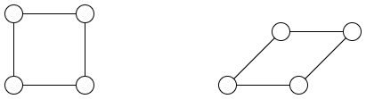
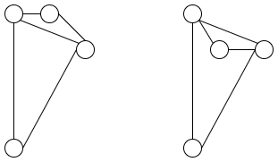

月刊組合せ論 Natori は面白そうな組合せ論のトピックを紹介していく企画です。今回は Netflix 問題の話をします。

ちなみに私は Netflix 未加入です。

## Netflix 問題

Netflix のユーザー数を $m$ 人、映画数を $n$ 本とします。人 $i$ は映画 $j$ に $a_{ij}$ 点の評価をつけたとします。評価を $m\times n$ の行列として表すことができます。

しかし現実にはすべてのユーザーがすべての映画を見るとは限りません。例えば

$$
\begin{pmatrix}
95 & 80 & ? & 50 \\
? & ? & 70 & 80 \\
90 & ? & 75 & ?
\end{pmatrix}
$$

のように、一部データが欠損した行列となります。

多くのサイトでは「おすすめ」機能があります。あるユーザーがまだ見ていない映画の中から、高く評価しそうな映画を選び出したいですが、そのためには行列を補完する必要があります。もちろん補完方法は無限にあるわけですが、どのように補完するのがよいでしょうか。

この問題は Netflix 問題と呼ばれています。以下が起源のようです。

- [Proceedings of KDD Cup and Workshop 2007](https://www.cs.uic.edu/%7Eliub/KDD-cup-2007/proceedings.html)

この問題へのアプローチはいろいろなものがありますが、行列をなるべく低ランクにするというアプローチをとります。ランクが高いとバラバラな評価をしているということになるので、自然な要請だと思います。

## グラフの剛性

この記事のもう 1 つの主題はグラフの剛性です。

グラフとは頂点と辺の組で、2 つの頂点がつながっているかつながっていないかだけを気にすることが普通です。ですがここでは、2 つの頂点を硬い棒でつなぐことを考えてみます。

例えば平面上に三角形があるとき、硬い棒でつながっているので形を変えることはできません。できるのは回転や平行移動のみです。

一方で四角形の場合は変形することができます。このように三角形は剛、四角形は柔、と考えられます。

では四角形に対角線を一本加えるとどうでしょうか。長さを保つ配置は 2 種類ありますが、連続変形することはできません。

グラフ $G$ を $d$ 次元空間 $\mathbb{R}^d$ に実現したもの $p$ を考えます。これは $G$ が $n$ 頂点のとき、空間内に $n$ 個の点 $p_1,\ldots,p_n$ を配置して、$(i,j)$ 間に辺があるときに $p_i,p_j$ 間に硬い棒を置いたものです。組 $(G,p)$ を**フレームワーク**と呼びます。

2 つのフレームワーク $(G,p), (G,q)$ が**合同**であるとは、平行移動・回転・反転の組合せで移りあうことを言います。$(G,p)$ が**剛**であるとは、$(G,p)$ と辺の長さが等しいフレームワーク $(G,q)$ が常に $(G,p)$ と合同であることをいいます。これは大域的に剛と呼ばれることもあります。局所的に剛という概念もあり、$(G,q)$ の存在できる範囲を $p$ の近傍に限ったものです。

剛性の判定は難しいことが知られています。そこで、無限小剛性を考えます。$p_i=p_i(t)$ を時間変化する変数とみなします。距離 $\|p_i-p_j\|$ が不変であることから、2 乗を時間微分すると

$$
\frac{d}{dt}\|p_i-p_j\|^2=(p_i-p_j)^T(\dot{p}_i-\dot{p}_j)=0
$$

となります。これを $\dot{p}_i$ が未知数の方程式とみます。

例えば $G$ が三角形で $p_1^T=(0,0), p_2^T=(1,0),p_3^T=(1,2)$ とすると、方程式は

$$
\begin{cases}
(p_1^T-p_2^T)(\dot{p}_1-\dot{p}_2) &= 0 \\
(p_2^T-p_3^T)(\dot{p}_2-\dot{p}_3) &= 0 \\
(p_1^T-p_3^T)(\dot{p}_1-\dot{p}_3) &= 0
\end{cases}
$$

となり、行列の形で書くと

$$
\begin{pmatrix}
-1 & 0 & 1 & 0 & 0 & 0 \\
0 & 0 & 0 & -2 & 0 & 2 \\
-1 & -2 & 0 & 0 & 1 & 2
\end{pmatrix}
\begin{pmatrix}
\dot{p}_1 \\
\dot{p}_2 \\
\dot{p}_3 \\
\end{pmatrix}=0
$$

となります。一方、$G$ が四角形で辺が $\{1,2\}, \{2,3\}, \{3,4\}, \{4,1\}$ であり、$p_1^T=(0,0), p_2^T=(1,2), p_3^T=(3,5), p_4^T=(4,1)$ のとき

$$
\begin{pmatrix}
-1 & -2 & 1 & 2 & 0 & 0 & 0 & 0 \\
0 & 0 & -2 & -3 & 2 & 3 & 0 & 0 \\
0 & 0 & 0 & 0 & -1 & 4 & 1 & -4 \\
-4 & -1 & 0 & 0 & 0 & 0 & 4 & 1
\end{pmatrix}
\begin{pmatrix}
\dot{p}_1 \\
\dot{p}_2 \\
\dot{p}_3 \\
\dot{p}_4
\end{pmatrix}=0
$$

となります。係数行列を $A$ とおいて、その階数を調べます。以降 $n\ge d+1$ と仮定します。$\mathbb{R}^d$ において回転運動の自由度が $\binom{d}{2}$、平行移動の自由度が $d$ なので、$Ax=0$ の解空間の次元は $\binom{d}{2}+d=\binom{d+1}{2}$ 以上です。よって階数は

$$
\operatorname{rank}A\le dn-\binom{d+1}{2}
$$

をみたします。フレームワーク $(G,p)$ が**無限小剛**とは、上の不等式で等号が成り立つことをいいます。1 つ目の例は無限小剛ですが、2 つ目はそうではありません。

剛性や無限小剛性は $G$ だけでなく $p$ にも依存して決まりますが、実際には $p$ をいい感じにランダムにとるとよい場合があります。


**定理** (Asimow-Roth). 頂点数 $n\ge d+1$ の一般的なフレームワーク $(G,p)$ に対して、剛であるための必要十分条件は無限小剛であることである。


## 行列の低ランク補完

話を行列の低ランク補完に戻します。一部が欠損した行列 $A$ を階数 $d$ 以下にする方法が一意的かどうかという問題に、グラフの剛性のテクニックが使えます。

まず、行列 $A$ は半正定値と仮定します。特に対称行列です。線形代数の結果より、半正定値行列はグラム行列です。$A$ の階数を $d$ とおくと、$p_1,\ldots,p_n\in \mathbb{R}^d$ を用いて $a_{ij}=p_i^Tp_j$ と表せます。

行列の各成分を変形させます。もし成分 $a_{ij}$ の値が確定しているとき、時間微分すると 0 です。つまり

$$
\frac{d}{dt}p_i^Tp_j=p_i^T\dot{p}_j+p_j^T\dot{p}_i=0
$$

という方程式が得られます。先ほどと似ていますね。

例として 3 次半正定値行列 $A$ の $(3,3)$ 成分以外がわかっているとき、$(3,3)$ 成分をうまく決めることで階数を 2 以下にできるかという問題を考えます。方程式は $3^2-1=8$ 本得られますが、対称性を考慮すると実質 5 本です。

$$
\begin{pmatrix}
2p_1^T & 0 & 0 \\
p_2^T & p_1^T & 0 \\
p_3^T & 0 & p_1^T \\
0 & 2p_2^T & 0 \\
0 & p_3^T & p_2^T
\end{pmatrix}
\begin{pmatrix}
\dot{p}_1 \\
\dot{p}_2 \\
\dot{p}_3
\end{pmatrix}=0
$$

となります。$p$ を一般的にとれば係数行列は階数 5 となります。実際、補完は一意的です。

$(1,3),(3,1)$ 成分以外がわかっている場合も階数 5 です。この場合補完方法は 2 通りありますが、局所的には一意的です。

一方、$(2,2),(3,3)$ 成分以外がわかっている場合、階数は 4 です。補完も一意的ではありません。

半正定値の場合を書きましたが、一般の場合には Kalai, Nevo, Novik の二部剛性というものが関係するそうです。

## マトロイドのはなし

係数行列が出てきましたが、行についての独立性を考えるとマトロイドが得られます。剛性から得られるマトロイドと、対称行列補完から得られるマトロイドは同値だそうです。

## おわりに

9 月はマトロイド強化月間にしていたのでマトロイドの記事を書こうとしましたが、他の記事の締切と重なってしまいあまり勉強が進みませんでした。

書けなかった内容がたくさんあるので、ぜひ参考文献を眺めてみてください。

今後も月刊組合せ論 Natori では組合せ論の面白いトピックを取り上げる予定なので、応援よろしくお願いします！

## 参考文献

- Joshua Brakensiek, Manik Dhar, Jiyang Gao, Sivakanth Gopi, Matt Larson. Rigidity matroids and linear algebraic matroids with applications to matrix completion and tensor codes. arXiv:2405.00778.
- James Cruickshank, Bill Jackson, Tibor Jordán, Shin-ichi Tanigawa. Rigidity of Graphs and Frameworks A Matroid Theoretic Approach. arXiv:2508.11636.
- S. Dzhenzher, T. Garaev, O. Nikitenko, A. Petukhov, A. Skopenkov, A. Voropaev. Low rank matrix completion and realization of graphs results and problems. arXiv:2501.13935.
- Singer, Amit; Cucuringu, Mihai. Uniqueness of low-rank matrix completion by rigidity theory. SIAM J. Matrix Anal. Appl. 31, No. 4, 1621-1641 (2010).
- Marie Thibeau, Matrix Completion and Graph Rigidity: Exploiting Surprising Similarities, Master Thesis.
