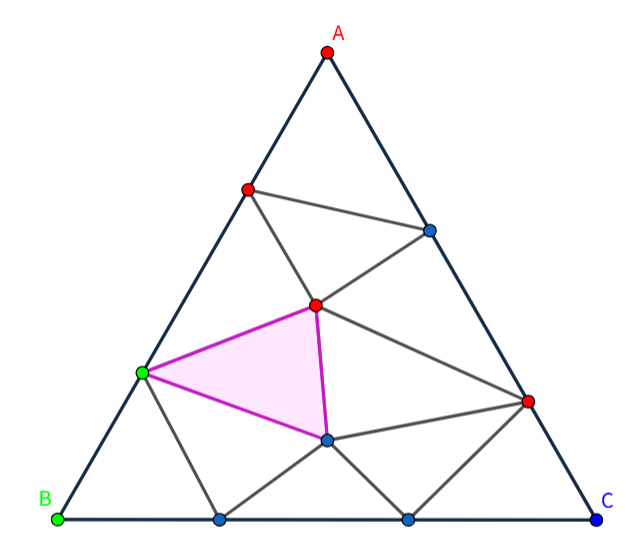
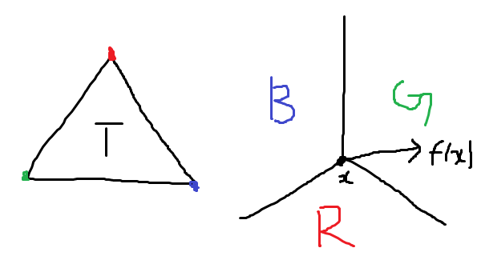

月刊組合せ論 Natori は面白そうな組合せ論のトピックを紹介していく企画です。今回は Brouwer の不動点定理と、その組合せ論バージョンと呼ばれる Sperner の補題を解説します。

## Brouwer の不動点定理とは

Brouwer の不動点定理は位相幾何学における定理です。


**定理**: $B^n=\{x\in \mathbb{R}^n\mid \|x\|\le 1\}$ を $n$ 次元閉球とする。このとき、連続写像 $f\colon B^n\to B^n$ は不動点を持つ。すなわち、$f(x)=x$ をみたす $x\in B^n$ が存在する。


次のような形で述べられることもあります。


**定理**: $X$ を $B^n$ と同相な空間とする。このとき連続写像 $f\colon X\to X$ は不動点を持つ。


証明：$\varphi\colon B^n\to X$ を同相写像とする。$\varphi^{-1}\circ f\circ \varphi$ は $B^n$ から $B^n$ への連続写像である。上の定理より、$(\varphi^{-1}\circ f\circ \varphi)(x)=x$ をみたす $x\in B^n$ が存在する。このとき $f(\varphi(x))=\varphi(x)$ となるので、$\varphi(x)\in X$ が不動点である。

## Sperner の補題

Sperner の補題は組合せ論の命題です。一般の次元で成り立ちますが、ここでは $1,2$ 次元の場合を紹介します。


**補題**: 線分 $AB$ 上に有限個の点がある。$A,B$ の色はそれぞれ赤・青であり、間にある点の色を赤または青とする。このとき、隣り合う頂点であって色が異なるものが存在する。


1 次元の場合、これはほぼ自明ですね。より強く、色の異なる隣り合う頂点の組は奇数個であることがいえます。ちなみに、2002 年の東大数学（文系）で次のような問題が出題されています。

> 円周上に $m$ 個の赤い点、$n$ 個の青い点がある。$m,n\ge 1$ のとき、$m+n$ 個の弧のうち両端の色が異なるものは偶数個あることを示せ。

色の異なる弧を 1 つ切断して線分にすると先ほどのシチュエーションと同じであることがわかります。


**補題**: 三角形 $ABC$ の三角形分割を考える。$A,B,C$ の色はそれぞれ赤・緑・青とし、辺 $AB$ 上の点は赤または緑、辺 $BC$ 上の点は緑または青、辺 $CA$ 上の点は赤または青とする。内部の点の色は赤・緑・青のいずれかとする。このとき、頂点の色がすべて異なるような三角形が存在する。


これが 2 次元の場合です。非自明になりましたが、1 次元の場合を用いて証明できます。

頂点の色が赤と青である辺に着目します。赤青の辺のうち、三角形 ABC の辺上にあるものの数を $a$、内部にあるものの数を $b$ とします。赤緑青の三角形の数を $x$、赤青赤・赤青青の三角形の数の和を $y$ とします。各三角形について赤青の辺の個数を求めて和をとると、$x+2y$ となります。ここで

- 三角形 ABC の周上の辺は、ちょうど 1 つの三角形の辺である。
- 三角形 ABC の内部の辺は、ちょうど 2 つの三角形の辺である。

ことに注目すると、内部の辺は二度カウントされていることになります。よって、$a+2b=x+2y$ という等式が成り立ちます。このことから $x\equiv a\pmod{2}$ となります。$a$ は一次元の場合の Sperner の補題から奇数なので、$x$ も奇数です。よって赤緑青の三角形が存在することが示されました。

他にもいろいろな証明があるので気になった方は調べてみてください。

## Sperner の補題から Brouwer の不動点定理を示す

2 次元の Brouwer の不動点定理を証明します。

2 次元閉球と同相な空間として正三角形 $T$ を考えます。$f\colon T\to T$ を連続写像とします。点 $x\in T$ から $f(x)$ へのベクトルを生やします（ベクトル場）。頂点の色は、ベクトルの向きに応じて次のように決めます。

このとき、Sperner の補題の仮定がみたされています。よって、任意の三角形分割について、頂点の色が異なる三角形が存在することがわかります。

いま、三角形分割の列をだんだん細かくなっていくようにとります。すなわち、辺の長さの最大値が 0 に収束するようにとります。そして Sperner の補題から得られる赤緑青の三角形の列を $A_1B_1C_1,A_2B_2C_2,\ldots$ とします。

ボルツァーノ＝ワイエルシュトラスの定理より、点列 $(A_1,A_2,\ldots)$ は収束部分列 $(A_{i_1},A_{i_2},\ldots)$ をもちます。この部分列の収束先を点 $X$ とします。

いま、三角形分割はだんだん細かくなるようにしているので、$(B_{i_1},B_{i_2},\ldots)$ と $(C_{i_1},C_{i_2},\ldots)$ も $X$ に収束します。

赤い点列の極限も赤であることは、$f$ が連続であることから従います。緑と青についても同様です。

以上より、$X$ が赤かつ緑かつ青であることがわかります。これは $X$ が不動点であることを意味しています。

## Brouwer の不動点定理から Sperner の補題を示す

逆に、Brouwer の不動点定理から Sperner の補題を示すことができます。

（このことが載っている論文があるらしいのですが、アクセスできないので確認できませんでした）

## 本当に同値なのか

上で述べたことから、Brouwer の不動点定理と Sperner の補題は同値だとよく書かれています。しかし本当にそうでしょうか？

Sperner の補題は点の座標を有理数にしても成り立ちます。一方、Brouwer の不動点定理では有理数上で考えると成り立ちません。1 次元の場合でも、$f\colon [1,2]\cap\mathbb{Q}\to [1,2]\cap\mathbb{Q}$ を

$$
f(x)=\begin{cases}
2 & \text{if } 1\le x<\sqrt{2} \\
1 & \text{if } \sqrt{2}<x\le 2
\end{cases}
$$

により定めると、連続ですが不動点をもちません。

上の証明ではボルツァーノ＝ワイエルシュトラスの定理を用いていましたが、このような実数の連続性が Brouwer の不動点定理を考えるときには重要ということでしょう。

## だが待て…まだまだあるぞ！

位相幾何と組合せ論の定理の関係を見ました。異なる分野の間に橋をかけるのは数学の醍醐味ですね。

実はこのような関係にある定理は他にもあります。有名なところでは位相幾何の Borsuk-Ulam の定理と組合せ論の Tucker の補題です。このように位相幾何と組合せ論が融合した分野を topological combinatorics といいます。

私の見方では、組合せ論の定理こそが数学の真髄であると感じます。組合せ論バージョンの定理で極限をとることで元の定理が得られるとき、組合せ論バージョンの定理は骨格というか本質というか、そういった感じがします。

Sara Billey という数学者は次のように言ったそうです。

> Combinatorics is the nanotechnology of mathematics.

難しい定理の骨格・本質を捉えようとする行為はまさにナノテクノロジーといえるのではないでしょうか。

## おわりに

位相幾何と組合せ論の関係はまだまだ面白そうなことがいっぱいあるので、また記事にしたいです。

12 月から[組合せ論 Advent Calendar 2025](https://adventar.org/calendars/11332) が始まります。参加者を募集しています。

月刊組合せ論 Natori では組合せ論の面白いトピックを紹介していくので、今後も応援よろしくお願いします。

## 参考文献

- Henle, Michael. A Combinatorial Introduction to Topology.
- Minagawa, Junichi. On the (in)equivalence of Brouwer's fixed point theorem and Sperner's lemma. arXiv:2507.02366.
- [Sperner の補題と Brouwer の不動点定理 | 高校数学の美しい物語](https://manabitimes.jp/math/2750)
