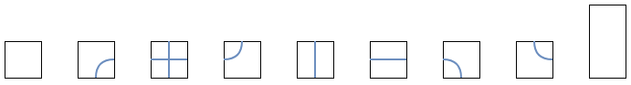
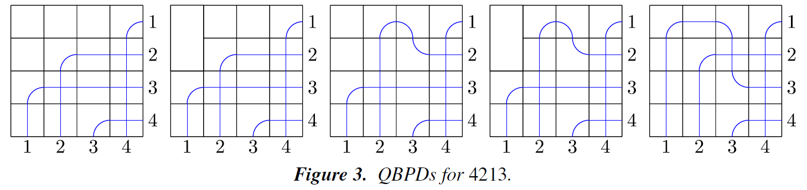

月刊組合せ論 Natori は面白そうな組合せ論のトピックを紹介していく企画です。今回は量子シューベルト多項式を紹介します。

2025 年は量子力学が誕生して 100 年と言われており、国際量⼦科学技術年に制定されました。日本ではこれを記念して量子フェスが開催されるなど、盛り上がりを見せています。

量子技術は物理学の範囲を超え、様々な分野と関わり始めています。その代表例は量子コンピュータです。いずれ実用化されるであろう量子コンピュータに向けて、世界中で量子人材の育成が進められています。

この記事では量子シューベルト多項式を紹介します。これを勉強することで量子人材になれる、かはわかりませんが、面白い話題だと思うので勉強していきましょう！

そしてこの記事は[組合せ論 Advent Calendar 2025](https://adventar.org/calendars/11332) の 1 日目の記事です。参加者を募集しております。

## 古典的シューベルト多項式

通常のシューベルト多項式については 2024 年 6 月号の Natori で解説しています。

[【月刊組合せ論 Natori】シューベルト多項式の組合せ論的表示【2024 年 6 月号】](../202406/)

この記事で必要になるものを復習していきましょう。$s_i=(i,i+1)\in S_n$ を隣接互換とします。多項式 $f\in\mathbb{Z}[x_1,\ldots,x_n]$ に対して

$$
\partial_if=\frac{f-s_if}{x_i-x_{i+1}}
$$

と定義します。ここで $s_if$ は $x_i$ と $x_{i+1}$ を入れ替えた多項式です。$\partial_i$ を差分商作用素といいます。

そして $w\in S_n$ の最短表示の 1 つを $w=s_{i_1}\cdots s_{i_l}$ とします。このとき $\partial_w=\partial_{i_1}\cdots \partial_{i_l}$ が最短表示のとり方によらず定まります。

二重シューベルト多項式は $x_1,\ldots,x_n,y_1,\ldots,y_n$ に関する多項式で、$w_0=(n,n-1,\ldots,2,1)$ としたとき

$$
\begin{align*}
\mathfrak{S}_{w_0}(x,y) &= \prod_{i+j<n+1}(x_i-y_j) \\
\mathfrak{S}_w(x,y) &= \partial^{(x)}_{w^{-1}w_0}\mathfrak{S}_{w_0}(x,y)
\end{align*}
$$

により定まります。ここで $\partial^{(x)}$ は変数 $x_1,\ldots,x_n$ に関する差分商作用素であることを表しています。

通常のシューベルト多項式は二重シューベルト多項式で $y_1=\cdots=y_n=0$ とすることで得られます。

## 量子シューベルト多項式

ここからはこの記事の主題である量子シューベルト多項式を扱っていきます。その前に、なぜ量子という名前がついているかを簡単に説明します。

古典的シューベルト多項式は旗多様体のコホモロジーと深く関係します。筆者は幾何学に詳しくないので解説できませんが、いつか勉強して記事を書きたいと思います。コホモロジー環を変形して量子コホモロジー環を得るという研究が 1990 年ごろから行われるようになりました。名前の通り物理学を由来とする概念です。旗多様体のコホモロジー環からシューベルト多項式が得られたように、旗多様体の量子コホモロジー環からは量子シューベルト多項式が得られます。

ではこの量子シューベルト多項式を定義していきましょう。$q_1,q_2,\ldots,q_{n-1}$ という変数を用意します。

$$
G_k=\begin{pmatrix}
x_1 & q_1 & 0 & \cdots & 0 \\
-1 & x_2 & q_2 & \cdots & 0 \\
0 & -1 & x_3 & \cdots & 0 \\
\vdots & \vdots & \vdots & \ddots & \vdots \\
0 & 0 & 0 & \cdots & x_k
\end{pmatrix}
$$

とおき、$\det(I+\lambda G_k)$ を展開したときの $\lambda^i$ の係数を $E_i^k(x_1,\ldots,x_k)$ とおきます。そして

$$
\mathfrak{S}_{w_0}^q(x,y)=\prod_{k=1}^{n-1}E_k^k(x_1-y_{n-k},\ldots,x_k-y_{n-k})
$$

とおき

$$
\mathfrak{S}_w^q(x,y)=(-1)^{\ell(w_0)-\ell(w)}\partial_{ww_0}^{(y)}\mathfrak{S}_{w_0}^q(x,y)
$$

と定義します。これが量子二重シューベルト多項式です。$y_i=0$ とすることで量子シューベルト多項式 $\mathfrak{S}_w^q(x)$ が得られます。

差分商作用素を用いた公式は量子二重シューベルト多項式では存在する一方、量子シューベルト多項式では知られていないことに注意が必要です。

具体例をいくつか挙げます。

- $\mathfrak{S}_{1234}^q(x)=1$
- $\mathfrak{S}_{3124}^q(x)=x_1^2-q_1$
- $\mathfrak{S}_{2314}^q(x)=x_1x_2+q_1$
- $\mathfrak{S}_{4213}^q(x)=x_1^3x_2+q_1x_1^2-q_1x_1x_2-q_1^2-q_1q_2$

古典的シューベルト多項式の場合とは異なり、マイナスの符号が現れることがあります。

量子シューベルト多項式で $q_i=0$ とすると古典的シューベルト多項式が得られます。

## 組合せ論的公式

シューベルト多項式を組合せ論的に記述する方法はいくつか知られています。（上述の記事を参照。）一方で、量子シューベルト多項式の組合せ論的公式は知られていませんでした。やはりマイナスが現れることが難しいのでしょう。

しかし、2025 年の論文で公式が見つかりました！

- Le, Tuong; Ouyang, Shuge; Tao, Leo; Restivo, Joseph; Zhang, Angelina. Quantum bumpless pipe dreams. Forum Math. Sigma 13, Paper No. e28, 21 p. (2025).

この論文では、bumpless pipe dream の量子バージョンを用いています。bumpless pipe dream も 2021 年の論文に登場する比較的新しい対象です。

それでは量子 bumpless pipe dream (QBPD) を紹介します。使うタイルは次の 9 種類です。

これを $n\times n$ のマス目に、次の条件をみたすように敷き詰めます。

- $n$ 本のパイプがあり、$i$ 行目の右端から出発したパイプは $w_i$ 列目の下端に到着する。
- 右端から出発したパイプは左・下・上に動くが、右に動いてはならない。
- どの 2 本のパイプも高々 1 回交わる。

$w=4213$ に対する例は次のようになっています。（図は先ほどの論文より）

各 QBPD $P$ に対して、以下のマスについてウェイトを定め、それらの積を QBPD の (binomial) ウェイト $\mathrm{bwt}(P)$ とします。

- 空のタイル（リストの左端のタイル）は、$i$ 行 $j$ 列にあるとき $x_i-y_j$
- ドミノタイル（右端）は、上のマスが $i$ 行目にあるとき $q_i$
- 十字タイル（左から 3 番目）であって縦向きのパイプでは上に動くものは、$i$ 行目にあるとき $q_i$
- 左下タイル（左から 7 番目）は、$i$ 行目にあるとき $-q_i$
- 縦タイル（左から 5 番目）であって上に動くものは、$i$ 行目にあるとき $-q_i$

ここで上に動くというのは、右端から出発して下端に到着する場合を考えています。

論文の主定理は、QBPD のウェイトから量子シューベルト多項式を計算できるということです：

$$
\mathfrak{S}_w^q(x,y)=\sum_{P\in \mathrm{QBPD}(w)}\mathrm{bwt}(P)
$$

先ほど $\mathfrak{S}_{4213}^q(x)=x_1^3x_2+q_1x_1^2-q_1x_1x_2-q_1^2-q_1q_2$ という例を出しましたが、実際に上記の 5 つの QBPD のウェイトを計算することで確かめられます。（この例は二重ではないので $y_i=0$ とします）

ただし、この公式では打ち消し合いが発生する場合があります。その意味でこの公式は最良ではないのですが、組合せ論的な公式が見つかったことの意義は大きいと思います。

証明を読み込んだわけではないのでここで証明することはできませんが、簡単に方針を述べておこうと思います。古典的シューベルト多項式の場合、Monk 公式から次の転換公式 (transition formula) が得られます：$w\in S_n$ を恒等置換でない置換、$r$ を $w(r)>w(r+1)$ をみたす元のうち最大のもの、$s$ を $w(s)<w(r)$ であるような元のうち最大のものとします。このとき

$$
\mathfrak{S}_w=x_r\mathfrak{S}_{wt_{rs}}+\sum_{\substack{i<r \\ \ell(wt_{rs}t_{ir})=\ell(w)}}\mathfrak{S}_{wt_{rs}t_{ir}}
$$

が成り立ちます。ここで $t_{rs}$ は $r,s$ を入れ替える互換です。量子二重シューベルト多項式でも似たような転換公式が成り立ちます。（論文の命題 3.14 です。）QBPD から得られる式が転換公式をみたすことを示すそうです。

## 今後の発展

量子シューベルト多項式を組合せ論的に表す公式が得られたことを活かして、さらなる研究が発展することを期待しています。

シューベルト多項式を組合せ論的に記述する方法はいくつかあり、そのうちの 1 つが bumpless pipe dream でした。他の組合せオブジェクトの量子版も考えられないでしょうか？

これからどのように研究が進んでいくか楽しみですね。あなたもぜひ、研究に参加してみませんか？

## おわりに

月刊組合せ論 Natori では今後も組合せ論の様々なトピックを紹介していく予定なので、応援よろしくお願いします。

また今月はアドベントカレンダーで他にも記事を書くので、そちらもチェックお願いします！

## 参考文献

- 前野俊昭, Schubert 多項式とその仲間たち, 数学書房.
