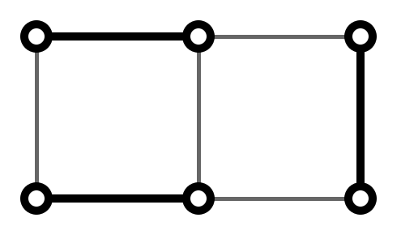

+++
title = "【月刊組合せ論 Natori】パフィアンと数え上げ【2026 年 9 月号】"
date = 2026-09-01
tags = ["数え上げ", "線形代数"]
+++





月刊組合せ論 Natori は面白そうな組合せ論のトピックを紹介していく企画です。今回はパフィアンを用いた数え上げを解説します。

2026 年、ようやく初 Natori です。今月号から毎月の連載を再開していこうと思います。

## パフィアン

まずはパフィアンを紹介します。行列式と似たようなものです。

行列式は次のように定義されるものでした。

$$
\det(A)=\sum_{\sigma\in S_n}\operatorname{sgn}(\sigma)\prod_{i=1}^n a_{i\sigma_i}
$$

行列式は任意の正方行列 $A$ について定義できますが、パフィアンを定義するには $A$ は次の条件をみたさなければなりません。

- 偶数次の正方行列
- 歪対称行列（すなわち、$a_{ij}=-a_{ji}$ をみたす）

歪対称行列であることから特に対角成分は 0 です。

$A$ を $2n$ 次歪対称行列とします。$F_n$ を $1,2,\ldots,2n$ の置換 $\sigma$ であって

- $\sigma(1)<\sigma(3)<\cdots<\sigma(2n-1)$
- $\sigma(2i-1)<\sigma(2i) \ (i=1,2,\ldots,n)$

をみたすもの全体からなる集合とします。このとき $A$ のパフィアンを

$$
\operatorname{pf}(A)=\sum_{\sigma\in F_n}\operatorname{sgn}(\sigma)\prod_{i=1}^n a_{\sigma(2i-1)\sigma(2i)}
$$

により定義します。

例えば $A$ が

$$
A=\begin{pmatrix} 0 & a \\ -a & 0 \end{pmatrix}
$$

のとき、パフィアンは $a$ です。$A$ が

$$
A=\begin{pmatrix} 0 & a & b & c \\ -a & 0 & d & e \\ -b & -d & 0 & f \\ -c & -e & -f & 0 \end{pmatrix}
$$

のとき、$\sigma$ としてあり得るものは $1234, 1324, 1423$ なので、パフィアンは $af-be+cd$ です。

パフィアンのもつ重要な性質として

$$
\det(A)=(\mathrm{pf}(A))^2
$$

があります。

パフィアンは行列式と同様、時間計算量 $O(n^3)$ で計算するアルゴリズムがあります。

このパフィアンを数え上げに応用していきます。

## 完全マッチング

### マッチングとは

パフィアンの定義で用いた $F_n$ がよくわからないと感じた方もいるかもしれません。これはマッチングであると考えることができます。

グラフの**マッチング**とは、頂点がダブらないように辺をいくつか選ぶことです。すべての頂点が選んだある辺の端点であるとき、**完全マッチング**といいます。

$2n$ 頂点の完全グラフの完全マッチングを考えます。例えば 6 頂点の場合、辺 $(1,3),(2,5),(4,6)$ を選ぶ完全マッチングがあります。これは $132546$ という $F_3$ の元と対応します。

辺の並べ方をうまく決めることで、一意的な表記としたいです。そのための条件が、定義で登場した

- $\sigma(1)<\sigma(3)<\cdots<\sigma(2n-1)$
- $\sigma(2i-1)<\sigma(2i) \ (i=1,2,\ldots,n)$

ということです。つまり、$F_n$ の元は完全グラフの完全マッチングを表しています。

なお、行列式では通常の置換 $\sigma \in S_n$ が出てきますが、これは完全二部グラフ $K_{n,n}$ の完全マッチングと考えられます。

### 完全マッチングの数え上げ

完全マッチングとパフィアンはさらに関係があります。

頂点が $2n$ 個のグラフを考えます。このグラフの辺に向きを決め、以下の行列 $K=(K_{ij})$ を定義します。

$$
K_{ij}=\begin{cases}
+1 & (v_i,v_j) \in E \\
-1 & (v_j,v_i) \in E \\
0 & \mathrm{otherwise}
\end{cases}
$$

この行列のパフィアンは

$$
\operatorname{pf}(K)=\sum_{\sigma\in F_n}\operatorname{sgn}(\sigma)\prod_{i=1}^n K_{\sigma(2i-1)\sigma(2i)}
$$

ですが、辺がないと 0 になって無視できるので、和の範囲はグラフの完全マッチング全体を動くことになります。

$$
\operatorname{pf}(K)=\sum_{M:\mathrm{matching}}\operatorname{sgn}(\sigma_M)\varepsilon(M)
$$

ここで $\sigma_M$ はマッチング $M$ から定まる置換で、$\varepsilon(M)$ はマッチング $M$ に含まれる辺 $(v_i,v_j)$ について $K_{ij}$ をかけ合わせたものです。

いま、$\operatorname{sgn}(\sigma_M)\varepsilon(M)$ が $M$ によらず一定と仮定します。この値は $+1$ か $-1$ なので、$\operatorname{pf}(K)$ の絶対値が完全マッチングの個数となります。よって、完全マッチングの個数はある行列のパフィアンで計算できることがわかりました。

問題となるのは上記の仮定をみたすように辺に向きをつけられるかということです。残念ながらすべてのグラフではできません。一方で、平面グラフでは可能であることが知られています。

パフィアンの絶対値が完全マッチングの個数と等しくなるような向き付けを **Pfaffian orientation** といいます。

平面グラフでこのような向き付けを求めるアルゴリズムとして、Fisher–Kasteleyn–Temperley algorithm が知られています。

## 非交差経路

### 行列式

行列式を用いた数え上げといえば LGV 公式と行列木定理ですね。ここでは LGV 公式を扱います。

$\Gamma=(V,E)$ をサイクルを含まない有限有向グラフとします。各辺 $e\in E$ の重み $w(e)\in \mathbb{Z}$ が定まっているとします。パス $P=(v_1,\ldots,v_n)$ の重みを $w(P)=w(v_1,v_2)w(v_2,v_3)\cdots w(v_{n-1},v_n)$ により定めます。2 つのパスが交わるとは、共通の頂点を持つこととします。$a_1,\ldots,a_n,b_1,\ldots,b_n\in V$ に対して $n\times n$ 行列

$$
M(a,b)=\left(\sum_{P\colon a_i\to b_j}w(P)\right)_{1\le i,j\le n}
$$

を定めます。ただし和において $P$ は $a_i$ から $b_j$ へのパス全体をわたるものとします。サイクルを含まないので有限和です。


条件「$i_1<i_2, j_1>j_2$ ならば $a_{i_1}$ から $b_{j_1}$ へのパスと $a_{i_2}$ から $b_{j_2}$ へのパスは必ず交わる」を仮定する。このとき

$$
\det M(a,b)=\sum_{(P_1,\ldots,P_n)}w(P_1)\cdots w(P_n)
$$

が成り立つ。ここで和は $P_i$ が $a_i$ から $b_i$ へのパスでどの 2 つのパスも互いに交わらないもの全体をわたる。


### パフィアン

LGV 公式は始点と終点が決まっている場合しか扱えません。始点のみ決まっていて、終点が決まっていない場合を考えます。

$n$ 本の経路からなる非交差経路で、$i$ 番目の経路の始点が $a_i$ であり、終点が $b_j \ (j \in \mathbb{Z})$ のいずれかであるものを考えます。


条件「$i_1<i_2, j_1>j_2$ ならば $a_{i_1}$ から $b_{j_1}$ へのパスと $a_{i_2}$ から $b_{j_2}$ へのパスは必ず交わる」を仮定する。$1\le i<j\le n$ に対して歪対称行列 $M$ の $(i,j)$ 成分を

$$
\sum_{(P_1,P_2)}w(P_1)w(P_2)
$$

とおく。ここで $P_1$ は $a_i$ からある $b_{i'}$ へのパス、$P_2$ は $a_j$ からある $b_{j'}$ へのパスであって交わらないものとする。このとき

$$
\mathrm{pf}(M)=\sum_{(P_1,\ldots,P_n)}w(P_1)\cdots w(P_n)
$$

が成り立つ。ここで和は $P_i$ が $a_i$ からある $b_{i'}$ へのパスでどの 2 つのパスも互いに交わらないもの全体をわたる。


$n$ 本の非交差経路について考えるには、2 本の非交差経路の組について計算して、パフィアンを計算すればよいことになります。

パフィアンは偶数次の行列に対して定義されるので、$n$ が奇数の場合はそのままでは使えません。しかし微修正すれば使えます。

## 使用例

[AtCoder Beginner Contest 216 H - Random Robots](https://atcoder.jp/contests/abc216/tasks/abc216_h) をパフィアンを用いて解くことができます。

公式解説にあるように、終点が固定されていない非交差経路の数え上げに帰着されます。パフィアンを用いることで、想定解よりもよい計算量で解くことができます。

## 関連する話題

行列式を用いた数え上げは、LGV 公式の他に行列木定理もあります。

パフィアン版の行列木定理もあるようです。いつか解説記事を書くかもしれません。

## おわりに

行列式を使った数え上げはそれなりに知名度がありますが、パフィアンはまだまだだと思うので、布教していきたいです。

今後も月刊組合せ論 Natori では組合せ論の面白いトピックを紹介していきたいので、応援のほどよろしくお願いします。

## 参考文献


