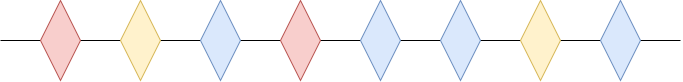
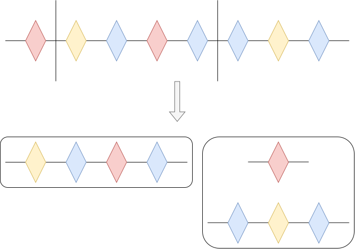
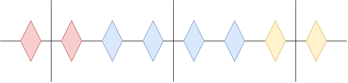

+++
title = "【月刊組合せ論 Natori】ネックレスどろぼう【2026 年 10 月号】"
date = 2026-10-01
tags = ["位相幾何学"]
+++






月刊組合せ論 Natori は面白そうな組合せ論のトピックを紹介していく企画です。今回はネックレス分割問題を扱っていきます。

## 事件

大変です。ネックレスが 2 人組の泥棒によって盗まれてしまいました。

ネックレスは宝石が一列に並んだものです。

ネックレスには $n$ 種類の宝石が使われており、どの宝石も偶数個が使われているとします。

泥棒たちはこれを均等に分けたいようです。つまり、ネックレスを何回か切断して、各部分をどちらかの泥棒が所有することで、$n$ 種類の宝石を 2 人の泥棒が同じ個数ずつ所有している状態にしたいです。

もちろんすべてバラバラにして宝石が 1 個ずつになるようにすれば可能です。しかしバラバラにするのはネックレスの価値が下がってしまうので、切断回数はなるべく少なくしたいようです。

例えば次のようにまとまって並んでいる場合、$n$ 回の切断が必要です。

実は、宝石がどのように並んでいても高々 $n$ 回の切断で均等に分けることが可能です。これを証明します。

## 連続版を考える

この問題は離散的でしたが、あえて連続的な状況に言い換えます。

区間 $[0,1]$ が有限個の区間に分けられ、各区間は $n$ 色のうちいずれかで塗られているとします。

このとき、高々 $n$ 回の切断で 2 人の間で均等に分けられるという主張が連続版です。

離散版が連続版から従うことをみます。ネックレスを $[0,1]$ だと考え、各宝石を同じ長さの区間だと考えます。連続版を適用すると、均等に分ける高々 $n$ 回の切断が得られますが、中途半端な位置で切断している可能性があります。そこで、切断位置をいい感じにずらせばよいです。（細かい部分をちゃんと確認しておりません）

ということで、連続版を証明すればよいことがわかりました。

## Borsuk-Ulam の定理

連続版は次の Borsuk-Ulam の定理から証明できます。これは位相幾何学の定理です。


$f\colon S^n \to \mathbb{R}^n$ を連続写像とする。このとき $f(x)=f(-x)$ をみたす $x \in S^n$ が存在する。




長さ 0 の線分も許すことにすれば、連続版における高々 $n$ 回の切断をちょうど $n$ 回の切断に変更できます。$n$ 回の切断から $n+1$ 個の線分が得られます。長さを $l_0,\ldots,l_n$ とおきます。$x_i$ を $\pm \sqrt{l_i}$ とし、符号は 2 人のどちらが得るかによって決めるものとします。$x=(x_0,\ldots,x_n)$ は $S^n$ の点です。$i=1,2,\ldots,n$ に対して $y_i$ を 1 人目が受け取る $i$ 番目の色の長さとします。$f(x)=(y_1,\ldots,y_n)\in \mathbb{R}^n$ とします。このとき $f(-x)$ の各成分は 2 人目が受け取る長さに対応します。$f$ は連続なので Borsuk-Ulam の定理が使用でき、$f(x)=f(-x)$ をみたす $x$ が存在します。これは均等に分けられることを意味しています。



こうしてネックレスを 2 人で分け合う問題が解けました。離散的な問題でしたが、連続的な定理を使って解けるのは不思議ですね。

## 組合せ論的な証明

しかし、組合せ論的な定理は組合せ論的に証明したいと考える人もいるかもしれません。

Borsuk-Ulam の定理を用いましたが、この定理には Tucker の補題という組合せ論的な補題を使って証明する方法があります。

実は、ネックレス分割問題は Tucker の補題から直接証明できます。詳しくは  を読んでください。

## 発展

$n$ 種類の宝石があるとき、高々 $n$ 回の切断でよいことがわかりました。では最小回数はどのように求められるでしょうか？

実は最小回数を求める問題は NP-hard であることが知られています。

また、2 人ではなく $k$ 人の泥棒を考えるという一般化もあります。この場合各宝石は $k$ の倍数個あるとします。このとき、高々 $n(k-1)$ 回の切断で均等に分けられることが知られています。こちらの証明も面白そうなので、いつか記事にしたいです。なお $k$ 人の場合を組合せ論的に証明できるかは未解決のようです。

## おわりに

ネックレス分割問題を紹介しました。組合せ論とトポロジーには他にも密接な関わりがあるそうです。

月刊組合せ論 Natori では今後も組合せ論の面白そうなトピックを紹介していく予定なので、応援のほどよろしくお願いします。

## 参考文献


