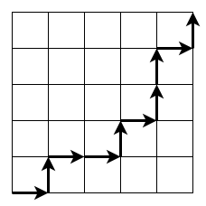
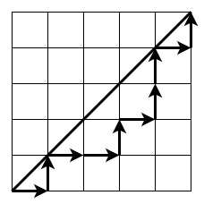
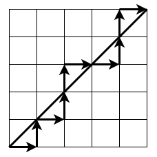
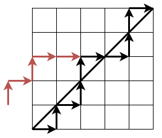



寺町さんから紙とペンを借りて、カタラン数について説明する。

「まずはこういう問題を考えてみます」

そういって僕は次のような図を描いた。

実際にはこんなに綺麗な図は描けていないのだが、描けたということにしておく。

「縦の長さが $n$、横の長さが $n$ のマス目があって、左下から出発して右上に向かいます。右か上にしか動けないとき、移動経路は何通りありますか？という問題です」

「これは有名な問題だね。$2n$ 回の移動のうち $n$ 回を右にすればいいから、$2n$ 個の中から $n$ 個を選ぶ方法の数、${}_{2n}\mathrm{C}_n$ だね」

「すごいですね」

流石は塔大生。一瞬でこの問題を解いてしまった。

「これがカタラン数？」

「えっと、カタラン数はこれをちょっと変えた問題で、こういう問題です」

僕はさっきの図に線を1つ付け加えた。

「斜め線が増えたね」

「この斜め線より上側に行かないような経路の個数は何通りありますか？という問題です」

寺町さんはしばらくの間、この問題を考えた。

「うーん、すぐにはわからないかも。どうやって解くの？」

「全体の個数である ${}_{2n}\mathrm{C}_n$ から、条件を満たさないものの個数を引きます」

「あー、余事象ね」

「条件を満たさないものは、斜め線より上側に行くような経路です」

そう言って僕は新しい図を描いた。

「これが斜め線より上側に行くような経路です」

そして僕は、かつて僕を魅了した一文を口にする。

「始点から、初めて上側に行く場所までを、**反転**させます」

僕は赤い経路を書き加えた。この経路は上に進む移動を右に進む移動、右に進む移動を上に進む移動に置き換えたものだ。書いてある斜め線より一個上の斜め線について、鏡映しにしたものということもできる。

「な、何をしているの……？」

「普通の経路を考える代わりに、最初に赤い経路を通ることを考えます。途中からは元の経路と合流します」

「うん……？」

僕たちは今2種類の経路を考えている。左下から右上に向かう経路であって斜め線より上側に行くものと、赤い経路を通って右上に向かうものだ。

「赤い経路を通るものの個数は、$2n$ 回の移動のうち $n+1$ 回を右にする方法の数なので、${} _ {2n}\mathrm{C} _ {n+1}$ です」

「それはそうだけど、今考えてるのって余事象の個数だったよね？」

そして僕は決め台詞を言う。

「実は、その余事象の個数こそが、この ${} _ {2n}\mathrm{C} _ {n+1}$ なんです！」

「……えっ？どうして？」

「鏡映しの関係になっているので、2種類の経路の個数は等しいんです」

「なるほど……」

「だから、問題の答えは余事象の個数を引いて、${} _ {2n} \mathrm{C} _ {n} - {} _ {2n}\mathrm{C} _ {n+1}$ なんです」

これこそがカタラン数である。かつて僕を魅了し、潟蘭大学への進学へと導いた存在。当時の感覚がよみがえってきた。今見ても美しい方法だ。

ふと冷静になる。一方的に話してしまってはいないだろうか。寺町さんの様子をうかがう。黙っている。まずい、勝手に盛り上がりすぎたか？

「す、すごい！」

寺町さんが輝いた目でこちらを見ている。

「なんなの、この美しい方法は！？」

「これが、カタラン数です」

「これがカタラン数なのね……」

寺町さんも解法の美しさに感動しているようだ。まるでいい映画の感想を共有しているような気持ちになる。

「浜田君の大学ってこういうことをやってるの？」

「まあ、そうですね」

「もっと知りたい！教えて！」

「えっと、今すぐには難しいかな……。ノートを持ってくればできると思いますけど」

「じゃあ、また今度会ったときに教えてくれる？」

「わかりました」

こうして、カタラン数のことをもっと知りたい寺町さんのために、バイトと並行してカタラン数を教える日々が始まった。
