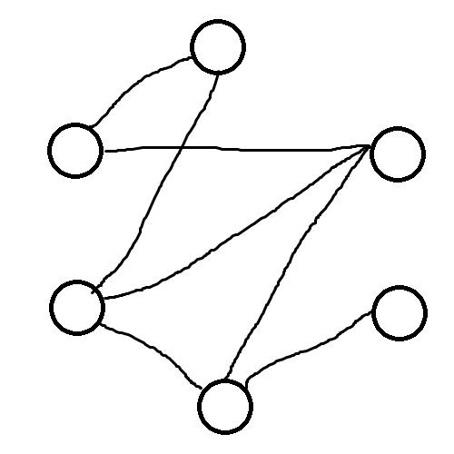


ﾁｮﾜﾖｰﾁｮﾜﾖｰ


あ、ｽﾋﾟｷだ。


ｽﾋﾟｷ!


この本に興味があるの？

> $e(X,Y)=p|X||Y|+o(n^2)$ for all $X,Y\subseteq V(G)$


ｱｰｳ!


ｽﾋﾟｷには難しい本かもね。

気になる？

この本はスペクトルグラフ理論の本だよ。グラフの性質を行列の固有値を使って調べる分野なんだ。

今読んでいる部分はグラフのランダム性についてだよ。この条件はグラフがランダムっぽいことを定義してる。

ランダムグラフというのは、頂点と頂点の間に確率 $p$ で辺を張ることでできるグラフ。

試しに、このグラフにランダムに辺を描いてみて。


ｽﾋﾟｷ!


できたね。こういうのがランダムグラフ。

じゃあ、グラフがランダムっぽいことを確かめるにはどうしたらいいかな。

さっきの定義

> $e(X,Y)=p|X||Y|+o(n^2)$ for all $X,Y\subseteq V(G)$

を使ってもいいけど、すべての $X,Y$ について確かめないといけないからこれは大変。

でも、固有値を使うとすごいことが起きる。実は次の条件と同値になるんだよ。

> $\lambda_1\ge\lambda_2\ge\cdots\ge\lambda_n$ をグラフの隣接行列の固有値とするとき、$\lambda_1=pn+o(n)$ かつ $\max_{i\ne 1}|\lambda_i|=o(n)$

固有値を使ってグラフの性質を調べられるなんてすごいよね。


ｳｱｰ!


聞いてくれてありがとう。お礼にこれをあげるね。


ﾁｮﾜﾖ!


**参考文献**

Zhao, Yufei. Graph theory and additive combinatorics. Cambridge University Press. (2023).

このおはなしはトリッカルの二次創作です。今すぐプレイ！

