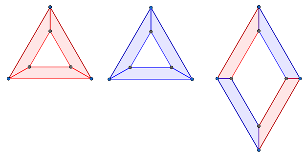
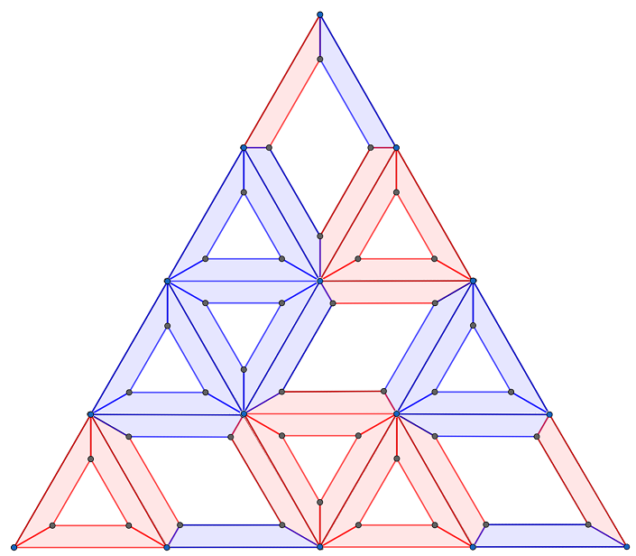



「篠澤さん、それは何ですか？」

「あ、プロデューサーだ」

篠澤広は三角形のピースを組み合わせて遊んでいるようだ。

「これはパズル。3 種類のピースを組み合わせて、敷き詰める」

3 種類のピースを見せてもらった。

「これが 3 種類のピース。回転させてもいいけど、裏返すのはダメ。辺を合わせるときは、色を合わせる。これがルール」

そして、篠澤広はピースを組み合わせて大きな三角形を作った。

「どう？プロデューサーも、やってみる？」

篠澤広からピースを渡された。それを組み立てつつ、話を続ける。

「そういえば、パズルが特技でしたね」

「まあね。でも、これはただの遊びじゃない」

「どういうことですか？」

「わたしのほかの特技、知ってる？」

「学業、特に物理と数学でしたね」

「そう。このパズルは、物理や数学とも、大いに関係する」

手元の不完全な三角形を前に、手が止まる。ただの遊びにしか見えないこのパズルが、物理や数学と関係する？

「ふふっ、知りたい？」

「聞かせてください」

「どこから話そうかな……」

篠澤広はしばし考える。そして、口を開く。

「シューア関数の話をしよう」

---

シューア関数はいろいろなところに現れる。

例えば、組合せ論。半標準ヤングタブローを使って記述できる。

例えば、表現論。一般線形群の、既約多項式表現の指標として現れる。

例えば、幾何学。グラスマン多様体のコホモロジーにおける、シューベルト類を表す。

物理に近いところだと、KP 階層の $\tau$ 関数になるという話もあるね。

それで、今考えたいのは、2 つのシューア関数の積。これはシューア関数の線形結合で書けることが知られている。係数を求めることが古くからの研究課題になってる。

この係数は、例えばリトルウッド・リチャードソンタブローの個数になる。他にもいろいろあるけど、パズルもそのひとつ。

Knutson, Tao, Woodward という 3 人の数学者が、この問題に取り組んだ。彼らは、三辺の色を決めたときのパズルピースのはめ方の個数が、リトルウッド・リチャードソン係数に等しいことを証明した。

その後、Zinn-Justin という人が、このパズルを量子可積分性の観点から捉えなおした。

現代では、グラスマン多様体を旗多様体に変えたり、コホモロジーを K コホモロジーや同変コホモロジーに変えたりと、いろいろな研究が行われているよ。その研究にも、量子可積分性が使われている。物理と数学を駆使して、パズルが研究されてる。

---

俺は篠澤広の語りに夢中になっていた。彼女の使う用語の多くは難しくてわからなかった。それなのに心はワクワクしている。

「もっと教えてください」

「いいよ。でも、細部まで完璧には覚えてないから、明日でもいい？」

「わかりました」

手元の不完全なパズルを眺める。ここからどんな数学・物理が発展していくのだろうか。
