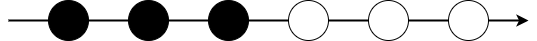
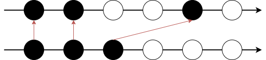
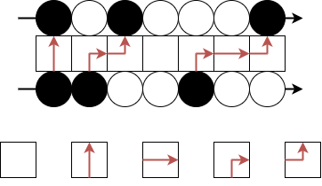
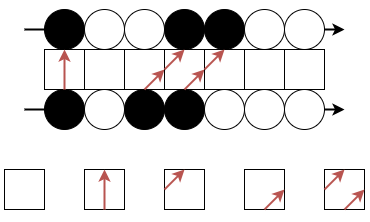
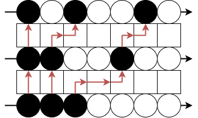
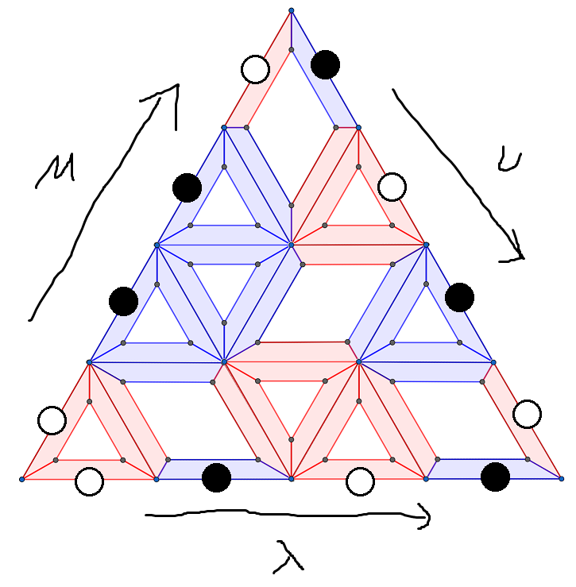



翌日、空き教室にて。

「今日はレッスンじゃないんだね」

「いえ、これは特別レッスンです。篠澤さんには物理、数学、パズルに関する授業をしてもらいます」

「それは、プロデューサーにしかメリットがなさそうだけど」

「そんなことはありません」

不思議そうな表情をしている篠澤さんに今回のレッスンの目的を説明する。

「篠澤さんは、まっすぐ立ち続けることや、大きな声を出すことが苦手です」

「うん」

「授業では長時間にわたって、立ちながらしゃべることが必要です。これは、篠澤さんにとって十分な負荷がかかるトレーニングとなるはずです」

「なるほど。プロデューサーが、わたしの話を聞きたいだけじゃないんだね」

勿論パズルの話を聞きたいだけではない。ちゃんと篠澤広のことを思ってのことだ。

「わかった。じゃあ早速、授業を始めるね」

俺は最前列の席に座る。篠澤広はチョークを手に取り、黒板に書き始める。

---

まずは、シューア関数について説明するね。定義方法はいくつもあるけど、フェルミオンを使って定義するね。

これが基本的な状態。黒いところに粒子があって、白いところにはない。と考えてもいいし、黒い粒子と白い粒子があると考えてもいい。座標は半奇数。この図だと黒い粒子が座標 $-\frac52,-\frac32,\frac12$ にあって、白い粒子が座標 $\frac12,\frac32,\frac52$ にある。書いてないけど、左側は全部黒、右側は全部白で無限に続いているものとするよ。

これがフェルミオンと呼ばれるのは、パウリの排他律をみたすから。つまり、同じ座標には粒子が 1 つまでしか存在できない。

この基本状態を真空というよ。

さて、この状態から粒子を励起させよう。こんな風に。

励起にはいくつかの方法がある。まずはこんなルールを考えよう。

昨日は 3 種類のパズルピースを見せたけど、ここでは 5 種類のタイルを使う。矢印にしたがって、粒子を移動させる。パズルピースが色を合わせていたように、タイルも矢印を合わせないといけない。途中で消えたりしたらダメ。

もう 1 つのルールはこんな感じ。

こっちも 5 種類のタイルを使うけど、模様が違う。どちらも 5 種類のタイルを使うことから、5 頂点模型と呼ばれているよ。

さて、賢明な読者はこの 2 つの関係がわかるだろう。

---

「プロデューサー、この 2 つのルールには、どんな関係があるかな？」

突然質問が飛んできた。

1 つ目のルールではどこまでも右に動けるが、2 つ目のルールでは 1 つしか右に動けない。一体どのような関係があるのだろうか。

「ヒントはありますか？」

「そうだね、黒い粒子の励起に注目してたけど、白い粒子に注目してみるとどう？」

改めて 1 つ目の図を見て白い粒子の動きに注目する。黒い粒子は右にいくつでも動けるが、白い粒子は左に 1 つしか動けないようだ。

1 つしか動けない……？

「もしかして、1 つ目のルールで黒い粒子が動いているときは、白い粒子は 2 つ目のルールで逆向きに動いている、とかでしょうか？」

「正解。別の言い方をすると、左右反転して白と黒を入れ替えると、2 つのルールが入れ替わる。この左右反転して白黒を入れ替えるという操作は重要だから、**共役**と名前を付けておこう」

共役。その言葉をメモする。

「それで、シューア関数の話でしたよね？」

「うん。シューア関数を定義する準備が整った」

いよいよシューア関数が定義されるようだ。

「……その前にプロデューサー。ずっとしゃべってたら喉がカラカラに」

俺はペットボトルを差しだした。

---

さて、ようやくシューア関数を定義できる。

2 つの励起ルール―名前がないと不便だからルール 1 とルール 2 としよう―これらを使う。

シューア関数は $s_{\lambda}(x_1,\ldots,x_n)$ という多項式。正確にはシューア多項式と言ったほうがいいかもね。$\lambda$ はフェルミオンの状態を表すよ。

真空のことを $|\varnothing\rangle$ と表すけど、$|\varnothing\rangle$ から出発して、ルール 1 を $n$ 回繰り返して $|\lambda\rangle$ を作る。たとえば……。

一番下が $|\varnothing\rangle$ で、一番上が $|\lambda\rangle$ だよ。

それで、黒い粒子の移動距離の分だけ $x_i$ をかける、ということをする。1 回目は黒い粒子が 2 だけ移動してるから、$x_1^2$ をかける。2 回目の移動距離は $1+1=2$ だから、$x_2^2$ をかける。すると、$x_1^2x_2^2$ になる。

$|\varnothing\rangle$ から $|\lambda\rangle$ を作る方法はあと 2 つあって、それぞれ $x_1x_2^3$ と $x_1^3x_2$ という単項式ができる。これらをすべて足し合わせたものが、シューア多項式。今回の例だと

$$
s_{\lambda}(x_1,x_2)=x_1^3x_2+x_1^2x_2^2+x_1x_2^3
$$

になる。

一般の場合も含めて、これを数式で書くと……。

$$
s_{\lambda}(x_1,\ldots,x_n)=\langle\varnothing | \prod_{i=1}^n T_1(x_i) | \lambda\rangle
$$

これはブラケット記法だね。$T_1$ というのはルール 1 に対応する作用素で、転送行列というよ。

次はルール 2 の方を考えよう。共役が大事だったね。$\lambda$ の共役を $\lambda^{\prime}$ とすると……。

$$
s_{\lambda^{\prime}}(x_1,\ldots,x_n)=\langle\varnothing | \prod_{i=1}^n T_2(x_i) | \lambda\rangle
$$

になることがわかる。

最後に、ルール 1 を $m$ 回使ってから、ルール 2 を $n$ 回使うことを考えて、新しい関数を作る。

$$
s_{\lambda}(x_1,\ldots,x_m;y_1,\ldots,y_n)=\langle\varnothing | \prod_{i=1}^m T_1(x_i)\prod_{i=1}^n T_2(y_i) | \lambda\rangle
$$

この左辺は超対称シューア関数という。これがパズルの証明において重要になる。

---

「質問です。この記号は何ですか？」

俺は $\prod$ という記号の意味を聞いた。

「これは総積という意味だよ。たとえば、$\prod_{i=1}^3T(x_i)=T(x_1)T(x_2)T(x_3)$ になる。数のかけ算にも使う記号だけど、数のかけ算と違ってかける順番が大事」

「作用素、もかけ算ができるんですね」

「そう。$f$ を作用させてから $g$ を作用させることは、$f$ と $g$ の積を作用させることと同じだと考える」

「わかりました」

---

超対称シューア関数は $|\varnothing\rangle$ からルール 1 とルール 2 を経て $|\lambda\rangle$ に到達していたね。これをもう少し観察しよう。

ルール 1 を終えた後の中間状態を $|\mu\rangle$ とすると、$|\varnothing\rangle$ からルール 1 で $|\mu\rangle$ に到達するところは普通のシューア関数 $s_{\mu}$ に対応する。では $|\mu\rangle$ からルール 2 で $|\lambda\rangle$ に到達するところはどうかな。そのために、こんな定義をする。

$$
s_{\lambda/\mu}(x_1,\ldots,x_n)=\langle\mu | \prod_{i=1}^n T_1(x_i) | \lambda\rangle
$$

$$
s_{\lambda^{\prime}/\mu^{\prime}}(x_1,\ldots,x_n)=\langle\mu | \prod_{i=1}^n T_2(x_i) | \lambda\rangle
$$

スタート地点を真空から $|\mu\rangle$ に変えただけ。もちろん、$\mu=\varnothing$ のときはふつうのシューア関数になる。これは skew シューア関数というよ。

これを使うと、超対称シューア関数はこう書ける。

$$
s_{\lambda}(x_1,\ldots,x_m;y_1,\ldots,y_n)=\sum_{\mu}s_{\mu}(x_1,\ldots,x_m)s_{\lambda^{\prime}/\mu^{\prime}}(y_1,\ldots,y_n)
$$

これで準備が整った。主定理を述べよう。

$s_{\mu}s_{\nu}=\sum_{\lambda}c^{\lambda} _ {\mu\nu}s _ {\lambda}$ をみたすような $c^{\lambda} _ {\mu\nu}$ が存在する。$\lambda,\mu,\nu$ はフェルミオンの状態だったけど、白い粒子、黒い粒子をそれぞれ赤・青に対応させる。すると、三辺の状態が $\lambda,\mu,\nu$ であるようなパズルの個数が、$c^{\lambda}_{\mu\nu}$ に等しい。これが主定理。

---

「ふう……」

篠澤広は主定理の説明を終え、一息ついた。

「ですが篠澤さん、$\lambda$ は無限に続きましたよね。この図では有限ですが、その違いはどうなっていますか？」

「そうだね……、それも……説明しなくちゃ……」

篠澤広の様子がおかしい。よく見ると、彼女は教卓につかまってようやく立っている状態であり、脚はがくがく震え、息遣いも荒い。

「大丈夫ですか！？」

「もう、限界かも……」

「何故もっと早く言わなかったんですか？」

「だって……限界に挑むのは……楽しい……か……ら……」

最後の力を振り絞るように言葉を発した後、篠澤広は倒れた。

授業を中断し、保健室へ連れていった。彼女は何故か幸せそうな表情をしていた。