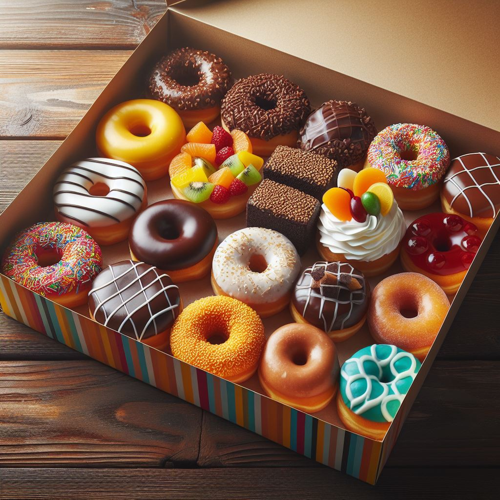

## いっぱい

早稲くみあ「おはよー！」

夏堂美澄「おはよ。紹介するね、ハルカ先輩」

萬田ハルカ「萬田ハルカよ！よろしくっ！」

早稲くみあ「早稲くみあです。よろしくお願いします」

萬田ハルカ「気楽にいこうよ～。だってゆるくすうがく会なんでしょ？」

早稲くみあ「そうですね。で、メンバーはこの3人？」

萬田ハルカ「いやいや、私も何人か呼んだんだ」

その後。

有堀菫「お邪魔します」

初本ひかり「お邪魔します！」

蛍津美悠「お邪魔……します……」

早稲くみあ「いっぱい来たねー。この部屋じゃちょっと狭いかも？」

夏堂美澄「10人とかになったら別の部屋を考えなきゃだね」

早稲くみあ「10人も集まるかな？」

萬田ハルカ「いいじゃんいいじゃん！賑やかで楽しそう！」

## 自己紹介

早稲くみあ「まずは自己紹介をしましょう！私は**早稲くみあ（わせくみあ）**、大学院生です！数学の魅力を発信するために、最近組合せ論VTuberを始めました！」

萬田ハルカ「おお～！」

初本ひかり「組合せ論VTuberってなんだかすごそうです！」

夏堂美澄「じゃあ次は私かな。**夏堂美澄（なつどうみすみ）**。くみあは大学の友達で、よく一緒に勉強してた。今は会社で働いてる。一応の専門はリーマン面っていうものなんだけど、よくわからないまま卒業しちゃったんだよね」

蛍津美悠「リーマン面……？」

夏堂美澄「もう忘れちゃった。くみあに聞いて」

早稲くみあ「私も詳しくないよー」

萬田ハルカ「次は私！**萬田ハルカ（まんだはるか）**！ミュージシャンとして活動してるよ。美澄はサークルの後輩。数学はあまりやってこなかったけど、これからやるつもりよ」

早稲くみあ「数学のできるミュージシャンっていいですよね！」

萬田ハルカ「これからは歌唱力だけでなく数学力も必要な時代だから」

夏堂美澄「そうなの？」

萬田ハルカ「じゃあ次はひかりちゃん！」

初本ひかり「はい！**初本ひかり（はつもとひかり）**、高校2年生です！歌とダンスが大好きです！アイドルを目指してます！」

早稲くみあ「若いね～」

萬田ハルカ「数学アイドル、目指してるんでしょ？」

初本ひかり「はい、プロデューサーさんの方針で。これからは数学アイドルの時代だって言っていました」

夏堂美澄「そうなの？」

初本ひかり「でも、私はあまり数学が得意ではなくて……。場違いかもしれませんが……」

早稲くみあ「大丈夫！ゆるくやっていく会だから」

萬田ハルカ「じゃあ次は菫ちゃん！」

有堀菫「**有堀菫（ありほりすみれ）** です。高校3年生です。トップアイドルを目指すために精進します」

萬田ハルカ「真面目だねえ。やっぱり数学アイドルを究めたいんだ」

有堀菫「いえ、そんなふざけたものではなく、本当のトップアイドルを目指します」

夏堂美澄「あれ？」

萬田ハルカ「じゃあ最後は美悠ちゃん！」

蛍津美悠「えっと……、**蛍津美悠（ほとつみゆ）**……です。よろしくお願いします……」

初本ひかり「好きなものとか言ってみようよ」

蛍津美悠「宇宙とか……、お菓子とか……好きです」

早稲くみあ「そうなんだ～」

初本ひかり「私たち3人でアイドルを目指してます！」

萬田ハルカ「この間は一緒にお仕事をしたから、その縁でここに誘ってみたってわけ」

早稲くみあ「なるほど」

## まずはこれ

早稲くみあ「この6人でやっていくんだね。まぁゆるい会だから増えたり減ったりするかもしれないけど」

夏堂美澄「無理して出る必要はないからね」

初本ひかり「はい！」

夏堂美澄「自己紹介も済んだことだし、まずはこれをやろう」

早稲くみあ「早速やっちゃう？」

夏堂美澄「ドーナツタイム！」

(Image Creator from Designer で作成)

早稲くみあ「あれ、数学じゃないの？」

夏堂美澄「ゆるくすうがく会でしょ？まずはおやつを食べるところからだよ。はい、みんなもどうぞ」

萬田ハルカ「やったあ」

初本ひかり「いいんですか？ありがとうございます！」

夏堂美澄「一応働いてるわけだし、これくらいはやるよ。それに、このお店のドーナツを布教できるなら私も嬉しい」

早稲くみあ「美澄はドーナツ大好きだからね」
