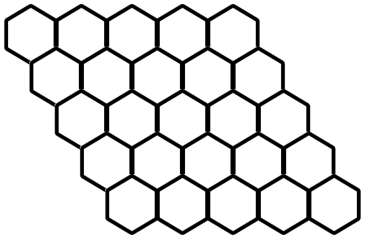
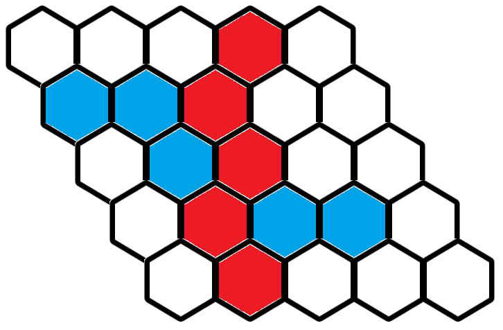
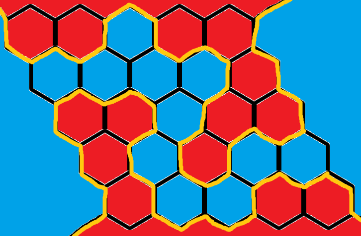

## 発表

夏堂美澄「さて、ドーナツも配ったことだし、そろそろ発表を聞こうか」

早稲くみあ「じゃあ私が発表するね！」

夏堂美澄「黒板部屋の黒板が活躍するね」

初本ひかり「家に黒板あるのすごいですね！」

早稲くみあ「気合い入れたからね」

---

さて、この私早稲くみあが、ゆるくすうがく会の最初の発表をします！気楽に聞いてね。

数学っていったら、難しい数式を扱うイメージがあるかもしれません。$\sin x$ とか、$e^x$ とか。

でもそうじゃない数学もあるってことを伝えたい！数学にはいろいろあるんだってことを！

今日はゲームについて数学的に考えていこうと、思います！将棋とかチェスとかいろいろありますよね。こういうのも実は数学で扱えるんです。

今日は**HEX**というゲームを扱います！

(Image Creator from Designer で作成)

あ、この画像はイメージだから本当のHEXじゃないけどね……。

HEXっていうのはこんなゲームです。まずはこんな盤面を用意します。

正六角形を並べます。この図だと $5\times 5$ だけど、他の大きさでもいいです。

それで、この盤面の上で2人がゲームをします。先手と後手に分かれて、先手は白い六角形を赤く、後手は白い六角形を青くしていきます。こんな感じに。

で、赤い六角形が上から下までつながったときに先手の勝ち、青い六角形が左から右までつながったときに後手の勝ちです。この図だと先手の勝ちですね。

これだけだと普通のゲームじゃんって思うかもしれないけど、数学的に研究されてるんです。そして、こんな面白い定理があります！


**定理** (HEX の定理): HEXに引き分けは存在しない。


つまり、必ず先手か後手が勝つっていうことです！

証明は雰囲気だけ伝えますね。白い六角形を全部赤か青に塗って、どっちかがつながってることを示します。赤と青の境界に黄色い線を引きます。

あ、外側にも色を塗ったことに注意。

そしたらこの黄色い線は途中で切れたり分岐したりしないことがわかります。だから、左上から出発すると、右上か右下か左下に到着することがわかります。ここで左上から出発した黄色い線の左側が常に赤であることに着目すると、右下に到着することはないことがわかります。

そんなわけで境界線の形としてあり得るのが2通りになって、これが先手が勝つことと後手が勝つことに対応するので、引き分けにならないということです。これで証明おしまい！

## 遊ぼう！

早稲くみあ「ここまで大丈夫？」

初本ひかり「な、なんだかすごいですね」

夏堂美澄「どうだった？」

萬田ハルカ「ドーナツ美味しい！」

早稲くみあ「ドーナツの感想！？」

夏堂美澄「ゆるくすうがく会なんだから、真面目に話聞く必要ないでしょ？」

早稲くみあ「そうだけど……」

蛍津美悠「真面目に聞いちゃってごめんなさい……」

早稲くみあ「いやいや、とってもありがたいよ」

夏堂美澄「まぁでも、実際にHEXを遊べるようにした方が、もっと楽しいんじゃない？」

早稲くみあ「そういうだろうと思って……」

有堀菫「まさか？」

早稲くみあ「じゃーん！HEXを遊べるようにしてみましたー！」

夏堂美澄「やるじゃん」

萬田ハルカ「おおー、楽しそう！」

早稲くみあ「遊んでみよう！」

## 参考文献

- [HEXの定理(1) - フィボナッチ・フリーク](https://fibonacci-freak.hatenablog.com/entry/2017/08/19/120329)