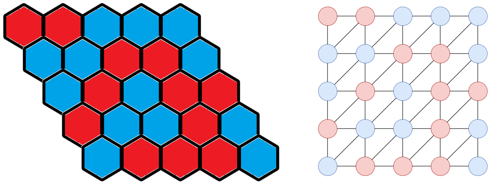

## ゲームと数学

早稲くみあ「いっぱい遊んだねー」

蛍津美悠「面白かった……です」

夏堂美澄「これでHEXとも親しくなれたかな」

有堀菫「でも、数学をやっている感じがあまりしません」

早稲くみあ「こういうのも数学なんだよ～。ゲームをしながら数学の研究もできるって、楽しいと思わない？」

萬田ハルカ「楽しそう！」

## ブラウワーの不動点定理

早稲くみあ「もう少し発表したいことがあるんだけどいいかな？」

有堀菫「聞きたいです」

夏堂美澄「じゃあよろしく」

---

HEXの定理、つまりHEXゲームに引き分けが存在しないことを証明したけど、この定理が面白いのはここから！

なんと、ブラウワーの不動点定理と同値になるんです！


**定理** (ブラウワーの不動点定理): $D=[0,1]\times [0,1]$ とし、$f\colon D\to D$ を連続写像とする。このとき $f$ は不動点をもつ。すなわち $f(x)=x$ をみたす $x$ が存在する。


同値というのは、HEXの定理からブラウワーの不動点定理を証明することもできるし、ブラウワーの不動点定理からHEXの定理を証明することができるということです。

見た目が全然違うこの2つの定理が同値っていうのが面白いですよね？HEXの定理は離散的、ブラウワーの不動点定理は連続的なのに、同値だなんて！

もう1つHEXの定理の応用例を紹介します。


**定理** (ジョルダン曲線定理): $C$ を $\mathbb{R}^2$ 上の単純閉曲線とする。このとき $\mathbb{R}^2\setminus C$ は 2 つの連結成分からなり、一方は有界、もう一方は非有界である。さらに 2 つの領域の境界は $C$ である。


閉じた曲線を描くと有限な領域と有限じゃない領域に分かれる、ということです。当たり前に見えますけど実は証明が大変な定理として知られているんです。そんなこの定理も証明できちゃうんです！

全部を完璧に証明しようとするとゆるくすうがく会じゃなくてガチすうがく会になっちゃうので、軽く証明します。HEXの定理は証明したので、HEXの定理からブラウワーの不動点定理を証明するところだけやります。

ポイント1つ目は、HEXの盤面をグラフで表現することです！グラフというのは頂点と辺があるもので、組合せ論ではよく出てきます。隣り合うという関係を辺で表現します。

ポイント2つ目は、グラフを $D=[0,1]\times [0,1]$ に埋め込むことです！こうすることでHEXの定理とブラウワーの不動点定理がつながりそうな気がしてきませんか？

証明の流れを軽く説明します。背理法を使うためにブラウワーの不動点定理の否定、つまり $f(x)=x$ をみたす $x\in D$ が存在しないと仮定します。すると $|f(x)-x|\ge \varepsilon>0$ となるようにできます。いま $D$ の中にHEXの盤面があるわけですけど、各頂点 $v$ について $f(v)-v$ は $x$ 座標の絶対値または $y$ 座標の絶対値が $\frac{\varepsilon}{2}$ 以上になります。$f(v)-v$ の $x$ 座標の絶対値が $\frac{\varepsilon}{2}$ 以上のとき $v$ を青色、そうでないとき $v$ を赤色で塗ります。するとHEXの定理から上下につなぐ赤色の道または左右につなぐ青色の道が存在するはずです。青い道が存在するとしてみましょう。

この青い道の頂点を2つに分けます。塗り方から $f(v)-v$ の $x$ 座標の絶対値は $\frac{\varepsilon}{2}$ 以上ですが、正か負かで分けます。左端の頂点は必ず正、右端の頂点は必ず負になることから、隣り合う頂点で正負が切り替わるところがあるはずです。盤面を細かくすれば、隣り合う頂点 $v,w$ の距離はいくらでも小さくすることができます。でも $f(v),f(w)$ の距離がある値より小さくならないことが計算できます。これは $f$ が一様連続でないことを意味していて、矛盾です。赤い道が存在すると仮定しても同様に矛盾です。

軽くと言ったのに長くなっちゃいましたね。ブラウワーの不動点定理の否定を仮定していたので、矛盾が導けたということで、これでブラウワーの不動点定理が証明できました。

---

早稲くみあ「聞いてくれてありがとう！」

初本ひかり「🤯」

萬田ハルカ「ひかりちゃん大丈夫？」

初本ひかり「ぜ、全然わかりませんでした……」

早稲くみあ「一様連続とか習ってないもんね。しょうがないよ」

夏堂美澄「そういえば、$f$ って一様連続なんだっけ？連続としか書いてなかったような」

早稲くみあ「$D$ はコンパクトだから」

夏堂美澄「そっか」

## 質疑応答

早稲くみあ「質問あったらどうぞ」

蛍津美悠「えっと……、HEXで2人とも勝つことって、ありますか……？」

早稲くみあ「ないよ。交互にプレイしていくからね」

蛍津美悠「そうじゃなくて……、赤い道と青い道が両方できることは……ありますか？」

早稲くみあ「そういうことね。それもないよ。四角形の中に縦の線と横の線を引くと交わるからね」

夏堂美澄「それって自明？」

早稲くみあ「自明……ではなさそう。ちょっと待ってね」

---

早稲くみあ「お待たせ。ジョルダン曲線定理を使って内部・外部の議論を上手く使うと交わることが示せる」

萬田ハルカ「待って、HEXの定理からジョルダン曲線定理を示せるんだよね？ここにジョルダン曲線定理を使っていいの？」

夏堂美澄「循環論法？」

早稲くみあ「あれ？……いやいや、HEXはどっちかの道ができた時点で終了だから、赤い道と青い道が両方できることはないということはHEXの定理とは関係ないよ」

夏堂美澄「循環論法じゃないんだ」

早稲くみあ「あるいは、HEXで出てくる曲線は一般の曲線じゃなくて折れ線だから、それに限ったらジョルダン曲線定理は簡単に示せるかも」

初本ひかり「私には理解できない会話が……」

蛍津美悠「すごい……」

早稲くみあ「ありがと、美悠ちゃん。いい質問だったよ」

## また次回

早稲くみあ「ゆるくすうがく会、どうだった？」

初本ひかり「面白かったです！理解はできませんでしたが……」

萬田ハルカ「ドーナツ美味しかった！」

夏堂美澄「ドーナツ目当てで来てもいいよ」

萬田ハルカ「お酒もあるといいな！」

夏堂美澄「それは先輩が用意してください」

萬田ハルカ「ちぇー」

早稲くみあ「次もまたゆるく集まろう！」

夏堂美澄「待ってるよ」

有堀菫「はい」

## 参考文献

- [HEXの定理(2) - フィボナッチ・フリーク](https://fibonacci-freak.hatenablog.com/entry/2017/08/25/144329)
- [Mark Schachner. The game of hex: a study in graph theory and algebraic topology.](https://math.uchicago.edu/~may/REU2019/REUPapers/Schachner.pdf)