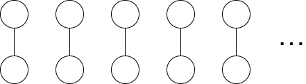


この記事は [Mathematical Logic Advent Calendar 2024](https://adventar.org/calendars/9945) の 19 日目の記事です。

今回は de Bruijn-Erdős の定理について解説します。少なくとも 2 つあるようですが、グラフ理論の方の定理を紹介します。

## 彩色

グラフの彩色については以下の記事でも少し触れています。

[【月刊組合せ論 Natori】June Huh 氏の業績を解説【2022 年 12 月号】](../../natori/202212/)

グラフが $n$ 彩色可能とは、頂点を $n$ 色のうちのいずれかで塗り、隣り合う 2 頂点は異なる色で塗られているようにできることをいいます。

de Bruijn-Erdős の定理は次のような定理です。


**定理** (de Bruijn-Erdős): グラフ $G$ の任意の有限部分グラフは $n$ 彩色可能とする。このとき $G$ も $n$ 彩色可能である。


## 類似の命題

de Bruijn-Erdős の定理と似た命題がいくつかあります。


**定理** (命題論理のコンパクト性): $\Sigma$ を命題論理の論理式の集合とする。$\Sigma$ の任意の有限部分集合が充足可能ならば、$\Sigma$ も充足可能である。


他にも次のような命題があります。


**命題**: $\Sigma$ を有限体 $\mathbb{F}_2$ 上の（多変数）多項式の集合とする。$\Sigma$ の任意の有限部分集合が共通の解をもつならば、$\Sigma$ も共通の解をもつ。


この命題は $\mathbb{F}_2$ の元を True, False だと思い、多項式を論理式だと思うことで命題論理のコンパクト性から従います。なお、この命題は一般の有限体上に拡張できますが、実数体などでは成り立ちません。反例を考えてみましょう。

## de Bruijn-Erdős の定理の証明

命題論理のコンパクト性を用いて de Bruijn-Erdős の定理を証明します。

グラフの頂点 $v$ と色 $c$ の組に対して、$A_{v,c}$ を変数とします。これは頂点 $v$ を色 $c$ で塗ることと対応します。そして $\Sigma$ を、各頂点はちょうど 1 色で塗られており、かつ隣り合う 2 頂点は異なる色で塗られていることを表す論理式の集合とします。$\Sigma$ が充足可能であることと、グラフ $G$ が $n$ 彩色可能であることは同値になります。

いま、$G$ のすべての有限部分グラフは $n$ 彩色可能であると仮定します。命題論理のコンパクト性より、$\Sigma$ のすべての有限部分集合が充足可能であることを示せばよいです。$\Sigma$ の有限部分集合 $\Gamma$ に対して、$G$ のある有限部分グラフの $n$ 彩色可能性と同値になる $\Sigma$ の部分集合 $\Gamma^{\prime}$ が存在して $\Gamma\subseteq\Gamma^{\prime}$ となります。仮定より $\Gamma^{\prime}$ は充足可能なので $\Gamma$ も充足可能です。

## 命題論理のコンパクト性の証明

命題論理のコンパクト性は超フィルター定理を用いて証明できます。

$F$ が 集合 $X$ 上の**フィルター**とは、$F$ は $X$ のべき集合 $\mathcal{P}(X)$ の部分集合であり

- $\emptyset\not\in F$
- $X\in F$
- $A\cap B\in F$ と $A\in F$ かつ $B\in F$ が同値

をみたすものです。$F$ より真に大きいフィルターが存在しないとき、$F$ は**超フィルター**であるといいます。

特にフィルター $F$ に対して、$A_1,\ldots,A_n\in F$ ならば $A_1\cap\cdots\cap A_n$ は空でないことがいえます。この性質を**有限交叉性**といいます。


**定理** (超フィルター定理): $X$ を集合とし、$S\subseteq 2^X$ は有限交叉性をもつとする。このとき $S$ を含む超フィルターが存在する。


超フィルター定理を仮定して命題論理のコンパクト性定理を証明します。集合 $I$ 上の論理式を考えているとし、$\Sigma$ を有限充足可能な論理式の集合、$2^I$ を付値全体の集合とします。論理式 $\phi\in\Sigma$ に対して

$$
V_{\phi}=\\{\nu\in 2^I\mid \nu(\phi)=1\\}
$$

とおき、仮定より $V_{\phi_1}\cap\cdots\cap V_{\phi_n}$ は空ではありません。よって

$$
X=\\{V_{\phi}\mid \phi\in \Sigma\\}
$$

は有限交叉性をみたすので、超フィルター定理より $X\subset D\subset\mathcal{P}(2^I)$ をみたす超フィルター $D$ が存在します。このような $D$ に対して、論理式の集合 $S$ を

$$
S=\\{\phi\mid V_{\phi} \in D\\}
$$

により定義します。$X\subset D$ より $\Sigma \subset S$ です。$\phi_1,\ldots,\phi_n\in S$ に対して、$D$ の有限交叉性から、$\nu(\phi_1)=\cdots=\nu(\phi_n)=1$ をみたす $\nu\in 2^I$ が存在します。すなわち $S$ は有限充足可能です。任意の論理式 $\phi$ に対して、$D$ は超フィルターより $\phi\in S$ または $\neg \phi\in S$ をみたします。したがって $S$ は極大なので、ある $\nu\in 2^I$ を用いて $S=\\{\phi\mid \nu(\phi)=1\\}$ と表せます。$\Sigma\subset S$ より、$\Sigma$ も充足可能です。（証明おわり）

逆に命題論理のコンパクト性から超フィルター定理を証明することもできます。すなわちこの 2 つの定理は同値です。

## 超フィルター定理の証明

超フィルター定理はツォルンの補題から証明できます。有名っぽいので省略します（嘘で、間に合わなかっただけです）。

この 2 つの命題は同値ではありません。

## 選択公理を仮定しない場合

de Bruijn-Erdős の定理を選択公理あるいはそれよりも弱い命題を仮定して証明しました。ではこれらを仮定しない場合はどうでしょうか。

実は、ZF では成り立ちません。$G$ が任意の有限部分グラフが 2 彩色可能なグラフだとしても、$G$ が 2 彩色可能になるとは限りません。

次のようなグラフを考えてみましょう。

このグラフの有限部分グラフは 2 彩色可能です。しかしこのグラフが 2 彩色可能であるとすると、一方の色で塗られた頂点に着目することで、2 元集合族の選択関数が構成できることになってしまいます。

## 逆

超フィルター定理から de Bruijn-Erdős の定理を証明しましたが、この逆については次のような定理が成り立ちます。


**定理**: $n\ge 3$ とする。グラフ $G$ の有限部分グラフが $n$ 彩色可能ならば $G$ も $n$ 彩色可能であるとする。このとき、超フィルター定理が成り立つ。


参考文献の "Axiom of Choice" では、定理 4.115, E.4 で 彩色に関する主張と PIT (Boolean Prime Ideal Theorem) との同値性、定理 4.37 で PIT と超フィルター定理の同値性を証明しています。もっと直接的に証明できるかもしれませんが考えていません。

## おわりに

筆者は組合せ論が好きですが、基礎論と組合せ論も関係が深いらしいですね。大学院のときに受けた講義でラムゼー理論が扱われていて、面白そうだと思いました。超フィルター定理もその講義で知りました。もっといろいろ勉強してみたいです。

基礎論の知識はほとんどないので、間違ったことを書いていたらご指摘ください。

## 参考文献

- Csirmaz, Laszlo; Gyenis, Zalán. Mathematical logic, Exercises and solutions, Springer, 2022.
- Herrlich, Horst. Axiom Of Choice. Springer, 2006.
