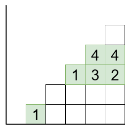
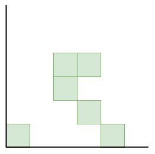
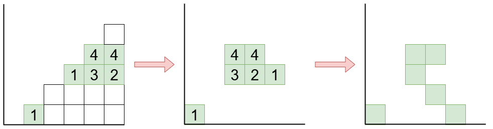

夏休みといえば自由研究ですね！

というわけで私も研究っぽいことをしてみます。みなさんもやってみませんか？

研究に終わりはないので、この記事も少しずつ更新されていく予定です。

ちなみに私はまだ夏休みではありません……。

## 研究のはじまり

inversions tableaux とは、7 月 15 日に公開された以下のプレプリントにて定義された、新しい概念です。

- Ilani Axelrod-Freed. Inversions Tableaux. [arXiv:2507.11516](https://arxiv.org/abs/2507.11516)

これはシューベルト多項式を記述する組合せ論的モデルの 1 つです。このようなモデルは過去の月刊組合せ論 Natori で紹介しています。

[【月刊組合せ論 Natori】シューベルト多項式の組合せ論的表示【2024 年 6 月号】](../../natori/202406/)

この記事内で紹介している Kohnert 図形が inversions tableaux と対応付けられるのではないか、と思ったのでこれを研究しました。

## 定義

まずは転倒タブロー (inversions tableaux) を定義します。まずは転倒図形を定義します。

$p$ を $(1,2,\ldots,n)$ の順列とします。$p$ の転倒ペアとは $1\le i<j\le n$ かつ $p_i>p_j$ をみたす組 $(i,j)$ です。転倒図形とは、各転倒ペア $(i,j)$ に対して $i$ 行 $j$ 列の位置に正方形のマスを置いた図形です。マスの個数は転倒数に等しいです。

転倒タブローとは転倒図形のマスに数を書き込んだものであって次の条件を満たすものです。

- $i<j<k$ に対して、$a,b,c$ をそれぞれマス $(i,j),(i,k),(j,k)$ にあるマスに書かれた数とする。このとき $a\le b\le c$ または $c\le b\le a$ が成り立つ。なお、$(i,j),(j,k)$ にマスがあるとき $(i,k)$ にもマスがある。
- 同じ列にある数は相異なる。
- $i$ 行目の数は $i$ 以下。

下の例では $p=215643$ です。

次に Kohnert 図形を定義します。上述の Natori にもあります。

順列 $p$ に対してその Rothe 図形を、$n\times n$ のマス目から $i$ 行目 $p_i$ 列目のマスを削除し、さらにそれらのマスの上または右にあるマスも削除して得られる図形です。

Kohnert 図形は Rothe 図形において、ある行の最も右端のマスを選び下に動かす（飛び越えてもよい）操作を好きな回数だけ行って得られる図形です。

## 全単射の構成

転倒タブローと Kohnert 図形の間にウェイトを保つ全単射を構成します。

転倒タブローが与えられたとき、$p_j$ 列目を $j$ 列目に移すことで Rothe 図形に数が書き込まれたものになります。$i$ が書かれているマスを $i$ 行目に落とすことで、Kohnert 図形が得られます。

全単射になっている、気がしていますが未証明です。

## 今後の課題

- 本当に全単射か？そもそも well-defined か？
- シューベルト多項式のモデルたちの間にはいろいろな全単射が知られている。これらは可換図式をなすか？これまでの全単射より簡単なものが得られるか？
- bumpless pipe dream との関係はどうか？
- 続くプレプリント Ilani Axelrod-Freed, Colin Defant, Hanna Mularczyk, Son Nguyen, Katherine Tung. Chute Move Posets are Lattices ([arXiv:2507.13214
](https://arxiv.org/abs/2507.13214)) においても転倒タブローが登場するが、Kohnert 図形を用いて解釈することができるか？
